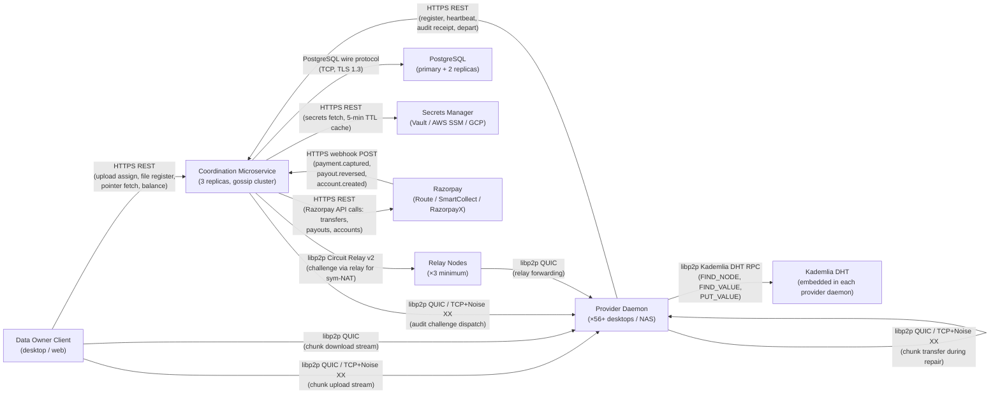

# Vyomanaut V2 — Interface Contracts

**Status:** Authoritative — backend, protocol, and integration engineers follow this document.
Where this document conflicts with an ADR, the ADR wins. Where it conflicts with
`architecture.md`, the ADR wins. Where it conflicts with `requirements.md`,
`requirements.md` wins.
**Version:** 1.0
**Date:** April 2026
**Author:** Vyomanaut Engineering
**Repository:** https://github.com/masamasaowl/Vyomanaut_Research
**Supersedes:** —
**Companion documents:**
- [`openapi.yaml`](./openapi.yaml) — authoritative REST/HTTP surface
- [`data-model.md`](./data-model.md) — canonical database schema and invariants
- [`architecture.md`](./architecture.md) — system overview and component descriptions
- [`requirements.md`](./requirements.md) — functional and non-functional requirements
- [`ADR-001`](../decisions/ADR-001-coordination-architecture.md) through [`ADR-029`](../decisions/ADR-029-bootstrap-minimum-viable-network.md) — all architectural decisions

---

## Table of Contents

1. [Purpose and Scope](#1-purpose-and-scope)
2. [Component Communication Map](#2-component-communication-map)
3. [REST / HTTP Contracts](#3-rest--http-contracts)
4. [libp2p Protocol Contracts](#4-libp2p-protocol-contracts)
   - [4.1 Chunk Upload Stream Protocol](#41-chunk-upload-stream-protocol)
   - [4.2 Audit Challenge Protocol](#42-audit-challenge-protocol)
   - [4.3 Heartbeat Multiaddr Update (HTTPS)](#43-heartbeat-multiaddr-update-https)
   - [4.4 Circuit Relay v2 Reservation](#44-circuit-relay-v2-reservation)
5. [Internal Go Package Contracts](#5-internal-go-package-contracts)
   - [5.1 `internal/crypto`](#51-internalcrypto)
   - [5.2 `internal/erasure`](#52-internalerasure)
   - [5.3 `internal/storage`](#53-internalstorage)
   - [5.4 `internal/p2p`](#54-internalp2p)
   - [5.5 `internal/audit`](#55-internalaudit)
   - [5.6 `internal/scoring`](#56-internalscoring)
   - [5.7 `internal/repair`](#57-internalrepair)
   - [5.8 `internal/payment`](#58-internalpayment)
   - [5.9 `internal/client`](#59-internalclient)
6. [PostgreSQL Row-Level Contracts](#6-postgresql-row-level-contracts)
7. [Razorpay Webhook Contracts](#7-razorpay-webhook-contracts)
   - [7.1 `virtual_account.payment.captured`](#71-virtual_accountpaymentcaptured)
   - [7.2 `payout.reversed`](#72-payoutreversed)
   - [7.3 `account.created`](#73-accountcreated)
8. [Secrets Manager Contract](#8-secrets-manager-contract)
9. [DHT Key Contract](#9-dht-key-contract)
10. [Versioning and Backwards Compatibility Rules](#10-versioning-and-backwards-compatibility-rules)

---

## 1. Purpose and Scope

This document is the single authoritative reference for the exact data contract between every
pair of components that communicate in the Vyomanaut V2 system. It exists because
[`openapi.yaml`](./openapi.yaml) covers only the HTTP/REST surface; the system's correctness
depends equally on the contracts governing libp2p wire messages, internal Go package
boundaries, PostgreSQL DML restrictions, and external webhook payloads.

This document is the enforcement point for the five invariants in
[`data-model.md §3`](./data-model.md#3-design-invariants). Any code path that would violate
an invariant must be rejected at review time; if a contract in this document permits such a
path, this document is wrong and must be corrected via PR before the code merges.

**In scope:**
- libp2p application protocol messages (framing, size limits, timeouts, 0-RTT policy)
- Internal Go package exported interfaces (signatures, pre/post-conditions, concurrency contracts)
- PostgreSQL per-table DML permissions (what roles may INSERT, UPDATE, DELETE, and under what conditions)
- Razorpay webhook payloads and idempotency contracts
- Secrets manager access patterns for the cluster audit secret
- DHT key derivation and validator contract

**Out of scope:**
- REST/HTTP endpoint schemas — defined exclusively in [`openapi.yaml`](./openapi.yaml); do
  not duplicate here
- Infrastructure provisioning details — covered in [`architecture.md §8`](./architecture.md#8-deployment-topology)
- Capacity calculations — covered in [`capacity.md`](./capacity.md)

**How to add a new interface.** Before implementing any new cross-component call:
1. Identify which section below covers it (or add a new section if it is a new interface class)
2. Write the contract here first — protocol ID, message schema, pre/post-conditions,
   error semantics, concurrency rules
3. Get the contract reviewed before writing the implementation
4. Reference this document from the PR description

---

## 2. Component Communication Map

The diagram below shows every communication link between system components, labelled with
the protocol used on that link. It is the single authoritative picture of which components
are allowed to talk to which. A code path that creates a communication link not shown here is
out of scope for V2 and requires a new ADR before implementation.



### Cross-reference: diagram links to ADRs

| Link | Protocol | ADR |
|---|---|---|
| Data Owner Client → Microservice | HTTPS REST | [`ADR-001`](../decisions/ADR-001-coordination-architecture.md) |
| Data Owner Client → Provider Daemon | libp2p QUIC / TCP+Noise XX (chunk upload) | [`ADR-021`](../decisions/ADR-021-p2p-transfer-protocol.md) |
| Provider Daemon → Microservice | HTTPS REST (heartbeat, audit receipt) | [`ADR-028`](../decisions/ADR-028-provider-heartbeat.md), [`ADR-002`](../decisions/ADR-002-proof-of-storage.md) |
| Microservice → Provider Daemon | libp2p QUIC / TCP+Noise XX (challenge dispatch) | [`ADR-002`](../decisions/ADR-002-proof-of-storage.md), [`ADR-021`](../decisions/ADR-021-p2p-transfer-protocol.md) |
| Microservice → Relay Nodes | libp2p Circuit Relay v2 (for symmetric-NAT providers) | [`ADR-021`](../decisions/ADR-021-p2p-transfer-protocol.md) |
| Microservice → PostgreSQL | PostgreSQL wire protocol | [`ADR-013`](../decisions/ADR-013-consistency-model.md), [`data-model.md`](./data-model.md) |
| Microservice → Secrets Manager | HTTPS REST | [`ADR-027`](../decisions/ADR-027-cluster-audit-secret.md) |
| Microservice → Razorpay | HTTPS REST | [`ADR-011`](../decisions/ADR-011-escrow-payments.md) |
| Razorpay → Microservice | HTTPS webhook POST | [`ADR-011`](../decisions/ADR-011-escrow-payments.md) |
| Provider Daemon ↔ DHT | libp2p Kademlia RPC | [`ADR-001`](../decisions/ADR-001-coordination-architecture.md) |
| Provider Daemon ↔ Provider Daemon (repair) | libp2p QUIC / TCP+Noise XX | [`ADR-021`](../decisions/ADR-021-p2p-transfer-protocol.md), [`ADR-004`](../decisions/ADR-004-repair-protocol.md) |

### What this diagram does not show

- Internal PostgreSQL primary-to-replica replication — managed by the cloud provider; opaque
  to the application layer
- Razorpay's internal bank settlement rails — external to Vyomanaut; not a component
  Vyomanaut controls
- DHT gossip between provider daemon instances — this is libp2p-internal; the application
  layer interacts with the DHT only through the `internal/p2p` package interface

---

## 3. REST / HTTP Contracts

All REST/HTTP interface contracts — request schemas, response schemas, status codes, error
bodies, authentication requirements, and idempotency semantics — are defined exclusively in
[`openapi.yaml`](./openapi.yaml).

**Do not duplicate REST contracts here.** If a REST contract needs updating, update
`openapi.yaml`. If a REST contract is ambiguous, raise a PR against `openapi.yaml` with the
clarification before implementing against it.

Cross-references for key REST contract decisions that originated in ADRs:

| Contract concern | Source |
|---|---|
| `challenge_nonce BYTEA(33)` — 33 bytes, not 32 | [`ADR-027`](../decisions/ADR-027-cluster-audit-secret.md), [`requirements.md §9.3`](./requirements.md#93-hard-constraints) |
| All `amount_paise` fields are `int64`, never float | [`ADR-016`](../decisions/ADR-016-payment-db-schema.md), [`NFR-046`](./requirements.md#77-compliance-and-payments) |
| `X-Payout-Idempotency` header mandatory since 15 March 2025 | [`ADR-012`](../decisions/ADR-012-payment-basis.md), Paper 35 |
| HTTP 503 returned from `/api/v1/upload/assign` until readiness gate passes | [`ADR-029`](../decisions/ADR-029-bootstrap-minimum-viable-network.md), [`FR-053`](./requirements.md#611-network-readiness-gate) |
| UPI Intent only — UPI Collect deprecated 28 February 2026 | [`ADR-011`](../decisions/ADR-011-escrow-payments.md), [`NFR-029`](./requirements.md#77-compliance-and-payments) |

---

## 4. libp2p Protocol Contracts

This section specifies the application-level wire protocol for every libp2p stream opened
between components. The transport layer (QUIC v1 primary, TCP+Noise XX fallback) and NAT
traversal (AutoNAT → DCUtR → Circuit Relay v2) are governed by
[`ADR-021`](../decisions/ADR-021-p2p-transfer-protocol.md) and are not repeated here.

**Common rules that apply to every libp2p protocol in this section:**

1. **Transport authentication.** The remote Peer ID is cryptographically verified during the
   TLS 1.3 (QUIC) or Noise XX handshake before any application data flows.
   ([`ADR-021`](../decisions/ADR-021-p2p-transfer-protocol.md), [`NFR-016`](./requirements.md#74-security-and-privacy))
   A stream that opens to an unknown or unregistered Peer ID must be closed immediately.

2. **Protocol negotiation.** libp2p multistream-select is used for all protocol negotiation.
   The initiating side proposes the protocol ID string; the receiving side accepts or rejects.

3. **Stream lifecycle.** Each logical operation (one chunk upload, one audit challenge
   round-trip) occupies one independent QUIC stream or yamux substream. Streams are not reused
   across operations.

4. **Error signalling.** Application-level errors are encoded as a one-byte error code at the
   start of the response frame (see per-protocol tables). Transport-level errors (stream reset,
   connection close) propagate as Go `error` values from the libp2p API.

5. **Framing.** All messages use length-prefix framing: a 4-byte big-endian `uint32` length
   field precedes the payload. The maximum frame size for each protocol is specified below.
   A frame exceeding the maximum must cause the receiving side to reset the stream with error
   code `0x01` (FRAME_TOO_LARGE).

---

### 4.1 Chunk Upload Stream Protocol

This protocol carries a single 256 KB chunk from the data owner client (or the microservice
during repair) to a provider daemon. It is the only path by which chunk data enters the
provider's vLog.

**Protocol ID:** `/vyomanaut/chunk-upload/1.0.0`

**Participants:** Initiator = data owner client or microservice (repair); Responder = provider
daemon.

**0-RTT policy:** 0-RTT session resumption is **permitted** for this protocol. Replaying a
chunk upload causes the provider to store a duplicate vLog entry for the same `chunk_id`. The
RocksDB UNIQUE constraint on `chunk_id` will reject the second write cleanly; no authentication
or payment consequence results from a replay. ([`ADR-021`](../decisions/ADR-021-p2p-transfer-protocol.md))

**Message flow:**

```
Initiator                          Responder
    │                                   │
    │── UploadRequest (frame 1) ────────►│
    │                                   │── write to vLog (fsync)
    │                                   │── insert RocksDB index
    │◄─ UploadResponse (frame 2) ───────│
```

**Frame 1 — UploadRequest:**

| Field | Type | Size | Description |
|---|---|---|---|
| `length` | uint32 big-endian | 4 B | Total payload length of this frame (not including the 4-byte length field itself). Must equal 32 + 4 + 262144 = 262180 bytes. |
| `chunk_id` | bytes | 32 B | SHA-256(chunk_data). Content address. Used as the RocksDB lookup key. |
| `shard_index` | uint32 big-endian | 4 B | Which of the 56 RS output shards this is (0–55). Validated against the assignment service record. |
| `chunk_data` | bytes | 262144 B | Raw 256 KB AONT-RS encoded shard. No additional encryption at the transport layer — TLS 1.3 handles confidentiality. |

Maximum frame payload: 262180 bytes. A frame with `length > 262180` is a FRAME_TOO_LARGE error.

**Frame 2 — UploadResponse:**

| Field | Type | Size | Description |
|---|---|---|---|
| `length` | uint32 big-endian | 4 B | Payload length. Success: 1 + 64 = 65 bytes. Error: 1 byte. |
| `status` | uint8 | 1 B | `0x00` = OK. `0x01` = FRAME_TOO_LARGE. `0x02` = CHUNK_ID_MISMATCH (SHA-256 of received data does not match `chunk_id`). `0x03` = NOT_ASSIGNED (provider is not the assigned holder for this chunk_id). `0x04` = STORAGE_FULL (provider has reached `declared_storage_gb` cap). `0x05` = INTERNAL_ERROR (vLog write or RocksDB insert failed). |
| `provider_sig` | bytes | 64 B | Ed25519 signature by the provider over `SHA-256(chunk_id \|\| shard_index \|\| timestamp_unix_ms)`. Present only when `status = 0x00`. This is the upload receipt that the initiator must retain as proof of acknowledged storage. |

**Timeout:** The initiator must receive `UploadResponse` within 5,000 ms of sending
`UploadRequest`. If no response is received within this window, the initiator resets the stream
and may retry on a different connection.

**Pre-conditions on the responder (provider daemon):**
- The provider's `providers.status` must be `ACTIVE` or `VETTING` at the time the stream is
  accepted. If `status = DEPARTED`, the stream must be reset immediately with a TCP RST
  equivalent (stream reset, no application response).
- The `chunk_id` must match `SHA-256(chunk_data)`. If it does not, respond with
  `status = 0x02` before writing anything to disk.

**Post-conditions on a successful response (`status = 0x00`):**
- The chunk_data is durably written to the vLog (fsync completed).
- The RocksDB index entry `(chunk_id → vlog_offset, chunk_size)` is inserted.
- The `content_hash = SHA-256(chunk_data)` is embedded in the vLog entry.
- The provider_sig covers the stored content and timestamp, forming the upload receipt.

---

### 4.2 Audit Challenge Protocol

This protocol carries a single audit challenge from the microservice to the provider daemon
and returns the provider's signed audit response. It is the most latency-sensitive protocol
in the system — the response must arrive before the per-provider deadline.

**Protocol ID:** `/vyomanaut/audit-challenge/1.0.0`

**Participants:** Initiator = coordination microservice; Responder = provider daemon.

**0-RTT policy:** 0-RTT session resumption is **prohibited** for this protocol.
([`ADR-021`](../decisions/ADR-021-p2p-transfer-protocol.md))
An audit response carries a cryptographic proof tied to a specific nonce and timestamp. A
replayed response could falsely credit a provider with a PASS for data they no longer hold.
The QUIC connection for audit challenges must set `DisableEarlyData: true` on the TLS
configuration. The provider daemon must reject any `ClientHello` that contains early data
on this protocol ID.

**Message flow:**

```
Microservice                        Provider Daemon
    │                                   │
    │── ChallengeRequest (frame 1) ─────►│
    │                                   │── Bloom filter check
    │                                   │── RocksDB lookup
    │                                   │── vLog read (1 random disk I/O)
    │                                   │── content_hash verification
    │                                   │── compute response_hash
    │                                   │── sign receipt
    │◄─ ChallengeResponse (frame 2) ────│
```

**Frame 1 — ChallengeRequest:**

| Field | Type | Size | Description |
|---|---|---|---|
| `length` | uint32 big-endian | 4 B | Payload length. Must equal 33 + 8 = 41 bytes. |
| `challenge_nonce` | bytes | 33 B | 1-byte version prefix \|\| 32-byte HMAC-SHA256. **Must be exactly 33 bytes.** ([`ADR-027`](../decisions/ADR-027-cluster-audit-secret.md), [`requirements.md §9.3`](./requirements.md#93-hard-constraints)) A frame with a nonce of any other length must be rejected with `status = 0x03`. |
| `server_challenge_ts_ms` | int64 big-endian | 8 B | Unix timestamp in milliseconds, set by the microservice. The provider must embed this value in the signed receipt without modification — it is the anti-backdating mechanism. ([`ADR-017`](../decisions/ADR-017-audit-receipt-schema.md)) |

Maximum frame payload: 41 bytes.

**Frame 2 — ChallengeResponse:**

| Field | Type | Size | Description |
|---|---|---|---|
| `length` | uint32 big-endian | 4 B | Payload length. Success: 1 + 32 + 64 = 97 bytes. Error: 1 byte. |
| `status` | uint8 | 1 B | `0x00` = OK (PASS). `0x01` = FAIL_NOT_FOUND (Bloom filter absent — chunk not on this provider). `0x02` = FAIL_CORRUPTION (`SHA-256(chunk_data) ≠ content_hash` — disk corruption). `0x03` = INVALID_NONCE (nonce is not 33 bytes). `0x04` = INTERNAL_ERROR (vLog read failed for a reason other than corruption). |
| `response_hash` | bytes | 32 B | `SHA-256(chunk_data \|\| challenge_nonce)`. Present only when `status = 0x00`. |
| `provider_sig` | bytes | 64 B | Ed25519 signature by the provider over `SHA-256(response_hash \|\| challenge_nonce \|\| server_challenge_ts_ms \|\| provider_id)`. Present only when `status = 0x00`. |

**Timeout:** The microservice must receive `ChallengeResponse` within the per-provider RTO:

```
RTO = avg_rtt_ms + 4 × var_rtt_ms
```

Values are stored as `(avg_rtt_ms FLOAT, var_rtt_ms FLOAT)` per provider in the `providers`
table. New providers use the pool-median RTO until `rto_sample_count ≥ 5`.
([`ADR-006`](../decisions/ADR-006-polling-interval.md), [`FR-040`](./requirements.md#68-audit-system))

If the timeout elapses, the microservice records `audit_result = TIMEOUT` and resets the
stream. The provider daemon must not retry — the microservice will issue a new challenge at
the next scheduled audit cycle.

**Concurrency.** The microservice may open multiple concurrent audit challenge streams to a
single provider (one per assigned chunk per audit cycle). Each stream is independent. Stream
multiplexing is handled by QUIC. The provider daemon must handle at least 32 concurrent
challenge streams without queuing delay.

**Pre-conditions on the responder (provider daemon):**
- The provider must verify that `challenge_nonce[0]` (the version byte) corresponds to a
  currently-valid `server_secret_vN`. If the version byte refers to a retired secret (past
  the 24-hour rotation overlap window), the provider should respond with `status = 0x03`.
- The provider must verify `SHA-256(chunk_data) == content_hash` before computing
  `response_hash`. If this check fails, respond with `status = 0x02`.

**Post-conditions on `status = 0x00`:**
- `response_hash` = `SHA-256(chunk_data || challenge_nonce)` — unforgeable without the chunk
- `provider_sig` covers both the response and the server-set timestamp — prevents replay
- The provider has NOT recorded the receipt in any local database — the microservice owns
  the authoritative receipt record

---

### 4.3 Heartbeat Multiaddr Update (HTTPS)

The heartbeat is not a libp2p protocol — it is a signed HTTPS POST to the microservice REST
API. It is documented here (rather than in the REST section) because its primary purpose is to
support the libp2p transport by keeping the microservice's address table current for challenge
dispatch. ([`ADR-028`](../decisions/ADR-028-provider-heartbeat.md))

**Endpoint:** `POST /api/v1/provider/heartbeat` — schema defined in [`openapi.yaml`](./openapi.yaml).

**Interval:** Every 4 hours ± jitter of ±5 minutes (randomised to prevent thundering herd
after microservice restart). Timer is reset after each successful acknowledgement.

**Required fields in the signed payload:**
- `current_multiaddrs[]` — all current libp2p multiaddrs (QUIC, TCP, relay), ordered by
  preference
- `timestamp` — ISO 8601 UTC; rejected if skew > ±5 minutes from microservice clock
- `provider_sig` — Ed25519 over canonical JSON of all other fields (sorted keys, no trailing
  whitespace, `provider_sig` absent from the signing input)

**Effect on challenge dispatch:** After a successful heartbeat, `providers.last_known_multiaddrs`
is updated and `providers.multiaddr_stale` is set to `false`. The microservice uses this
column as the **primary** address source for audit challenge dispatch. DHT lookup is used only
as a fallback when `multiaddr_stale = true` (after 2+ missed heartbeats).

**Effect on departure detection:** `providers.last_heartbeat_ts` is updated. The departure
detector compares this value to `NOW() - INTERVAL '72 hours'`.

---

### 4.4 Circuit Relay v2 Reservation

Providers behind symmetric NAT cannot accept inbound connections directly. They must establish
a relay reservation with a Vyomanaut relay node before the microservice can dispatch audit
challenges to them. This section specifies the Vyomanaut-specific configuration layered on top
of the libp2p Circuit Relay v2 standard.

**Protocol ID:** `/libp2p/circuit/relay/0.2.0/hop` (standard libp2p; not a Vyomanaut-specific
protocol)

**Relay node multiaddrs:** Injected into the provider daemon at install time via the
`--relay-addrs` flag. Relay nodes are Vyomanaut-operated and co-located in Indian cloud
regions. The provider daemon attempts each relay in order until a reservation is confirmed.

**Reservation TTL:** 30 minutes (libp2p default). The daemon must refresh the reservation
before expiry. A refresh failure triggers an immediate retry to the next relay in the list.

**Concurrent reservations:** Each relay node supports 128 simultaneous active reservations.
([`ADR-021`](../decisions/ADR-021-p2p-transfer-protocol.md), [`capacity.md §5.2`](./capacity.md#52-relay-infrastructure-scaling))

**Effect on heartbeat:** When a relay reservation is active, the daemon includes the relay
multiaddr (`/p2p-circuit/p2p/<PeerID>`) in the `current_multiaddrs[]` array sent with each
heartbeat. The microservice stores this relay address alongside the direct addresses and
dials it when all direct addresses are unreachable.

**0-RTT policy:** Relay-forwarded streams inherit the 0-RTT policy of the application
protocol they carry. Audit challenge streams forwarded through a relay are still subject to
`DisableEarlyData: true`.

**Relay overhead constraint.** Relay-mediated connections must add < 50 ms RTT from
Indian cloud-hosted relay nodes. ([`NFR-006`](./requirements.md#72-availability)) This is
validated during the M8 launch milestone per [`mvp.md §Relay latency measurement`](./mvp.md#milestone-8--network-readiness-gate-and-private-beta).

---

## 5. Internal Go Package Contracts

This section specifies the exported interface of every internal package, including:
- Exported function/method signatures (as compilable Go code)
- Pre-conditions: what must be true before the call (caller's responsibility)
- Post-conditions: what is guaranteed if the call returns `nil` error
- Error semantics: which errors are recoverable (`error` return), which are fatal
  (`panic` in debug builds)
- Concurrency contract: whether the exported surface is goroutine-safe and what
  synchronisation obligation falls on the caller

**Convention.** A function whose pre-condition is violated causes a `panic` in `debug`
build tags and returns a sentinel error in `release` builds. Pre-condition violations are
always bugs in the caller, not in the callee.

---

### 5.1 `internal/crypto`

Provides all key derivation and cipher primitives. All functions are **pure** (no shared
mutable state) and **goroutine-safe** by design — they take all inputs as arguments and
return all outputs as values.

```go
// Package crypto implements all cryptographic primitives for Vyomanaut V2.
// Every function is goroutine-safe. No function writes to shared mutable state.
//
// INVARIANT: No function in this package accepts a float64 or float32 parameter
// or returns one. All monetary calculations are delegated to internal/payment.
//
// See ADR-019 (ChaCha20-256 / AES-256-CTR), ADR-020 (HKDF key hierarchy).
package crypto

// DeriveAESNIAvailable detects hardware AES-NI support via CPUID (x86) or
// equivalent. Called once at daemon startup and stored as a package-level
// constant. Never re-checked at runtime.
//
// Pre-conditions: none.
// Post-conditions: returns true iff AES-NI instructions are available on this CPU.
// Goroutine-safe: yes (read-only hardware probe).
func DetectAESNI() bool

// DeriveFileKey derives a 32-byte file key using HKDF-SHA256.
//   file_key = HKDF-SHA256(ikm=masterSecret, salt=ownerID, info="vyomanaut-file-v1"||fileID)
//
// Pre-conditions:
//   - len(masterSecret) == 32  (panic in debug if violated)
//   - len(ownerID) == 16       (UUID bytes)
//   - len(fileID) == 16        (UUID bytes)
// Post-conditions:
//   - returns a 32-byte key that is deterministic for the given inputs.
// Error semantics: no errors returned; pre-condition violations panic.
// Goroutine-safe: yes.
func DeriveFileKey(masterSecret, ownerID, fileID []byte) [32]byte

// DerivePointerEncKey derives the 32-byte key used to encrypt a pointer file.
//   key = HKDF-SHA256(ikm=masterSecret, salt=ownerID, info="vyomanaut-pointer-v1"||fileID)
//
// Pre/post/error semantics identical to DeriveFileKey.
func DerivePointerEncKey(masterSecret, ownerID, fileID []byte) [32]byte

// DeriveKeystoreEncKey derives the 32-byte key used to encrypt the daemon's
// local keystore.
//   key = HKDF-SHA256(ikm=masterSecret, salt=ownerID, info="vyomanaut-keystore-v1")
//
// Pre/post/error semantics identical to DeriveFileKey.
func DeriveKeystoreEncKey(masterSecret, ownerID []byte) [32]byte

// DeriveMasterSecret derives the 32-byte master secret from the owner's passphrase
// using Argon2id with parameters t=3, m=65536, p=4.
// The master secret must NEVER be written to disk or transmitted over any network.
//
// Pre-conditions:
//   - len(passphrase) >= 8     (panic in debug if violated)
//   - len(ownerID) == 16       (UUID bytes, used as Argon2id salt)
// Post-conditions:
//   - returns a 32-byte master secret, deterministic for the given inputs.
//   - execution time >= 200ms on any supported hardware (budgeted in NFR-010).
// Error semantics: no errors returned; pre-condition violations panic.
// Goroutine-safe: yes (pure function).
func DeriveMasterSecret(passphrase, ownerID []byte) [32]byte

// EncryptPointerFile encrypts the serialised pointer file plaintext using
// AEAD_CHACHA20_POLY1305 (RFC 8439, ADR-019).
//
// Pre-conditions:
//   - len(key) == 32
//   - len(nonce) == 12         (96-bit counter; caller increments BEFORE this call)
//   - len(aad) > 0             (must include ownerID || fileID || schemaVersion)
// Post-conditions:
//   - returned ciphertext is len(plaintext)+16 bytes (plaintext + 16-byte Poly1305 tag)
//   - tag is over ciphertext with the supplied AAD
// Error semantics: returns error if the underlying cipher construction fails (should
//   never happen with correct inputs; treat as fatal if it does).
// Goroutine-safe: yes.
func EncryptPointerFile(key [32]byte, nonce [12]byte, aad, plaintext []byte) ([]byte, error)

// DecryptPointerFile decrypts and verifies a pointer file ciphertext.
// CRITICAL: The Poly1305 tag is verified with constant-time comparison before
// any plaintext is returned. (NFR-019, ADR-019)
//
// Pre-conditions:
//   - len(key) == 32
//   - len(nonce) == 12
//   - len(ciphertext) >= 16    (must include the 16-byte tag)
// Post-conditions (on nil error):
//   - returned plaintext is authenticated under the given key, nonce, and aad
//   - tag was verified with crypto/subtle.ConstantTimeCompare
// Error semantics:
//   - ErrTagMismatch: tag verification failed; caller MUST NOT use any returned bytes.
//   - Other errors: internal cipher failure; treat as fatal.
// Goroutine-safe: yes.
func DecryptPointerFile(key [32]byte, nonce [12]byte, aad, ciphertext []byte) ([]byte, error)

// AONTEncodeSegment applies the All-or-Nothing Transform to a plaintext segment.
// Cipher selection: ChaCha20-256 if aesNIAvailable==false, AES-256-CTR if true.
// The AONT key K is generated fresh via crypto/rand and embedded in the output package.
// (ADR-022, ADR-019)
//
// Pre-conditions:
//   - len(segment) is a multiple of 16 (segment is pre-padded by the caller to 4 MB minimum)
//   - aesNIAvailable must be the value returned by DetectAESNI() at startup
// Post-conditions:
//   - returns the AONT package: (s+1) 16-byte words where s = len(segment)/16
//   - the last word is K XOR SHA-256(all preceding codewords)
//   - the second-to-last word is the canary (fixed 16-byte value defined in aont_canary.go)
//   - K is not returned; it is embedded and inaccessible without assembling all s+1 words
// Error semantics: returns error if crypto/rand fails (treat as fatal).
// Goroutine-safe: yes.
func AONTEncodeSegment(segment []byte, aesNIAvailable bool) ([]byte, error)

// AONTDecodePackage recovers the plaintext segment from an AONT package.
// Also verifies the canary word after decryption. (FR-018, ADR-022)
//
// Pre-conditions:
//   - len(aontPackage) >= 32   (must have at least one data word, canary word, key-block)
//   - len(aontPackage) is a multiple of 16
//   - aesNIAvailable must be the value returned by DetectAESNI() at startup
// Post-conditions (on nil error):
//   - returned plaintext has the canary stripped
//   - canary has been verified; a wrong canary causes ErrCanaryMismatch
// Error semantics:
//   - ErrCanaryMismatch: the decoded segment is corrupt; caller MUST NOT return any
//     plaintext to the data owner. Zero the buffer before returning.
//   - Other errors: internal cipher failure; treat as fatal.
// Goroutine-safe: yes.
func AONTDecodePackage(aontPackage []byte, aesNIAvailable bool) ([]byte, error)
```

**Sentinel errors exported by this package:**

```go
var (
    ErrTagMismatch    = errors.New("crypto: Poly1305 tag verification failed")
    ErrCanaryMismatch = errors.New("crypto: AONT canary word mismatch after decode")
)
```

---

### 5.2 `internal/erasure`

Provides Reed-Solomon RS(s=16, r=40) encode and decode over GF(2^8). Implemented using
`github.com/klauspost/reedsolomon`. All functions are **goroutine-safe**.

```go
// Package erasure implements Reed-Solomon RS(16, 56) encode and decode.
// Parameters s=16, r=40, n=56 are fixed constants; they may not be overridden
// at runtime. (ADR-003)
package erasure

const (
    DataShards   = 16   // s — reconstruction threshold
    ParityShards = 40   // r — parity fragments
    TotalShards  = 56   // n = s + r
    ShardSize    = 262144 // lf — 256 KB per shard in bytes
)

// EncodeSegment splits an AONT package into 56 shards of 256 KB each.
// The first 16 shards are the systematic (identity-mapped) AONT codewords.
// Shards 16–55 are Reed-Solomon parity.
//
// Pre-conditions:
//   - len(aontPackage) == DataShards * ShardSize exactly
//     (caller pads the segment to exactly 4 MB = 16 * 256 KB before AONT)
// Post-conditions:
//   - returns exactly TotalShards byte slices, each of length ShardSize
//   - shards[0:DataShards] are the systematic shards (equal to the input words)
//   - shards[DataShards:TotalShards] are the parity shards
//   - any DataShards of the returned shards can reconstruct the original aontPackage
// Error semantics: returns error only if the underlying GF arithmetic fails (fatal).
// Goroutine-safe: yes (no shared mutable state).
func EncodeSegment(aontPackage []byte) ([][]byte, error)

// DecodeSegment reconstructs an AONT package from any DataShards (16) of the
// 56 shards. Absent shards are represented as nil slices.
//
// Pre-conditions:
//   - len(shards) == TotalShards
//   - at least DataShards entries in shards are non-nil
//   - every non-nil shard has len == ShardSize
// Post-conditions:
//   - returns the reconstructed AONT package of length DataShards * ShardSize
//   - all nil entries in shards are filled in-place (the caller's slice is modified)
// Error semantics:
//   - ErrTooFewShards: fewer than DataShards non-nil shards provided
//   - ErrShardSize: a non-nil shard has the wrong length
//   - Other errors from klauspost/reedsolomon: treat as fatal.
// Goroutine-safe: yes.
func DecodeSegment(shards [][]byte) ([]byte, error)

var (
    ErrTooFewShards = errors.New("erasure: fewer than 16 non-nil shards provided")
    ErrShardSize    = errors.New("erasure: shard has incorrect length")
)
```

---

### 5.3 `internal/storage`

Provides the WiscKey-style chunk storage engine: RocksDB index + append-only vLog.
([`ADR-023`](../decisions/ADR-023-provider-storage-engine.md), [`NFR-023`](./requirements.md#75-reliability-and-correctness))

**Critical concurrency rule.** `AppendChunk` is **NOT goroutine-safe**. It is designed to be
called exclusively from a single writer goroutine. All other goroutines must submit write
requests through a channel to that goroutine. Calling `AppendChunk` from multiple goroutines
concurrently produces undefined vLog corruption. This is Invariant 5 in the storage engine
design and is enforced in production by the daemon's upload manager.

```go
// Package storage implements the WiscKey key-value separated chunk storage engine.
// The vLog (value log) is an append-only file; the index is RocksDB.
//
// CONCURRENCY CONTRACT: AppendChunk is NOT goroutine-safe. It must only be called
// from the single designated writer goroutine. See ADR-023 §Single writer goroutine.
// All other exported functions are goroutine-safe (read-only paths).
package storage

// ChunkStore is the main storage interface. Create with NewChunkStore.
type ChunkStore interface {
    // AppendChunk writes a 256 KB chunk to the vLog and inserts the index entry.
    //
    // *** SINGLE WRITER ONLY — NOT goroutine-safe ***
    // Callers must ensure this is called from exactly one goroutine at a time.
    //
    // Pre-conditions:
    //   - len(chunkID) == 32         (SHA-256 content address)
    //   - len(chunkData) == 262144   (exactly 256 KB)
    //   - SHA-256(chunkData) == chunkID  (caller must verify before calling)
    //   - The vLog file handle is open and positioned at the end
    // Post-conditions (on nil error):
    //   - chunkData and its content_hash are durably fsync'd to the vLog
    //   - The RocksDB index entry (chunkID → vlog_offset, chunk_size) is inserted
    //   - The returned vlogOffset is the byte offset where the entry begins in the vLog
    // Error semantics:
    //   - ErrVLogFsync: the fsync failed; the vLog may be in an inconsistent state;
    //     the daemon must halt and restart (crash recovery will fix the tail on next start)
    //   - ErrRocksDBInsert: the index insert failed after a successful vLog write;
    //     the next startup's crash recovery scan will repair the missing index entry
    // Goroutine-safe: NO — single writer goroutine only.
    AppendChunk(chunkID [32]byte, chunkData []byte) (vlogOffset uint64, err error)

    // LookupChunk retrieves a chunk from the vLog by content address.
    // Verifies content_hash = SHA-256(chunk_data) before returning.
    //
    // Pre-conditions:
    //   - len(chunkID) == 32
    // Post-conditions (on nil error):
    //   - returned data is exactly 262144 bytes
    //   - SHA-256(returned data) == chunkID  (verified internally; no need to re-check)
    // Error semantics:
    //   - ErrChunkNotFound: Bloom filter or RocksDB has no entry for chunkID;
    //     this is the expected response for an audit challenge on an unassigned chunk
    //   - ErrContentHashMismatch: the data is present but its hash does not match;
    //     indicates silent disk corruption; caller must return audit FAIL with
    //     status=0x02 (FAIL_CORRUPTION) — see §4.2
    //   - ErrVLogRead: an I/O error reading the vLog; treat as fatal
    // Goroutine-safe: yes (read-only path via RocksDB + vLog pread).
    LookupChunk(chunkID [32]byte) ([]byte, error)

    // DeleteChunk removes a chunk from the index. The vLog entry is not immediately
    // freed; it is reclaimed during the next GC cycle.
    //
    // Pre-conditions:
    //   - len(chunkID) == 32
    // Post-conditions (on nil error):
    //   - The RocksDB index entry for chunkID is deleted
    //   - Subsequent LookupChunk calls for this chunkID will return ErrChunkNotFound
    //   - The vLog entry remains on disk until GC reclaims it
    // Goroutine-safe: yes.
    DeleteChunk(chunkID [32]byte) error

    // RecoverFromCrash scans the vLog from the last known head offset and re-inserts
    // any RocksDB index entries that are missing. Must be called once at daemon startup
    // before the writer goroutine is started. (ADR-023 §Crash recovery, NFR-024)
    //
    // Pre-conditions:
    //   - AppendChunk has not been called since the store was opened
    //   - No writer goroutine is running
    // Post-conditions (on nil error):
    //   - All vLog entries up to the current EOF are reflected in RocksDB
    // Goroutine-safe: NO — must be called before the writer goroutine starts.
    RecoverFromCrash() error

    // RunGC performs garbage collection on the vLog, reclaiming space from deleted
    // chunks. Runs in a background goroutine; the caller provides a context for
    // cancellation. (ADR-023 §Garbage collection)
    //
    // Goroutine-safe: yes (GC uses a separate read handle from the writer goroutine).
    RunGC(ctx context.Context) error

    // Close flushes and closes the RocksDB instance and the vLog file handle.
    // After Close returns, the ChunkStore must not be used.
    Close() error
}

var (
    ErrChunkNotFound      = errors.New("storage: chunk not found")
    ErrContentHashMismatch = errors.New("storage: content hash mismatch (disk corruption)")
    ErrVLogFsync          = errors.New("storage: vLog fsync failed")
    ErrVLogRead           = errors.New("storage: vLog read failed")
    ErrRocksDBInsert      = errors.New("storage: RocksDB index insert failed")
)
```

---

### 5.4 `internal/p2p`

Provides peer identity management, transport stack initialisation, and the Kademlia DHT
interface. Goroutine-safe after construction.

```go
// Package p2p manages the libp2p host, transport stack (QUIC primary / TCP+Noise fallback),
// NAT traversal, and the Kademlia DHT with the custom HMAC key validator.
// (ADR-021, ADR-001)
package p2p

// Host is the primary libp2p interface. Constructed once at daemon startup.
// All methods are goroutine-safe.
type Host interface {
    // PeerID returns the local Ed25519-based libp2p Peer ID.
    // This is multihash(ed25519_public_key). (ADR-021)
    PeerID() peer.ID

    // Connect dials a remote peer at the given multiaddrs and performs the
    // transport-layer authentication handshake. Returns when the connection
    // is established and the Peer ID is verified.
    //
    // Pre-conditions:
    //   - len(addrs) >= 1
    // Post-conditions (on nil error):
    //   - A connection to peerID is established
    //   - The Peer ID of the remote is verified against peerID (not self-reported)
    // Error semantics:
    //   - ErrPeerIDMismatch: the remote peer's actual ID does not match peerID
    //   - ErrAllAddrsFailed: all provided addresses failed to connect
    Connect(ctx context.Context, peerID peer.ID, addrs []multiaddr.Multiaddr) error

    // NewStream opens a new application-level stream to peerID for the given
    // protocol. Requires an existing connection (call Connect first).
    //
    // 0-RTT policy: 0-RTT is disabled for protocols with IDs ending in
    // "-audit" or "-challenge". The caller does not need to enforce this; the
    // Host enforces it automatically based on the protocol ID. (ADR-021)
    NewStream(ctx context.Context, peerID peer.ID, protocolID protocol.ID) (network.Stream, error)

    // SetStreamHandler registers a handler for incoming streams of the given
    // protocol. The handler is called in a new goroutine per stream.
    SetStreamHandler(protocolID protocol.ID, handler network.StreamHandler)

    // NATType returns the current AutoNAT classification of the local node.
    // Updated periodically by the AutoNAT service.
    NATType() (natType autonat.NATStatus)

    // Close shuts down the libp2p host and all open connections.
    Close() error
}

// DHT is the Kademlia DHT interface with the custom HMAC key validator.
// (ADR-001 §DHT Key Contract)
type DHT interface {
    // PutProviderRecord announces that the local peer holds the value for the
    // given DHT key. The key must be an HMAC-derived key
    // (HMAC-SHA256(chunk_hash, file_owner_key)); the validator will reject any
    // key that does not pass the HMAC format check.
    PutProviderRecord(ctx context.Context, key []byte) error

    // FindProviders returns up to maxCount peers that have announced holding
    // the value for key. The key must be an HMAC-derived key.
    FindProviders(ctx context.Context, key []byte, maxCount int) ([]peer.AddrInfo, error)

    // Bootstrap connects to the well-known seed nodes and fills the k-buckets.
    // Must be called once at daemon startup after the Host is created.
    Bootstrap(ctx context.Context) error
}

var (
    ErrPeerIDMismatch  = errors.New("p2p: remote Peer ID does not match expected")
    ErrAllAddrsFailed  = errors.New("p2p: all provided multiaddrs failed to connect")
    ErrDHTKeyInvalid   = errors.New("p2p: DHT key does not pass HMAC validator")
)
```

---

### 5.5 `internal/audit`

Provides the microservice-side audit challenge generation, dispatch, receipt validation, and
the two-phase crash-safe database write. Goroutine-safe.

```go
// Package audit manages the audit challenge lifecycle on the microservice side.
// (ADR-002, ADR-015, ADR-017, ADR-027)
package audit

// ChallengeNonce generates a 33-byte versioned challenge nonce.
//   nonce = version_byte || HMAC-SHA256(serverSecretVN, chunkID || serverTsMs)
//
// Pre-conditions:
//   - len(serverSecretVN) == 32
//   - versionByte == N mod 256 (must match the version of serverSecretVN)
//   - len(chunkID) == 32
//   - serverTsMs is current Unix time in ms (set by caller from time.Now())
// Post-conditions:
//   - returns a 33-byte nonce; nonce[0] == versionByte
// Goroutine-safe: yes.
func ChallengeNonce(serverSecretVN []byte, versionByte uint8,
    chunkID [32]byte, serverTsMs int64) [33]byte

// ValidateResponse verifies a provider's audit response.
//
// Pre-conditions:
//   - len(challengeNonce) == 33
//   - challengeNonce[0] must identify a currently-valid server secret version
//   - len(responseHash) == 32
//   - len(providerSig) == 64
//   - len(providerPubKey) == 32 (Ed25519 public key)
// Post-conditions (on nil error):
//   - responseHash == SHA-256(chunkData || challengeNonce) as verified externally
//     (the caller performs the hash recomputation; this function verifies the signature)
//   - providerSig is a valid Ed25519 signature by providerPubKey over the signed fields
// Error semantics:
//   - ErrInvalidSignature: the Ed25519 signature is wrong
//   - ErrNonceLength: len(challengeNonce) != 33
// Goroutine-safe: yes.
func ValidateResponse(challengeNonce [33]byte, responseHash [32]byte,
    providerSig [64]byte, providerPubKey [32]byte) error

// WriteReceiptPhase1 performs the crash-safe Phase 1 INSERT to audit_receipts.
// Inserts a PENDING row (audit_result = NULL) with the provider signature.
// Returns the receipt_id (UUIDv7) assigned to the row.
// (ADR-015 §Crash-safe receipt writing)
//
// Pre-conditions:
//   - All required receipt fields are non-zero
//   - The database connection is open
// Post-conditions (on nil error):
//   - A row with audit_result = NULL exists in audit_receipts
//   - The row is durable (WAL-flushed) before this function returns
// Error semantics: database errors are returned; caller must not proceed with
//   Phase 2 if Phase 1 fails.
// Goroutine-safe: yes (uses connection pool).
func WriteReceiptPhase1(ctx context.Context, db *sql.DB, fields ReceiptFields) (receiptID uuid.UUID, err error)

// WriteReceiptPhase2 performs the crash-safe Phase 2 UPDATE on audit_receipts.
// Sets audit_result, service_sig, and service_countersign_ts atomically.
// (ADR-015 §Crash-safe receipt writing, Invariant 1 in data-model.md)
//
// Pre-conditions:
//   - receiptID must identify an existing PENDING row (audit_result IS NULL)
//   - result must be PASS, FAIL, or TIMEOUT (not NULL)
//   - len(serviceSig) == 64
// Post-conditions (on nil error):
//   - The row is updated; audit_result is no longer NULL
//   - The row security policy permits this specific NULL → terminal transition
// Error semantics:
//   - ErrReceiptAlreadyFinal: the row already has a non-NULL audit_result (idempotent; caller
//     should treat this as success and return the existing service_sig)
//   - Other database errors: return to caller.
// Goroutine-safe: yes.
func WriteReceiptPhase2(ctx context.Context, db *sql.DB,
    receiptID uuid.UUID, result AuditResult,
    serviceSig [64]byte, serviceTS time.Time) error

// AuditResult is the terminal state of an audit receipt.
type AuditResult int

const (
    AuditPass    AuditResult = iota
    AuditFail
    AuditTimeout
)

var (
    ErrInvalidSignature    = errors.New("audit: invalid Ed25519 signature")
    ErrNonceLength         = errors.New("audit: challenge nonce must be exactly 33 bytes")
    ErrReceiptAlreadyFinal = errors.New("audit: receipt already has a terminal result")
)
```

---

### 5.6 `internal/scoring`

Computes the three-window reliability score from the audit receipt history. Read-only
against the database. Goroutine-safe.

```go
// Package scoring computes per-provider reliability scores from the audit_receipts table.
// Scores are non-I-confluent (floor ≥ 0 constraint) and must be computed by a single
// authoritative scorer instance. (ADR-008, ADR-013)
package scoring

// ProviderScore holds the three-window scores and the weighted composite.
type ProviderScore struct {
    Score24h      float64 // window weight 0.50 in composite
    Score7d       float64 // window weight 0.30
    Score30d      float64 // window weight 0.20
    Composite     float64 // 0.50*24h + 0.30*7d + 0.20*30d
    DualWindowFlag bool   // true when score30d - score7d > 0.20 (ADR-024 §3)
}

// GetScore queries the mv_provider_scores materialised view for the given provider.
// The view may be up to 60 seconds stale; this is acceptable for scoring queries.
//
// Pre-conditions:
//   - providerID is a valid non-zero UUID
// Post-conditions (on nil error):
//   - all score fields are in [0.0, 1.0]
//   - DualWindowFlag is set iff score30d - score7d > 0.20
// Error semantics:
//   - ErrProviderNotFound: the provider does not exist in the view yet (no audits)
// Goroutine-safe: yes.
func GetScore(ctx context.Context, db *sql.DB, providerID uuid.UUID) (ProviderScore, error)

// IncrementConsecutivePasses atomically increments consecutive_audit_passes for a
// provider. If the new value equals 80, also sets status = 'ACTIVE'. This is the
// VETTING → ACTIVE transition. (ADR-005, FR-026)
//
// Pre-conditions:
//   - providerID identifies a provider with status = 'VETTING'
// Post-conditions (on nil error):
//   - consecutive_audit_passes is incremented by 1
//   - if new value == 80, status is set to 'ACTIVE' in the same transaction
// Error semantics:
//   - ErrProviderNotVetting: provider is not in VETTING status; no-op
// Goroutine-safe: yes (uses SELECT FOR UPDATE within a transaction).
func IncrementConsecutivePasses(ctx context.Context, db *sql.DB, providerID uuid.UUID) error

// ResetConsecutivePasses resets consecutive_audit_passes to 0 on any non-PASS audit.
// (ADR-005 — any FAIL or TIMEOUT resets the counter)
//
// Goroutine-safe: yes.
func ResetConsecutivePasses(ctx context.Context, db *sql.DB, providerID uuid.UUID) error

var (
    ErrProviderNotFound   = errors.New("scoring: provider not found in score view")
    ErrProviderNotVetting = errors.New("scoring: provider is not in VETTING status")
)
```

---

### 5.7 `internal/repair`

Manages the repair job queue and orchestrates fragment reconstruction. Goroutine-safe.

```go
// Package repair manages the repair job queue and orchestrates lazy repair.
// (ADR-004, ADR-014)
package repair

// Priority mirrors the repair_priority DB enum.
type Priority int

const (
    PriorityPermanentDeparture Priority = iota // drains before PriorityPreWarning
    PriorityPreWarning
)

// TriggerType mirrors the repair_trigger_type DB enum.
type TriggerType int

const (
    TriggerSilentDeparture    TriggerType = iota
    TriggerAnnouncedDeparture
    TriggerThresholdWarning
    TriggerEmergencyFloor
)

// EnqueueJob inserts a repair job into the repair_jobs table.
// The priority is derived from triggerType automatically (enforcing the
// repair_jobs_priority_matches_trigger constraint in data-model.md).
//
// Pre-conditions:
//   - len(chunkID) == 32
//   - segmentID is a valid UUID
//   - availableShardCount is in [16, 56]
// Post-conditions (on nil error):
//   - A row with status='QUEUED' is inserted into repair_jobs
//   - priority is set to PERMANENT_DEPARTURE iff triggerType is SilentDeparture
//     or AnnouncedDeparture; PRE_WARNING otherwise
// Error semantics: database errors returned; nil means success.
// Goroutine-safe: yes.
func EnqueueJob(ctx context.Context, db *sql.DB,
    chunkID [32]byte, segmentID uuid.UUID, providerID *uuid.UUID,
    triggerType TriggerType, availableShardCount int) error

// DequeueNextJob retrieves and atomically marks as IN_PROGRESS the highest-priority
// QUEUED repair job. PERMANENT_DEPARTURE jobs drain before PRE_WARNING jobs (Paper 39).
// Returns nil, nil if the queue is empty.
//
// Goroutine-safe: yes (uses SELECT ... FOR UPDATE SKIP LOCKED).
func DequeueNextJob(ctx context.Context, db *sql.DB) (*RepairJob, error)

// MarkJobComplete sets a repair job's status to COMPLETED or FAILED.
//
// Goroutine-safe: yes.
func MarkJobComplete(ctx context.Context, db *sql.DB, jobID uuid.UUID, success bool) error

// RepairJob is the in-memory representation of a dequeued job.
type RepairJob struct {
    JobID               uuid.UUID
    ChunkID             [32]byte
    SegmentID           uuid.UUID
    ProviderID          *uuid.UUID // nil for THRESHOLD_WARNING and EMERGENCY_FLOOR
    TriggerType         TriggerType
    Priority            Priority
    AvailableShardCount int
}
```

---

### 5.8 `internal/payment`

Implements the `PaymentProvider` interface and the append-only escrow ledger.
([`ADR-011`](../decisions/ADR-011-escrow-payments.md), [`ADR-016`](../decisions/ADR-016-payment-db-schema.md))

**INVARIANT: All `amountPaise` parameters and return values are integer paise (₹1 = 100 paise).
Passing a float64 or float32 anywhere in this package is a calling contract violation and will
cause a `panic` in debug builds. Floating-point arithmetic is prohibited throughout the payment
path.** ([`ADR-016`](../decisions/ADR-016-payment-db-schema.md), [`NFR-046`](./requirements.md#77-compliance-and-payments), Invariant 4 in [`data-model.md §3`](./data-model.md#3-design-invariants))

```go
// Package payment implements the PaymentProvider interface and the escrow ledger.
// ALL monetary amounts are int64 paise (₹1 = 100 paise). Passing float64 is a
// calling contract violation — it panics in debug builds. (ADR-016, NFR-046)
package payment

// PaymentProvider is the abstraction over Razorpay Route + RazorpayX.
// Implement this interface to add a new payment gateway (e.g. Stripe Connect).
// (ADR-011 §Abstraction layer)
type PaymentProvider interface {
    // InitiateEscrow creates a virtual UPI address for the data owner and
    // records the expected deposit amount. Returns the VPA and QR code URL.
    //
    // Pre-conditions:
    //   - amountPaise > 0 and is an integer (not a fractional paise)
    // Goroutine-safe: yes.
    InitiateEscrow(ctx context.Context, ownerID uuid.UUID,
        amountPaise int64, contractID uuid.UUID) (vpa string, qrURL string, err error)

    // ReleaseEscrow initiates a monthly payout to the provider's linked account.
    // The idempotency key prevents double-payment on retry.
    //
    // Pre-conditions:
    //   - amountPaise > 0 and is an integer
    //   - idempotencyKey == SHA-256(providerID || auditPeriodID), hex-encoded, 64 chars
    //     (mandatory for Razorpay since 15 March 2025 — ADR-012, Paper 35)
    // Post-conditions (on nil error):
    //   - A payout transfer is initiated to the provider's Razorpay Linked Account
    //   - The transfer's on_hold_until is set to the last working day of the current month
    // Goroutine-safe: yes.
    ReleaseEscrow(ctx context.Context, providerID uuid.UUID,
        amountPaise int64, auditPeriodID uuid.UUID,
        idempotencyKey string) error

    // Penalise seizes all escrow from a departed provider's rolling 30-day window.
    // Used on silent departure. (ADR-024 §5)
    //
    // Pre-conditions:
    //   - amountPaise > 0 and is an integer
    //   - idempotencyKey == SHA-256(providerID || "seizure" || departedAt), hex-encoded
    // Goroutine-safe: yes.
    Penalise(ctx context.Context, providerID uuid.UUID,
        amountPaise int64, idempotencyKey string) error

    // GetBalance returns the current escrow balance for an entity.
    // Always computed as SUM(DEPOSIT) - SUM(RELEASE + SEIZURE) from escrow_events.
    // (ADR-016, Invariant 2)
    //
    // Return value: integer paise; never negative.
    // Goroutine-safe: yes.
    GetBalance(ctx context.Context, providerID uuid.UUID) (int64, error)
}

// InsertEscrowEvent appends one row to the escrow_events table.
// This is the only permitted write to escrow_events. (Invariant 2)
//
// Pre-conditions:
//   - amountPaise > 0 (must be positive; sign is encoded in eventType)
//   - idempotencyKey is unique across all existing rows (UNIQUE constraint at DB level)
// Post-conditions (on nil error):
//   - One INSERT-only row added to escrow_events
// Error semantics:
//   - ErrDuplicateIdempotencyKey: a row with this idempotency key already exists;
//     treat as idempotent success (the event was already recorded)
// Goroutine-safe: yes.
func InsertEscrowEvent(ctx context.Context, db *sql.DB,
    providerID uuid.UUID, eventType EscrowEventType,
    amountPaise int64, idempotencyKey string,
    auditPeriodID *uuid.UUID) error

type EscrowEventType string

const (
    EscrowDeposit  EscrowEventType = "DEPOSIT"
    EscrowRelease  EscrowEventType = "RELEASE"
    EscrowSeizure  EscrowEventType = "SEIZURE"
)

var (
    ErrDuplicateIdempotencyKey = errors.New("payment: idempotency key already exists")
)
```

---

### 5.9 `internal/client`

Provides the upload orchestrator used by the data owner client. Goroutine-safe;
coordinates AONT-RS encoding, provider assignment, parallel upload, and pointer file
creation.

```go
// Package client provides the data owner upload and retrieval orchestrators.
// (ADR-022, ADR-020, ADR-021, FR-060)
package client

// UploadOrchestrator manages the full upload lifecycle for one file.
type UploadOrchestrator interface {
    // UploadFile encodes, distributes, and registers a file.
    //
    // Pre-conditions:
    //   - masterSecret is the 32-byte Argon2id-derived master secret (in memory, not on disk)
    //   - ownerID is the data owner's UUID
    //   - plaintext is the raw file bytes (may be any size; orchestrator handles segmentation
    //     and padding internally)
    //   - The data owner's escrow balance must cover 30 days of storage for len(plaintext)
    //     (the orchestrator calls the assignment service which enforces this via HTTP 409)
    // Post-conditions (on nil error):
    //   - All 56 × num_segments shards are durably stored on provider daemons
    //   - The encrypted pointer file ciphertext is stored with the microservice
    //   - The local session state file is cleaned up
    //   - The fileID returned can be used with RetrieveFile
    // Error semantics:
    //   - ErrInsufficientEscrow: balance check failed; data owner must deposit first
    //   - ErrNetworkNotReady: the microservice returned HTTP 503 (readiness gate)
    //   - ErrUploadIncomplete: some shards failed after retries; session state is
    //     persisted to disk for a future resume attempt (FR-060)
    // Goroutine-safe: yes (constructs fresh goroutines per upload).
    UploadFile(ctx context.Context,
        masterSecret [32]byte, ownerID uuid.UUID,
        plaintext []byte) (fileID uuid.UUID, err error)

    // ResumeUpload resumes an interrupted upload using the persisted session state.
    // (FR-060 — crash recovery without retransmitting acknowledged shards)
    //
    // Pre-conditions:
    //   - A session state file for fileID exists on disk
    //   - masterSecret is the same master secret used for the original upload
    // Post-conditions: same as UploadFile on success.
    ResumeUpload(ctx context.Context,
        masterSecret [32]byte, ownerID, fileID uuid.UUID) error

    // RetrieveFile downloads and decodes a file.
    //
    // Pre-conditions:
    //   - masterSecret is the 32-byte master secret
    //   - fileID identifies an ACTIVE file owned by ownerID
    // Post-conditions (on nil error):
    //   - returned plaintext is verified: Poly1305 tag passed, all shard content addresses
    //     verified, AONT canary verified
    //   - plaintext is exactly original_size_bytes (padding stripped)
    // Error semantics:
    //   - ErrPointerTagMismatch: Poly1305 verification failed; no plaintext returned
    //   - ErrTooFewShards: fewer than 16 providers reachable (FR-016 path exhausted)
    //   - ErrCanaryMismatch: AONT canary failed after decode; no plaintext returned (FR-018)
    // Goroutine-safe: yes.
    RetrieveFile(ctx context.Context,
        masterSecret [32]byte, ownerID, fileID uuid.UUID) (plaintext []byte, err error)
}

var (
    ErrInsufficientEscrow  = errors.New("client: escrow balance insufficient for 30-day storage")
    ErrNetworkNotReady     = errors.New("client: network readiness gate not satisfied (HTTP 503)")
    ErrUploadIncomplete    = errors.New("client: upload incomplete; session state saved for resume")
    ErrPointerTagMismatch  = errors.New("client: pointer file Poly1305 tag verification failed")
    ErrTooFewShards        = errors.New("client: fewer than 16 shards reachable for this segment")
    ErrCanaryMismatch      = errors.New("client: AONT canary mismatch after decode (segment corrupt)")
)
```

---

## 6. PostgreSQL Row-Level Contracts

This section specifies exactly what DML each application role may perform on each table.
These contracts are the enforcement point for Invariants 1–3 from
[`data-model.md §3`](./data-model.md#3-design-invariants). The row security policies in
[`data-model.md §6`](./data-model.md#6-row-security-policies) implement these contracts at
the database layer; the contracts here document the intent for application-layer code review.

**Database roles used:**
- `vyomanaut_app` — the microservice application role; all normal application writes
- `vyomanaut_gc` — the background garbage-collection process; minimal privileges
- `vyomanaut_ro` — read-only analytics and admin tooling; no writes

---

### `owners`

| Operation | Permitted by | Condition |
|---|---|---|
| INSERT | `vyomanaut_app` | At OTP-verified registration only |
| UPDATE `smart_collect_vpa` | `vyomanaut_app` | On Razorpay `virtual_account.created` webhook only |
| UPDATE any other column | **Prohibited** | No application path modifies owner identity |
| DELETE | **Prohibited** | No physical deletion; V2 has no account deletion feature |

### `providers`

| Operation | Permitted by | Condition |
|---|---|---|
| INSERT | `vyomanaut_app` | At registration only |
| UPDATE `status` | `vyomanaut_app` | Transitions must follow the state machine in [`ADR-007`](../decisions/ADR-007-provider-exit-states.md): `PENDING_ONBOARDING → VETTING`, `VETTING → ACTIVE`, any `→ DEPARTED`. No transition moves backward. |
| UPDATE `last_known_multiaddrs`, `last_heartbeat_ts`, `multiaddr_stale` | `vyomanaut_app` | On heartbeat receipt only |
| UPDATE `p95_throughput_kbps`, `avg_rtt_ms`, `var_rtt_ms`, `rto_sample_count` | `vyomanaut_app` | After each audit response, via EWMA update |
| UPDATE `consecutive_audit_passes` | `vyomanaut_app` | Incremented on PASS; reset to 0 on non-PASS |
| UPDATE `accelerated_reaudit` | `vyomanaut_app` | Set when >1 FAIL in rolling 7-day window; cleared when window clears |
| UPDATE `frozen`, `departed_at` | `vyomanaut_app` | On departure declaration only; `departed_at` is never cleared once set |
| UPDATE `razorpay_linked_account_id`, `razorpay_cooling_until` | `vyomanaut_app` | On Razorpay `account.created` webhook only |
| UPDATE `promised_return_at` | `vyomanaut_app` | On `POST /api/v1/provider/downtime`; cleared on return heartbeat or overrun |
| DELETE (physical) | **Prohibited for all roles** | Soft-delete via `status = 'DEPARTED'` only. Invariant 3. |

### `files`

| Operation | Permitted by | Condition |
|---|---|---|
| INSERT | `vyomanaut_app` | On `POST /api/v1/file/register` only; only after all shards are acknowledged |
| UPDATE `status` to `'DELETED'` | `vyomanaut_app` | On `DELETE /api/v1/file/{file_id}` only |
| UPDATE any other column | **Prohibited** | Pointer files are immutable once registered |
| DELETE (physical) | **Prohibited** | Soft-delete via `status = 'DELETED'` only |

### `segments` and `chunk_assignments`

| Operation | Permitted by | Condition |
|---|---|---|
| INSERT `segments` | `vyomanaut_app` | During upload assignment only |
| INSERT `chunk_assignments` | `vyomanaut_app` | During upload assignment and repair replacement only; ASN cap enforced at INSERT time |
| UPDATE `chunk_assignments.status` | `vyomanaut_app` | Permitted transitions only: `ACTIVE → REPAIRING`, `ACTIVE → PENDING_DELETION`, `REPAIRING → ACTIVE`, `PENDING_DELETION → DELETED` |
| DELETE `chunk_assignments` | `vyomanaut_app` | **Only** by the departure handler, and **only** when `status = 'ACTIVE'` and `providers.status = 'DEPARTED'` for the owning provider. No other code path may hard-delete `chunk_assignments` rows. |
| DELETE `segments` | **Prohibited** | Segments are immutable references |

### `audit_receipts`

This table enforces Invariant 1. The row security policy in
[`data-model.md §6`](./data-model.md#6-row-security-policies) implements these restrictions at
the database level, independent of application code.

| Operation | Permitted by | Condition |
|---|---|---|
| INSERT | `vyomanaut_app` | Phase 1 of the two-phase write: `audit_result = NULL`, `provider_sig` populated |
| UPDATE `audit_result`, `service_sig`, `service_countersign_ts`, `jit_flag` | `vyomanaut_app` | Phase 2 of the two-phase write only; `WHERE audit_result IS NULL AND abandoned_at IS NULL`; `audit_result` must be `PASS`, `FAIL`, or `TIMEOUT` — never re-set to NULL |
| UPDATE `abandoned_at` | `vyomanaut_gc` | GC process only; `WHERE audit_result IS NULL AND abandoned_at IS NULL AND server_challenge_ts < NOW() - INTERVAL '48 hours'`; sets to `NOW()` and never to NULL |
| UPDATE any other column | **Prohibited** | All other columns are immutable after INSERT |
| DELETE | **Prohibited for all roles** | No deletion ever. Invariant 1. |

### `escrow_events`

This table enforces Invariant 2.

| Operation | Permitted by | Condition |
|---|---|---|
| INSERT | `vyomanaut_app` | One row per DEPOSIT, RELEASE, or SEIZURE event; `amount_paise` must be `> 0`; `idempotency_key` must be unique |
| UPDATE | **Prohibited for all roles** | Balance is always recomputed from the immutable event log. Invariant 2. |
| DELETE | **Prohibited for all roles** | Invariant 2. |

### `audit_periods` and `repair_jobs`

| Operation | Permitted by | Condition |
|---|---|---|
| INSERT both tables | `vyomanaut_app` | Normal application writes |
| UPDATE `audit_periods.audit_passes/fails/timeouts`, `release_computed` | `vyomanaut_app` | Materialised tally updates and monthly release flag |
| UPDATE `repair_jobs.status`, `started_at`, `completed_at` | `vyomanaut_app` | Job lifecycle transitions only: `QUEUED → IN_PROGRESS → COMPLETED/FAILED` |
| DELETE | **Prohibited** | Historical records; soft-status only |

---

## 7. Razorpay Webhook Contracts

Razorpay delivers webhooks as HTTP POST requests to the microservice endpoint
`POST /webhooks/razorpay`. All incoming webhooks must be verified using the Razorpay webhook
signature (`X-Razorpay-Signature` header) against the shared webhook secret before any
database write is triggered. Unverified webhooks must be rejected with HTTP 400.

All database writes triggered by webhooks use an idempotency key to handle Razorpay's
at-least-once delivery guarantee. A webhook delivered a second time with the same payload
must produce a 200 OK response without creating a duplicate database row.

---

### 7.1 `virtual_account.payment.captured`

Triggered when a data owner's UPI payment to their virtual account is captured by Razorpay
Smart Collect 2.0. This is the **only** event that credits a data owner's escrow balance.

**Razorpay event name:** `virtual_account.payment.captured`

**Fields read from payload:**

| Field path | Type | Mapped to |
|---|---|---|
| `payload.payment.entity.id` | string | `idempotency_key` = `SHA-256("deposit" || payment_id)` |
| `payload.virtual_account.entity.id` | string | Used to look up `owners.owner_id` via the Smart Collect VPA mapping table |
| `payload.payment.entity.amount` | integer (paise from Razorpay) | `escrow_events.amount_paise` — **already in paise; do not multiply** |

**Database write triggered:**

```sql
INSERT INTO escrow_events (
    event_id, provider_id, event_type, amount_paise,
    audit_period_id, idempotency_key, created_at
) VALUES (
    gen_random_uuid(), <owner_escrow_account_id>, 'DEPOSIT',
    <amount_from_webhook>, NULL,
    SHA256('deposit' || <payment_id>), NOW()
)
ON CONFLICT (idempotency_key) DO NOTHING;
```

**Idempotency:** The `ON CONFLICT DO NOTHING` on the `UNIQUE(idempotency_key)` index handles
duplicate delivery. A second delivery of the same webhook returns HTTP 200 without creating a
duplicate deposit.

**Failure mode:** If the database INSERT fails (connection error, constraint violation other
than idempotency), the microservice returns HTTP 500. Razorpay will retry delivery with
exponential backoff. The handler must be idempotent — retries must be safe.

---

### 7.2 `payout.reversed`

Triggered when a provider payout initiated by the microservice is reversed by Razorpay (bank
rejection, invalid UPI handle, etc.). This event restores the payout amount to the provider's
effective escrow balance.

**Razorpay event name:** `payout.reversed`

**Fields read from payload:**

| Field path | Type | Mapped to |
|---|---|---|
| `payload.payout.entity.id` | string | Used to look up the original RELEASE event's `idempotency_key` |
| `payload.payout.entity.amount` | integer (paise) | The reversal amount; must match the original RELEASE row |
| `payload.payout.entity.reference_id` | string | The `X-Payout-Idempotency` value from the original payout call |

**Database write triggered:**

A negative-RELEASE event is inserted to restore the balance:

```sql
INSERT INTO escrow_events (
    event_id, provider_id, event_type, amount_paise,
    audit_period_id, idempotency_key, created_at
) VALUES (
    gen_random_uuid(), <provider_id>, 'RELEASE',
    -<amount_paise>,  -- negative amount restores balance
    <original_audit_period_id>,
    SHA256(<original_idempotency_key> || 'reversal'), NOW()
)
ON CONFLICT (idempotency_key) DO NOTHING;
```

**Note on negative amount.** The schema allows `amount_paise > 0` as a CHECK constraint.
If the reversal model is implemented as a negative RELEASE (rather than a new `REVERSAL`
event type), the CHECK constraint must be relaxed to `amount_paise != 0` for this event type,
or a separate `REVERSAL` event type must be added to `escrow_event_type`. This is a **pending
team decision** that must be resolved before the schema is locked. Document the resolution in
a PR against `data-model.md` before M6 closes.

**Failure mode:** If the microservice cannot find the original payout in its records (the
`reference_id` is unknown), log the event at WARNING level and return HTTP 200. Do not return
an error that would cause Razorpay to retry indefinitely.

---

### 7.3 `account.created`

Triggered when Razorpay completes creation of a Route Linked Account for a newly registered
provider. This event starts the 24-hour cooling period timer.

**Razorpay event name:** `account.created` (or `account.activated` depending on Razorpay API
version — check Paper 35 and the Razorpay changelog at deployment time)

**Fields read from payload:**

| Field path | Type | Mapped to |
|---|---|---|
| `payload.account.entity.id` | string | `providers.razorpay_linked_account_id` |
| `payload.account.entity.notes.provider_id` | UUID string | Used to look up the `providers` row |

**Database write triggered:**

```sql
UPDATE providers
SET razorpay_linked_account_id = <account_id>,
    razorpay_cooling_until = NOW() + INTERVAL '24 hours'
WHERE provider_id = <provider_id_from_notes>
  AND razorpay_linked_account_id IS NULL; -- idempotent: no-op if already set
```

**Idempotency:** The `AND razorpay_linked_account_id IS NULL` guard prevents double-update on
redelivery.

**Failure mode:** If `provider_id` from the webhook notes does not match any row in
`providers`, log at ERROR level and return HTTP 200. This indicates a registration-side bug;
do not block Razorpay webhook delivery.

---

## 8. Secrets Manager Contract

The coordination microservice fetches the cluster audit secret from a secrets manager
(HashiCorp Vault, AWS SSM Parameter Store, or GCP Secret Manager) at startup and caches it
for 5 minutes. The following contract governs this interaction.
([`ADR-027`](../decisions/ADR-027-cluster-audit-secret.md))

**Path naming convention:**

```
/vyomanaut/audit-secret/v{N}
```

Where `N` is the version integer (starts at 1 at cluster bootstrap; incremented on rotation).
Each path stores a 32-byte (256-bit) secret, base64-encoded.

**Read contract:**
- The microservice reads `server_secret_vN` at startup and on every 5-minute cache refresh.
- If the secrets manager is unreachable at **startup**, the replica **must not start** (fail-closed).
  Better to produce zero audit challenges than to issue challenges that cannot be validated.
- If the secrets manager becomes unreachable **during operation** after the initial load, the
  microservice continues serving using the cached value for up to 5 minutes, then returns
  `ErrSecretExpired` to the challenge generation function. The caller must back off and retry;
  it must not issue challenges with an expired secret.

**Rotation contract (24-hour overlap window):**
- During rotation, both `v{N}` and `v{N+1}` must exist in the secrets manager simultaneously.
- The microservice reads both versions and caches them both.
- New challenges are issued under `v{N+1}` (higher version byte in the nonce prefix).
- Validation accepts nonces with version byte `N` or `N+1` during the overlap window.
- After 24 hours, `v{N}` is removed from the secrets manager.
- Any nonce with version byte `N` received after 24 hours is rejected as expired.
  ([`ADR-027`](../decisions/ADR-027-cluster-audit-secret.md) §4)

**Write contract:** The microservice **never writes to the secrets manager**. Only the
operator (human or operator tooling via `vyomanaut-admin rotate-secret`) writes new versions.
The microservice is a read-only consumer.

**Local development / simulation mode:** The `VYOMANAUT_CLUSTER_MASTER_SEED` environment
variable may substitute for the secrets manager in `dev` and `--sim-count` modes. This
variable must be **absent** in all production deployments. Presence of this variable in a
non-dev environment is a critical misconfiguration that the startup check must detect and halt.

**Go interface for the secrets manager client:**

```go
// SecretsManagerClient abstracts over Vault, AWS SSM, and GCP Secret Manager.
type SecretsManagerClient interface {
    // GetSecret retrieves the secret at the given path.
    // Returns the raw bytes of the secret value.
    //
    // Pre-conditions:
    //   - path is a valid secrets path (e.g. "/vyomanaut/audit-secret/v3")
    // Post-conditions (on nil error):
    //   - returned bytes are the decoded secret value (not base64)
    // Error semantics:
    //   - ErrSecretNotFound: the path does not exist
    //   - ErrSecretManagerUnavailable: the secrets manager is unreachable
    // Goroutine-safe: yes.
    GetSecret(ctx context.Context, path string) ([]byte, error)
}

var (
    ErrSecretNotFound           = errors.New("secrets: path not found")
    ErrSecretManagerUnavailable = errors.New("secrets: manager unreachable")
    ErrSecretExpired            = errors.New("secrets: cached secret TTL expired and manager unavailable")
)
```

---

## 9. DHT Key Contract

Every key stored in the Kademlia DHT by a Vyomanaut provider daemon or retrieved by the data
owner client must satisfy this contract. The custom key validator registered with libp2p
enforces it at the DHT layer.
([`ADR-001`](../decisions/ADR-001-coordination-architecture.md))

**Key derivation:**

```
dht_key = HMAC-SHA256(chunk_hash, file_owner_key)

where:
    chunk_hash      = SHA-256(chunk_data)  — the content address
    file_owner_key  = HKDF-SHA256(
                          ikm  = master_secret,
                          salt = owner_id,
                          info = "vyomanaut-dht-v1" || file_id,
                          len  = 32
                      )
```

Only the file owner — who holds `master_secret` — can derive `file_owner_key` and reverse-map
a DHT key back to its `chunk_hash`. A monitoring node observing DHT traffic cannot correlate
lookup requests with file identity. This closes DHT Challenge 3 from the SoK DSN survey.
([`ADR-001`](../decisions/ADR-001-coordination-architecture.md), [`NFR-017`](./requirements.md#78-privacy),
[`NFR-032`](./requirements.md#78-privacy))

**Key validator ID string registered with libp2p:**

```
/vyomanaut/dht-key/1.0.0
```

**What the validator accepts:**
- Any 32-byte key (the HMAC output is always exactly 32 bytes)

**What the validator rejects:**
- Keys shorter or longer than 32 bytes
- Keys that are plaintext SHA-256 hashes (detectable by a prefix check: Vyomanaut plain
  chunk hashes are stored with a `vyom-chunk:` prefix in other contexts, never in the DHT)
- The libp2p default CID namespace keys (which use a multihash encoding not produced by
  HMAC-SHA256)

**Anti-upgrade-drift test (mandatory in CI):**

The following test must pass on every commit that touches `internal/p2p` or upgrades the
`go-libp2p` dependency:

```go
func TestDHTKeyValidatorPersists(t *testing.T) {
    host := buildTestHost(t)
    dht := host.DHT()
    
    // A valid HMAC-derived key must be accepted
    validKey := deriveTestDHTKey(t)
    require.NoError(t, dht.PutProviderRecord(ctx, validKey))
    
    // A plain CID must be rejected
    plainCID := cid.NewCidV1(cid.Raw, []byte("test")).Bytes()
    require.ErrorIs(t, dht.PutProviderRecord(ctx, plainCID), ErrDHTKeyInvalid)
    
    // A 31-byte key must be rejected
    shortKey := validKey[:31]
    require.ErrorIs(t, dht.PutProviderRecord(ctx, shortKey), ErrDHTKeyInvalid)
}
```

This test catches the scenario where a `go-libp2p` version upgrade silently resets the
namespace configuration to defaults and begins accepting plain CIDs — which would leak file
identity in DHT traffic. ([`mvp.md §Security Verification Checklist`](./mvp.md#security-verification-checklist))

**Key namespace pinning.** The custom HMAC validator must be registered in the daemon
initialisation path (`cmd/provider/main.go`) using a configuration constant, not an inline
string. This ensures a global search for the string `/vyomanaut/dht-key/1.0.0` finds all
registration points. Whenever `go-libp2p` is upgraded, the developer must verify this
constant survives the upgrade by running `TestDHTKeyValidatorPersists`.

---

## 10. Versioning and Backwards Compatibility Rules

This section governs when and how breaking changes are permitted across each interface class.
The general principle: **additive changes are always safe; breaking changes require explicit
coordination across the affected components before deployment**.

### REST / HTTP API (`openapi.yaml`)

- **Additive changes** (new optional fields in responses, new optional query parameters):
  allowed without a version bump; existing clients ignore unknown fields.
- **Breaking changes** (removing a field, changing a field's type, changing HTTP method or
  path): require incrementing the URL path version prefix (`/api/v2/...`). The old version
  (`/api/v1/...`) must remain available for at least one full release cycle (approximately
  one sprint) to give provider daemons time to update.
- **Schema corrections** that fix a bug without changing semantics (e.g. `challenge_nonce`
  from `BYTEA(32)` to `BYTEA(33)` per [`ADR-027`](../decisions/ADR-027-cluster-audit-secret.md)):
  treated as a bug fix; rolled out in a single migration; all components must be updated in
  the same sprint deployment.

### libp2p Protocol Strings

- **Protocol IDs are semver strings** embedded in the protocol ID (e.g.
  `/vyomanaut/chunk-upload/1.0.0`). The version suffix must be incremented whenever the wire
  format changes in any backwards-incompatible way.
- **Old and new protocol versions must coexist** for at least one full release cycle. Both
  responders (providers) and initiators (clients, microservice) must negotiate via
  multistream-select and handle both the old and new protocol for the overlap period.
- **Never change the framing without a version bump.** Changing the `length` field encoding
  or a message field's byte offset is always a breaking change.

### Internal Go Package Interfaces

- **Additive changes** (new exported functions, new optional parameters via a new overloaded
  function name): allowed within a milestone without coordination.
- **Breaking changes** (changing an exported function's signature, changing pre/post-conditions,
  changing error sentinel values): require a new milestone entry in
  [`mvp.md`](./mvp.md) identifying all affected call sites. Changes must be made atomically —
  the PR that changes the interface must also update all call sites.
- **Sentinel error identity.** Exported `var Err... = errors.New(...)` values must never be
  renamed; callers use `errors.Is()` for matching. Adding a new sentinel is additive and safe.

### PostgreSQL Schema

- **Additive changes** (new nullable columns, new indexes, new materialised views): allowed
  via a new versioned migration file (`migrations/NNN_description.sql`). Existing queries are
  unaffected.
- **Breaking changes** (removing a column, changing a column type, changing a constraint):
  require explicit coordination. The migration must include both the schema change and any
  application-layer changes that depend on it. Both must be reviewed and deployed together.
- **Row security policy changes**: treated as breaking; require a PR against this document and
  [`data-model.md §6`](./data-model.md#6-row-security-policies) to update the contracts before
  the migration is written.
- **Invariants 1–5 in `data-model.md §3` may never be relaxed** by any migration. A migration
  that would weaken these invariants is rejected regardless of business justification — open a
  new ADR to change the design instead.

### Razorpay Webhook Payloads

- The Razorpay webhook payload schema is controlled by Razorpay, not by Vyomanaut. Monitor
  the [Razorpay changelog](https://razorpay.com/docs/api/changelog) as part of the December
  deployment. Any field renamed or removed by Razorpay requires an update to
  [Section 7](#7-razorpay-webhook-contracts) of this document and a corresponding code update
  before the change takes effect in production.
- **Field reads must use safe accessors** (typed unmarshalling with explicit `omitempty` on
  optional fields). Code that crashes on an unexpected webhook shape causes payment processing
  outages.

### DHT Key Contract

- The key validator ID string `/vyomanaut/dht-key/1.0.0` must remain unchanged until a
  network-wide migration plan is in place. Changing the validator while providers are running
  old daemon versions causes those providers' DHT records to be rejected by peers running new
  daemons — effectively partitioning the DHT for those providers.
- Any change to the key derivation formula (`HMAC-SHA256(chunk_hash, file_owner_key)`) is a
  **network-breaking change** requiring a full re-indexing of all DHT records. This is a V3+
  concern; do not change the formula in V2.