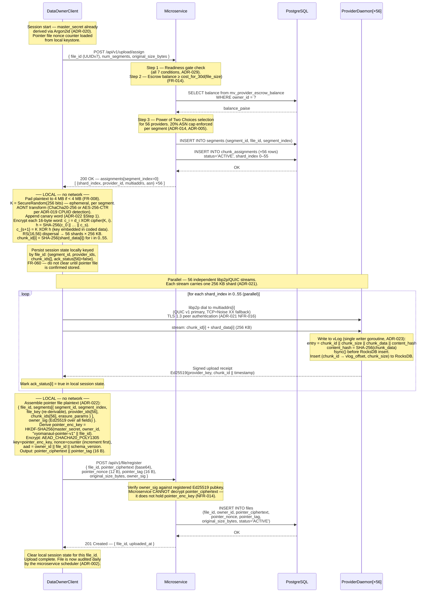
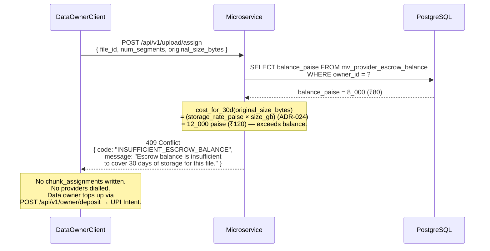
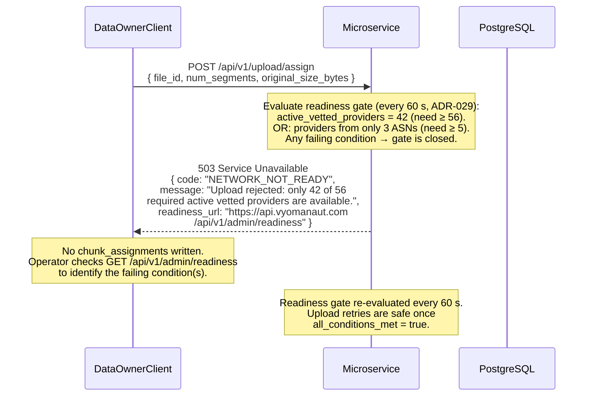
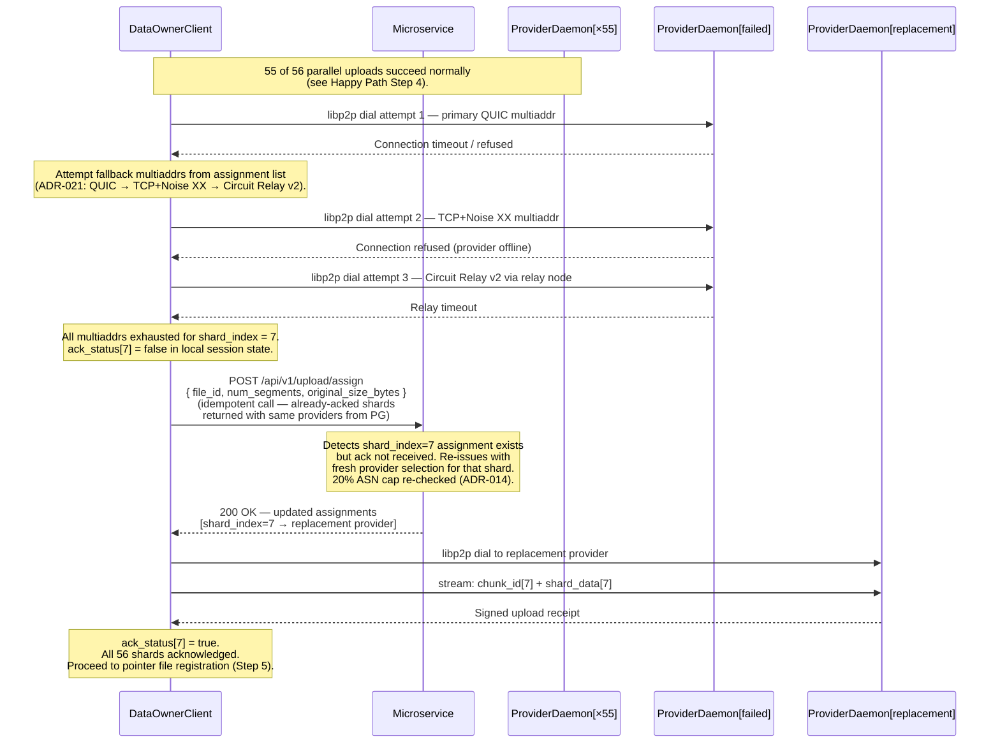

# Vyomanaut V2 — File Upload Sequence Diagram

**Document ID:** `VYOM-SEQ-001`  
**Version:** 1.0  
**Status:** Authoritative  
**Date:** April 2026  
**Author:** Vyomanaut Engineering  
**Repository:** [masamasaowl/Vyomanaut_Research](https://github.com/masamasaowl/Vyomanaut_Research)  
**Companion documents:**  
- [architecture.md §10 Data Encoding Pipeline](../architecture.md#10-data-encoding-pipeline)  
- [architecture.md §22 Runtime Flows — Flow 1](../architecture.md#22-runtime-flows)  
- [requirements.md §6.2 Data Owner — File Upload](../requirements.md#62-data-owner--file-upload)  
- [ADR-019](../../decisions/ADR-019-client-side-encryption.md) · [ADR-020](../../decisions/ADR-020-key-management.md) · [ADR-021](../../decisions/ADR-021-p2p-transfer-protocol.md) · [ADR-022](../../decisions/ADR-022-encryption-erasure-order.md)  

---

## Overview

This diagram covers the complete file upload flow: from a data owner initiating an upload
through AONT-RS encoding on their local device, provider assignment by the coordination
microservice, 56-way parallel libp2p/QUIC shard transfer directly to provider daemons, and
pointer file registration. The primary correctness property being illustrated is that the
encoding pipeline runs **entirely on the data owner's device** — the microservice and all
providers receive only encrypted fragments; neither the AONT key K nor plaintext ever leave
the data owner's machine. This property derives from [ADR-022](../../decisions/ADR-022-encryption-erasure-order.md)
(AONT-RS encoding pipeline) and [ADR-020](../../decisions/ADR-020-key-management.md) (pointer
file as the sole retrieval credential, encrypted with a key the microservice cannot hold).

---

## Participants

| Participant label | Role in this flow | Described in |
|---|---|---|
| `DataOwnerClient` | Runs the encoding pipeline locally; orchestrates all 56 shard uploads | [architecture.md §6](../architecture.md#6-component-overview) |
| `Microservice` | Enforces escrow balance check; assigns 56 providers (20% ASN cap); stores encrypted pointer ciphertext | [architecture.md §18](../architecture.md#18-coordination-microservice) |
| `PostgreSQL` | Persists `chunk_assignments`, `files`, `segments`; provides escrow balance via materialised view | [architecture.md §6](../architecture.md#6-component-overview) |
| `ProviderDaemon[×56]` | Receives one 256 KB shard each; writes to vLog; returns signed upload receipt | [architecture.md §16](../architecture.md#16-provider-storage-engine) |
| `Razorpay` | Smart Collect 2.0 — funds escrow balance on UPI deposit (pre-condition, not in upload path) | [architecture.md §17](../architecture.md#17-payment-system) |

---

## Happy Path

The happy path assumes the data owner has a sufficient escrow balance, the network readiness
gate is satisfied (all seven conditions in [ADR-029](../../decisions/ADR-029-bootstrap-minimum-viable-network.md)
are met), and all 56 selected providers are reachable. The encoding is shown for a
single segment (≤ 14 MB of plaintext); files larger than 14 MB repeat this sequence per
segment, with each segment processed independently.



### Cross-reference: diagram steps to ADRs and requirements

| Step # | Description | ADR / Requirement |
|---|---|---|
| 1a | Network readiness gate checked before any assignment | [ADR-029](../../decisions/ADR-029-bootstrap-minimum-viable-network.md), [FR-053](../requirements.md#611-network-readiness-gate) |
| 1b | Escrow balance ≥ 30-day cost before assignment is issued | [FR-014](../requirements.md#62-data-owner--file-upload) |
| 1c | Power of Two Choices provider selection, weighted by reliability score | [ADR-005](../../decisions/ADR-005-peer-selection.md) |
| 1d | 20% ASN cap enforced at `chunk_assignments` INSERT time | [ADR-014](../../decisions/ADR-014-adversarial-defences.md), [ADR-003](../../decisions/ADR-003-erasure-coding.md) |
| 2a | AONT key K generated with `SecureRandom(256 bits)`, never stored or transmitted | [ADR-022](../../decisions/ADR-022-encryption-erasure-order.md), [NFR-014](../requirements.md#74-security-and-privacy) |
| 2b | Cipher selection: ChaCha20-256 (no AES-NI) or AES-256-CTR (AES-NI), detected at daemon startup | [ADR-019](../../decisions/ADR-019-client-side-encryption.md) |
| 2c | Canary word appended before AONT to enable corruption detection on decode | [ADR-022](../../decisions/ADR-022-encryption-erasure-order.md), [FR-018](../requirements.md#63-data-owner--file-retrieval) |
| 2d | Key embedding: `c_{s+1} = K XOR SHA-256(all codewords)` — K recoverable only with all s+1 codewords | [ADR-022](../../decisions/ADR-022-encryption-erasure-order.md) |
| 2e | RS(16,56) systematic dispersal; shard 0–15 are direct AONT codewords | [ADR-003](../../decisions/ADR-003-erasure-coding.md), [ADR-022](../../decisions/ADR-022-encryption-erasure-order.md) |
| 2f | `chunk_id[i] = SHA-256(shard_data[i])` — content address, also the RocksDB lookup key | [ADR-023](../../decisions/ADR-023-provider-storage-engine.md), [ADR-017](../../decisions/ADR-017-audit-receipt-schema.md) |
| 3 | Upload session state persisted locally; enables crash recovery without retransmitting acknowledged shards | [FR-060](../requirements.md#614-data-owner--escrow-management-and-upload-resume) |
| 4a | QUIC v1 primary, TCP+Noise XX fallback; transport auto-selected by libp2p | [ADR-021](../../decisions/ADR-021-p2p-transfer-protocol.md) |
| 4b | Each connection authenticated at transport layer (TLS 1.3 / Noise XX peer ID) | [ADR-021](../../decisions/ADR-021-p2p-transfer-protocol.md), [NFR-016](../requirements.md#74-security-and-privacy) |
| 4c | Provider writes to vLog via single writer goroutine; fsync before RocksDB insert | [ADR-023](../../decisions/ADR-023-provider-storage-engine.md), [NFR-023](../requirements.md#75-reliability-and-correctness) |
| 4d | `content_hash = SHA-256(chunk_data)` embedded in vLog entry; verified on every subsequent read | [ADR-023](../../decisions/ADR-023-provider-storage-engine.md) |
| 5a | Pointer file pointer_nonce is a monotone counter incremented before use (never random) | [ADR-019](../../decisions/ADR-019-client-side-encryption.md), [ADR-020](../../decisions/ADR-020-key-management.md) |
| 5b | AEAD AAD includes `owner_id || file_id || schema_version` — prevents ciphertext transplant | [ADR-019](../../decisions/ADR-019-client-side-encryption.md) |
| 5c | Microservice stores pointer ciphertext blindly; zero-knowledge property holds even under microservice compromise | [ADR-020](../../decisions/ADR-020-key-management.md), [NFR-014](../requirements.md#74-security-and-privacy) |
| 5d | Session state cleared **only** after pointer file is confirmed stored | [FR-060](../requirements.md#614-data-owner--escrow-management-and-upload-resume) |

### What this diagram does not show

- **Key derivation internals** — how `master_secret` is derived from passphrase via Argon2id, and how `pointer_enc_key` descends from it via HKDF, are covered in [ADR-020](../../decisions/ADR-020-key-management.md) and [architecture.md §11](../architecture.md#11-key-hierarchy).
- **Multi-segment files** — for files larger than 14 MB, the sequence from Step 2 onward repeats independently for each segment. Each segment has its own fresh K, its own 56 shard assignments, and its own `segment_id`. The pointer file collects all segments before Step 5.
- **BIP-39 mnemonic backup** — the data owner's onboarding flow (displaying and confirming the recovery mnemonic) precedes this diagram and is covered in [FR-003](../requirements.md#61-data-owner--registration-and-onboarding).
- **Retrieval** — covered in [05 sequence diagram](./05-provider-lifecycle.md) and [architecture.md §22 Flow 5](../architecture.md#22-runtime-flows).
- **DHT record republication** — after upload, the availability service republishes DHT records for all new chunk IDs on a 12-hour cycle ([ADR-001](../../decisions/ADR-001-coordination-architecture.md), [ADR-006](../../decisions/ADR-006-polling-interval.md)). This background activity is not part of the upload flow.

---

## Failure Path 1: Escrow Balance Insufficient

The assignment service checks the data owner's current escrow balance before issuing any
provider assignments. If the balance is below the 30-day storage cost for the requested file,
the upload is rejected with HTTP 409 and no `chunk_assignments` rows are written.
The data owner must top up their escrow via UPI Intent before retrying. ([FR-014](../requirements.md#62-data-owner--file-upload))



### Cross-reference

| Step # | Description | ADR / Requirement |
|---|---|---|
| 1 | Balance queried from materialised view (up to 60 s stale — sufficient for this check) | [ADR-016](../../decisions/ADR-016-payment-db-schema.md), [FR-014](../requirements.md#62-data-owner--file-upload) |
| 2 | 409 returned before any `chunk_assignments` INSERT; database state unchanged | [FR-014](../requirements.md#62-data-owner--file-upload) |
| 3 | Deposit flow uses UPI Intent only; UPI Collect is deprecated (2026-02-28) | [ADR-011](../../decisions/ADR-011-escrow-payments.md), [NFR-029](../requirements.md#77-compliance-and-payments) |

### What this failure path does not show

- The UPI Intent deposit flow and Smart Collect 2.0 webhook processing — covered in [04-payment-release.md §Escrow deposit](./04-payment-release.md).
- Withdrawal of available balance — covered in [FR-059](../requirements.md#614-data-owner--escrow-management-and-upload-resume).
- How the storage rate is determined — product decision (OQ-001 in [requirements.md](../requirements.md#12-open-questions)).

---

## Failure Path 2: ASN Cap Cannot Be Satisfied (Network Not Ready)

The assignment service enforces the 20% ASN cap at write time for every segment. If the
active provider pool has too few distinct ASNs to satisfy the cap (or if any of the seven
readiness conditions in [ADR-029](../../decisions/ADR-029-bootstrap-minimum-viable-network.md)
are not yet met), the assignment is rejected with HTTP 503 and a `readiness_url` body field
pointing the operator to the per-condition status endpoint.



### Cross-reference

| Step # | Description | ADR / Requirement |
|---|---|---|
| 1 | Gate enforces seven simultaneous conditions — checked before any database write | [ADR-029](../../decisions/ADR-029-bootstrap-minimum-viable-network.md), [FR-053](../requirements.md#611-network-readiness-gate) |
| 2 | `readiness_url` in body links operator directly to per-condition status | [FR-054](../requirements.md#611-network-readiness-gate), `openapi.yaml 503ServiceUnavailable` |
| 3 | The 20% ASN cap with < 5 distinct ASNs means one ASN necessarily holds > 20% — structurally unsatisfiable | [ADR-014](../../decisions/ADR-014-adversarial-defences.md), [ADR-003](../../decisions/ADR-003-erasure-coding.md), [NFR-002](../requirements.md#71-durability) |

### What this failure path does not show

- The operator's response to a failed readiness gate (provider recruitment, Razorpay account cooling) — covered in [mvp.md §M8 Exit criterion](../mvp.md#milestone-8--network-readiness-gate-and-private-beta).
- A mid-upload ASN cap violation (where an assignment was issued successfully but a subsequent segment cannot be placed) — this is handled identically: 503 returned, session state retained for resume.

---

## Failure Path 3: Provider Dial Fails Mid-Upload

One or more of the 56 direct libp2p dials fails after the assignment has been issued. The
data owner client retries by dialling the next available multiaddr for that provider or,
after exhausting all multiaddrs, by requesting a replacement provider from the microservice.
Session state ensures already-acknowledged shards are not retransmitted. ([FR-060](../requirements.md#614-data-owner--escrow-management-and-upload-resume))



### Cross-reference

| Step # | Description | ADR / Requirement |
|---|---|---|
| 1 | Three-tier dial sequence: QUIC → TCP+Noise → Circuit Relay v2 | [ADR-021](../../decisions/ADR-021-p2p-transfer-protocol.md) |
| 2 | Session state `ack_status[]` persisted locally — crash between retries does not retransmit acked shards | [FR-060](../requirements.md#614-data-owner--escrow-management-and-upload-resume) |
| 3 | Idempotent re-call to `/upload/assign` returns same assignments for acknowledged shards | [FR-060](../requirements.md#614-data-owner--escrow-management-and-upload-resume) |
| 4 | 20% ASN cap re-enforced for replacement provider selection | [ADR-014](../../decisions/ADR-014-adversarial-defences.md) |
| 5 | Replacement provider receives the same shard data — content-addressed by `chunk_id` | [ADR-023](../../decisions/ADR-023-provider-storage-engine.md) |

### What this failure path does not show

- The internal libp2p DCUtR retry logic (`max_hole_punch_retries = 1` per [ADR-021](../../decisions/ADR-021-p2p-transfer-protocol.md) and [Paper 30](../../research/paper-30-trautwein-dcutr-nat.md)) — this happens below the application layer.
- How relay node selection works when multiple relays are available — covered in [ADR-021](../../decisions/ADR-021-p2p-transfer-protocol.md).
- What happens if the replacement provider also fails — the same retry loop applies with successive re-calls to `/upload/assign`.

---

## Failure Path 4: Crash Recovery — Client Crashes After Partial Upload

The data owner client crashes after some but not all 56 shard uploads have been
acknowledged. On restart, the locally persisted session state enables resume without
retransmitting already-acknowledged shards. The pointer file is not registered until all 56
shards are confirmed, ensuring the file record is never created in a partial state.
([FR-060](../requirements.md#614-data-owner--escrow-management-and-upload-resume))

```mermaid
sequenceDiagram
    %% File Upload — Crash Recovery
    %% FR-060, ADR-022, ADR-020

    participant C  as DataOwnerClient
    participant MS as Microservice
    participant PG as PostgreSQL
    participant PD as ProviderDaemon[×56]

    Note over C: Original session before crash:<br/>  file_id = abc-123 (UUIDv7)<br/>  AONT-RS encoding complete (all 56 shards in memory)<br/>  Session state persisted locally:<br/>  { segment_id, provider_ids[56], chunk_ids[56],<br/>    ack_status = [true ×38, false ×18] }<br/>  Crash occurs here — shards 38–55 not yet uploaded.

    Note over C: ── CLIENT RESTART ──<br/>Daemon loads encrypted keystore.<br/>Derives master_secret from passphrase<br/>(Argon2id, ADR-020).<br/>Finds pending session state for file_id abc-123.

    C->>MS: POST /api/v1/upload/assign<br/>{ file_id: abc-123, num_segments: 1,<br/>  original_size_bytes }
    Note over MS: file_id abc-123 already has chunk_assignments.<br/>Returns existing assignments (idempotent).
    MS-->>C: 200 OK — same 56 assignments as before

    Note over C: Re-encodes shards 38–55 only<br/>(AONT is deterministic given the same K;<br/>however K is ephemeral and not stored —<br/>client must re-encode from plaintext for<br/>the un-acked shards using the session state).<br/><br/>Shards 0–37: ack_status = true → skip upload.

    loop for shard_index in 38..55 (parallel)
        C->>PD: libp2p dial — upload shard_data[i] (256 KB)
        PD-->>C: Signed upload receipt
        Note over C: ack_status[i] = true.
    end

    Note over C: All 56 shards acknowledged.<br/>Re-derive pointer_enc_key = HKDF(master_secret, …).<br/>Re-encrypt pointer file (increment nonce counter first —<br/>prevents nonce reuse, ADR-019).
    C->>MS: POST /api/v1/file/register<br/>{ file_id, pointer_ciphertext, … }
    MS->>PG: INSERT INTO files …
    PG-->>MS: OK
    MS-->>C: 201 Created
    Note over C: Clear local session state for file_id abc-123.
```

### Cross-reference

| Step # | Description | ADR / Requirement |
|---|---|---|
| 1 | Session state keyed by `file_id` persisted before first libp2p dial | [FR-060](../requirements.md#614-data-owner--escrow-management-and-upload-resume) |
| 2 | Idempotent re-call to `/upload/assign` — same assignments returned from `chunk_assignments` | [FR-060](../requirements.md#614-data-owner--escrow-management-and-upload-resume) |
| 3 | K is ephemeral and not stored — un-acked shards must be re-encoded from plaintext on resume | [ADR-022](../../decisions/ADR-022-encryption-erasure-order.md) |
| 4 | Pointer file nonce counter is incremented before use on every session — prevents nonce reuse even across restarts | [ADR-019](../../decisions/ADR-019-client-side-encryption.md), [ADR-020](../../decisions/ADR-020-key-management.md) |
| 5 | `files` table row only inserted after all 56 shards are acked — no partial file record | [FR-060](../requirements.md#614-data-owner--escrow-management-and-upload-resume) |

### What this failure path does not show

- Recovery from a keystore corruption scenario (nonce counter lost) — the daemon refuses to re-encrypt with a seen nonce; the owner must rotate the pointer file key per [ADR-019](../../decisions/ADR-019-client-side-encryption.md).
- Multi-segment crash recovery — the identical pattern applies per segment; segments are independent.

---

## Failure Path 5: Microservice Replica Failover During Assignment

The assignment request lands on Replica A, which fails after inserting `chunk_assignments`
but before returning to the client. The client retries; Replica B or C (healthy, R=2 satisfied)
serves the idempotent retry and returns the same assignments. No duplicate rows are written.
([ADR-025](../../decisions/ADR-025-microservice-consistency-mechanism.md), [ADR-013](../../decisions/ADR-013-consistency-model.md))

```mermaid
sequenceDiagram
    %% File Upload — Microservice Replica Failover During Assignment
    %% ADR-025 ((3,2,2) quorum), ADR-013 (I-confluence map)

    participant C   as DataOwnerClient
    participant MSA as Microservice[Replica A]
    participant MSB as Microservice[Replica B]
    participant PG  as PostgreSQL

    C->>MSA: POST /api/v1/upload/assign { file_id, … }
    Note over MSA: Escrow check passes. Provider selection<br/>complete (ASN cap enforced).
    MSA->>PG: INSERT INTO segments + chunk_assignments (W=2 quorum write)
    PG-->>MSA: OK (committed to primary + one replica)
    Note over MSA: Replica A crashes before<br/>returning the HTTP 200 to the client.

    C->>C: Request timeout. Retry on next<br/>available replica (client-driven routing,<br/>membership cache refreshed from healthy replica).

    C->>MSB: POST /api/v1/upload/assign { file_id, … }
    Note over MSB: file_id already has chunk_assignments<br/>in PostgreSQL (written by Replica A).<br/>INSERT is I-confluent (UUIDv7, ADR-013) —<br/>idempotency guaranteed by file_id UNIQUE constraint.
    MSB->>PG: SELECT existing assignments for file_id
    PG-->>MSB: existing chunk_assignments (56 rows)
    MSB-->>C: 200 OK — same 56 assignments

    Note over C: Proceeds with shard upload.<br/>No duplicate assignments; no data inconsistency.
```

### Cross-reference

| Step # | Description | ADR / Requirement |
|---|---|---|
| 1 | W=2 quorum write ensures assignment survives single-replica failure | [ADR-025](../../decisions/ADR-025-microservice-consistency-mechanism.md) |
| 2 | Client-driven routing refreshes membership from random replica every 10 s | [ADR-025](../../decisions/ADR-025-microservice-consistency-mechanism.md) |
| 3 | `INSERT INTO chunk_assignments` is I-confluent — UUIDv7 PKs, no floor invariant | [ADR-013](../../decisions/ADR-013-consistency-model.md) |
| 4 | Retry to Replica B sees the committed data from Replica A via Postgres primary | [ADR-025](../../decisions/ADR-025-microservice-consistency-mechanism.md) |

### What this failure path does not show

- Gossip membership convergence after Replica A restarts — covered in [ADR-025](../../decisions/ADR-025-microservice-consistency-mechanism.md).
- The case where both Replica A and B fail simultaneously — this violates the (3,2,2) quorum, which requires at least 2 healthy replicas; the system returns 503 until quorum is restored.

---

## Invariants Demonstrated

| Invariant | Where it appears in this flow | Source |
|---|---|---|
| AONT key K never transmitted or stored | Step 2 (encoding) — K generated, used, and discarded locally; not in any network message | [ADR-022](../../decisions/ADR-022-encryption-erasure-order.md), [architecture.md §9.5](../architecture.md#95-security-boundary-summary) |
| 20% ASN cap enforced at assignment time | Step 1c (happy path) and Step 4 (retry after dial failure) | [ADR-014](../../decisions/ADR-014-adversarial-defences.md), Invariant 4 in [trade-offs.md](../trade-offs.md) |
| Microservice stores only pointer ciphertext (zero-knowledge) | Step 5c — no decryption key transmitted; blind store confirmed | [ADR-020](../../decisions/ADR-020-key-management.md), [NFR-014](../requirements.md#74-security-and-privacy) |
| Pointer file registered only after all shards acked | Session state cleared only on 201 response (both happy path and crash recovery) | [FR-060](../requirements.md#614-data-owner--escrow-management-and-upload-resume) |
| Nonce counter monotone; incremented before use | Step 5a and crash recovery Step 3 explicitly note the counter increment | [ADR-019](../../decisions/ADR-019-client-side-encryption.md) |
| content_hash embedded and fsync'd before index insert | Step 4c (provider-side write order) | [ADR-023](../../decisions/ADR-023-provider-storage-engine.md), Invariant in [data-model.md](../data-model.md#3-design-invariants) |

---

## Related Diagrams

- **[02-audit-cycle.md](./02-audit-cycle.md)** — what happens to the chunks stored in this flow: daily challenge-response audits that verify providers still hold their assigned shards.
- **[03-repair-flow.md](./03-repair-flow.md)** — what happens when one of the 56 provider daemons that received a shard in this flow goes offline permanently.
- **[04-payment-release.md](./04-payment-release.md)** — how the data owner's escrow deposit (pre-condition for this flow) is processed, and how provider earnings from audit passes on these shards are released monthly.
- **[05-provider-lifecycle.md](./05-provider-lifecycle.md)** — the registration and vetting flow that a provider must complete before they can appear in the assignment pool used in Step 1c of this flow.