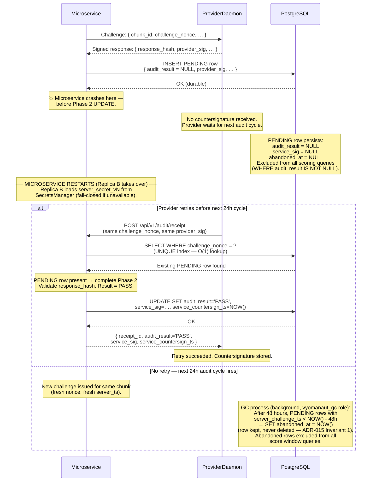
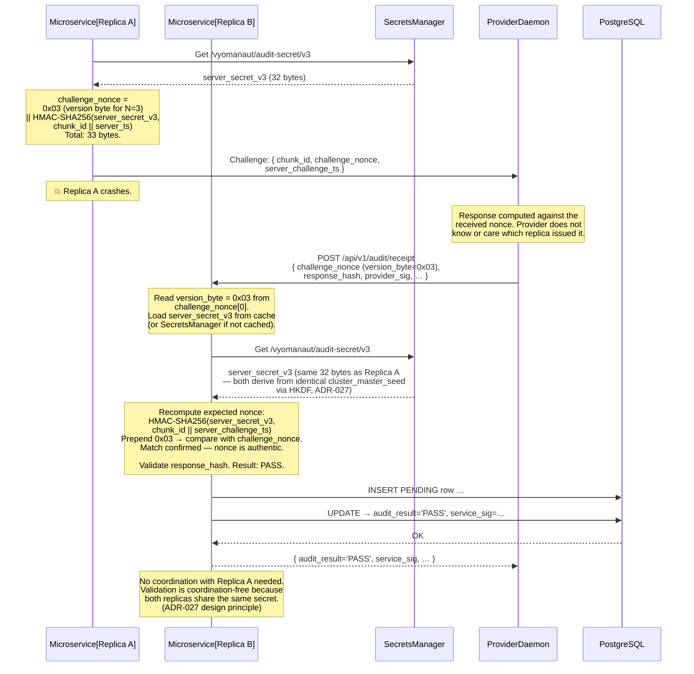
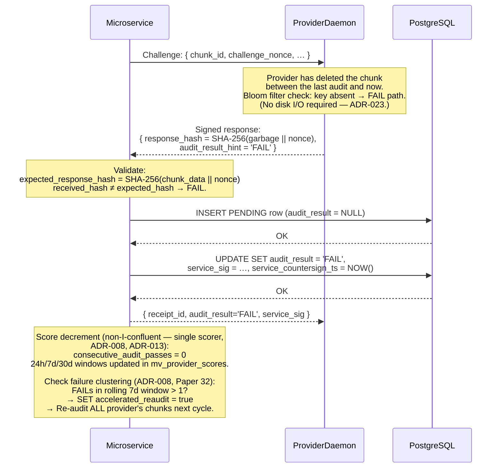
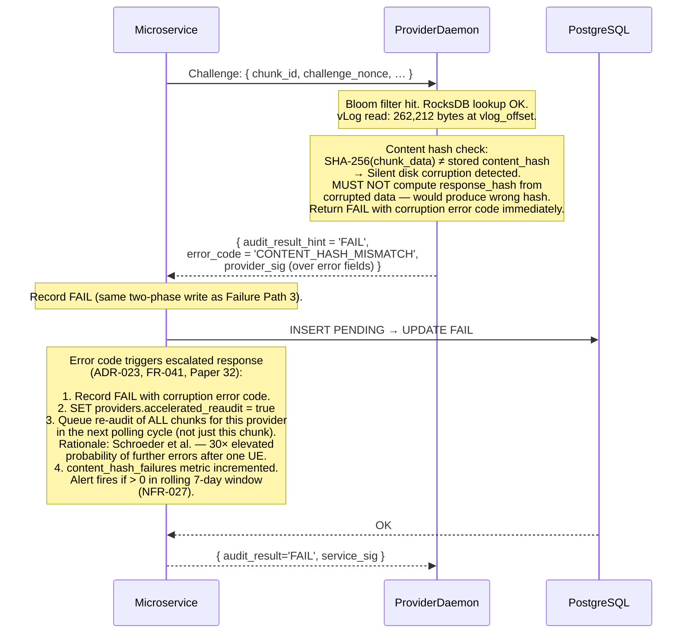
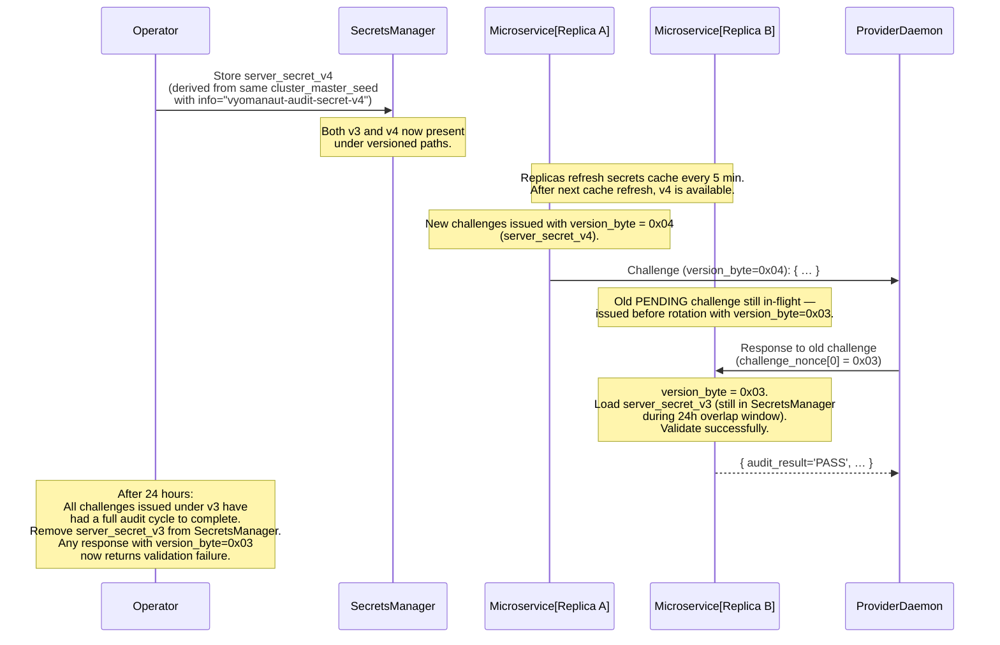

# Vyomanaut V2 — Audit Cycle Sequence Diagram

**Document ID:** `VYOM-SEQ-002`  
**Version:** 1.0  
**Status:** Authoritative  
**Date:** April 2026  
**Author:** Vyomanaut Engineering  
**Repository:** [masamasaowl/Vyomanaut_Research](https://github.com/masamasaowl/Vyomanaut_Research)  
**Companion documents:**  
- [architecture.md §14 Audit System](../architecture.md#14-audit-system)  
- [architecture.md §22 Runtime Flows — Flow 2](../architecture.md#22-runtime-flows)  
- [requirements.md §6.8 Audit System](../requirements.md#68-audit-system)  
- [ADR-002](../../decisions/ADR-002-proof-of-storage.md) · [ADR-006](../../decisions/ADR-006-polling-interval.md) · [ADR-014](../../decisions/ADR-014-adversarial-defences.md) · [ADR-015](../../decisions/ADR-015-audit-trail.md) · [ADR-017](../../decisions/ADR-017-audit-receipt-schema.md) · [ADR-027](../../decisions/ADR-027-cluster-audit-secret.md)

---

## Overview

This diagram covers the daily audit cycle: the microservice issues a cryptographic
challenge to each provider for each assigned chunk; the provider reads the chunk from local
disk, verifies its integrity, computes a response hash, and returns a signed receipt; the
microservice validates the response and durably records the result via a crash-safe two-phase
write. The primary correctness properties being illustrated are: (1) the challenge nonce is
unforgeable — a provider cannot compute a valid response without the actual chunk data;
(2) the audit receipt is tamper-evident — the INSERT-only table and dual Ed25519 signatures
ensure neither party can alter the record after the fact; (3) cross-replica nonce validation
works correctly across failover — any microservice replica can validate any challenge nonce
because all replicas share the same `server_secret_vN` derived from a common cluster master
seed. These properties derive from [ADR-002](../../decisions/ADR-002-proof-of-storage.md),
[ADR-015](../../decisions/ADR-015-audit-trail.md), and [ADR-027](../../decisions/ADR-027-cluster-audit-secret.md).

---

## Participants

| Participant label | Role in this flow | Described in |
|---|---|---|
| `Microservice` | Issues challenges; validates responses; executes two-phase receipt write; updates per-provider RTO | [architecture.md §18](../architecture.md#18-coordination-microservice) |
| `SecretsManager` | Holds the cluster master seed; provides `server_secret_vN` on demand | [architecture.md §8](../architecture.md#8-deployment-topology) |
| `ProviderDaemon` | Reads chunk from vLog; verifies `content_hash`; computes and signs audit response | [architecture.md §16](../architecture.md#16-provider-storage-engine) |
| `PostgreSQL` | Stores audit receipts (INSERT-only); serves materialised reliability score view | [architecture.md §6](../architecture.md#6-component-overview) |

---

## Happy Path

The happy path shows a single audit challenge for one chunk against one provider. In
production, the scheduler issues challenges for all assigned chunks across all active
providers within each 24-hour window, with randomised jitter to prevent just-in-time
caching attacks. Only the single-challenge flow is diagrammed; the parallel scheduler
loop follows this exact sequence per challenge.

```mermaid
sequenceDiagram
    %% Audit Cycle — Happy Path
    %% ADR-002 (PoR), ADR-006 (polling/RTO), ADR-014 (JIT defence),
    %% ADR-015 (two-phase write), ADR-017 (receipt schema), ADR-027 (cluster secret)

    participant MS  as Microservice
    participant SM  as SecretsManager
    participant PD  as ProviderDaemon
    participant PG  as PostgreSQL

    Note over MS: Audit scheduler fires for provider P,<br/>chunk C (one of up to N×chunks_per_provider<br/>per day, ADR-006).<br/>Timing is randomised within the 24h window<br/>to prevent predictive JIT caching (ADR-014 Defence 3).

    %% ── Step 1: Load cluster audit secret ──────────────────────
    Note over MS: Check in-memory cache for server_secret_vN<br/>(5-minute TTL, ADR-027).
    MS->>SM: Get /vyomanaut/audit-secret/v{N}
    SM-->>MS: server_secret_vN (32 bytes)
    Note over MS: Cache loaded. server_secret_vN never written<br/>to disk on the microservice. (ADR-027)

    %% ── Step 2: Generate challenge nonce ───────────────────────
    Note over MS: server_ts = NOW() (server-generated; provider<br/>cannot influence it — prevents backdating, ADR-017).<br/><br/>challenge_nonce =<br/>  version_byte (1 B, = N mod 256)<br/>  || HMAC-SHA256(server_secret_vN,<br/>               chunk_id || server_ts)<br/><br/>Total: 33 bytes (66 hex chars). MUST NOT be 32 bytes.<br/>(ADR-027, requirements.md §9.3)

    %% ── Step 3: Dispatch challenge to provider ──────────────────
    Note over MS: Dial address from providers.last_known_multiaddrs<br/>(heartbeat-maintained, ADR-028). DHT is fallback only.<br/><br/>Per-provider deadline:<br/>  deadline_ms = ceil((256 / p95_throughput_kbps) × 1500)<br/>  (ADR-014 Defence 2).

    MS->>PD: libp2p challenge: { chunk_id, challenge_nonce (33 B),<br/>  server_challenge_ts, deadline_ms }

    %% ── Step 4: Provider reads chunk and computes response ──────
    Note over PD: Step 1 — Bloom filter check:<br/>  chunk_id present? (ADR-023)<br/>  If absent → FAIL immediately, no disk I/O.
    Note over PD: Step 2 — RocksDB lookup:<br/>  Get (vlog_offset, chunk_size).<br/>  Typically a block-cache hit → no disk I/O.
    Note over PD: Step 3 — vLog read:<br/>  Read 262,212 bytes at vlog_offset.<br/>  One random disk read: ~1 ms SSD / ~12–15 ms HDD.
    Note over PD: Step 4 — Content hash verification:<br/>  SHA-256(chunk_data) == stored content_hash?<br/>  If NO → return FAIL with corruption error code<br/>  (ADR-023, FR-041). Triggers accelerated re-audit.
    Note over PD: Step 5 — Compute response:<br/>  response_hash =<br/>    SHA-256(chunk_data || challenge_nonce)<br/>  Cannot be computed without the actual chunk data<br/>  (ADR-002, NFR-015).
    Note over PD: Step 6 — Sign receipt:<br/>  provider_sig = Ed25519(provider_key,<br/>    canonical_json_of_receipt_fields)

    PD-->>MS: Signed audit response:<br/>{ receipt_id (UUIDv7), chunk_id, file_id,<br/>  provider_id, challenge_nonce,<br/>  server_challenge_ts, response_hash,<br/>  response_latency_ms, provider_sig }

    %% ── Step 5: Phase 1 — Durable PENDING write ────────────────
    Note over MS: Phase 1 of crash-safe two-phase write (ADR-015):<br/>  INSERT PENDING row before validation.<br/>  Durable before Phase 2.
    MS->>PG: INSERT INTO audit_receipts<br/>{ receipt_id, schema_version=1,<br/>  chunk_id, file_id, provider_id,<br/>  challenge_nonce (33 B),<br/>  server_challenge_ts,<br/>  response_hash, response_latency_ms,<br/>  audit_result = NULL,  ← in-flight state<br/>  provider_sig,<br/>  service_sig = NULL,<br/>  service_countersign_ts = NULL,<br/>  jit_flag = false }
    PG-->>MS: OK (row durable — WAL flushed)

    %% ── Step 6: Validate response ───────────────────────────────
    Note over MS: Verify provider_sig against<br/>providers.ed25519_public_key.<br/><br/>Recompute expected_response_hash =<br/>  SHA-256(chunk_data || challenge_nonce)<br/>  (microservice has chunk content address from<br/>   chunk_assignments.chunk_id).<br/><br/>Compare response_hash == expected_response_hash.<br/>→ Result: PASS.
    Note over MS: JIT detection (ADR-014 Defence 3):<br/>  threshold = (256 / p95_throughput_kbps) × 0.3<br/>  response_latency_ms < threshold?<br/>  → jit_flag = true (log only at 1st flag; 3+ in 7d → score penalty).

    %% ── Step 7: Phase 2 — Countersign and finalise ──────────────
    Note over MS: service_ts = NOW().<br/>service_sig = Ed25519(microservice_key,<br/>  canonical_json(provider_sig || service_ts))

    MS->>PG: UPDATE audit_receipts<br/>SET audit_result = 'PASS',<br/>    service_sig = ...,<br/>    service_countersign_ts = NOW(),<br/>    jit_flag = false<br/>WHERE receipt_id = ? AND audit_result IS NULL
    Note over PG: Row security policy: only this specific<br/>NULL → terminal transition is permitted.<br/>No other UPDATE or DELETE ever. (NFR-021)
    PG-->>MS: OK

    %% ── Step 8: Return countersignature to provider ─────────────
    MS-->>PD: { receipt_id, audit_result='PASS',<br/>  service_sig, service_countersign_ts, jit_flag }
    Note over PD: Provider stores service_sig as payment evidence.<br/>This is proof the microservice recorded the PASS.

    %% ── Step 9: Update per-provider RTO ────────────────────────
    Note over MS: EWMA update for p95_throughput_kbps and RTO:<br/>  avg_rtt_ms = α × response_latency_ms + (1-α) × avg_rtt_ms<br/>  var_rtt_ms = α × |latency - avg_rtt_ms|² + (1-α) × var_rtt_ms<br/>  RTO = avg_rtt_ms + 4 × var_rtt_ms<br/>  (ADR-006, Paper 28)<br/><br/>  Materialised view mv_provider_scores refreshed<br/>  asynchronously (ADR-008). Score feeds release<br/>  multiplier computation (ADR-024).
```

### Cross-reference: diagram steps to ADRs and requirements

| Step # | Description | ADR / Requirement |
|---|---|---|
| 1 | Secrets manager cache (5 min TTL); fail-closed on startup if unavailable | [ADR-027](../../decisions/ADR-027-cluster-audit-secret.md), [NFR-018](../requirements.md#74-security-and-privacy) |
| 2a | `challenge_nonce` = 1-byte version + 32-byte HMAC; total 33 bytes (66 hex) | [ADR-027](../../decisions/ADR-027-cluster-audit-secret.md), [NFR-020](../requirements.md#74-security-and-privacy) |
| 2b | `server_ts` generated by microservice — provider cannot backdate or predict | [ADR-017](../../decisions/ADR-017-audit-receipt-schema.md) |
| 3a | Challenge dispatched to `last_known_multiaddrs` (heartbeat address); DHT fallback only | [ADR-028](../../decisions/ADR-028-provider-heartbeat.md), [FR-037](../requirements.md#68-audit-system) |
| 3b | Per-provider deadline = `ceil((chunk_size_kb / p95_throughput_kbps) × 1500)` | [ADR-014](../../decisions/ADR-014-adversarial-defences.md), [NFR-007](../requirements.md#73-performance) |
| 4a–b | Bloom filter + RocksDB block cache typically absorbs lookup with zero disk I/O | [ADR-023](../../decisions/ADR-023-provider-storage-engine.md) |
| 4c | One random disk read (vLog at stored offset): ~1 ms SSD, ~12–15 ms HDD | [ADR-023](../../decisions/ADR-023-provider-storage-engine.md), [NFR-008](../requirements.md#73-performance) |
| 4d | `content_hash` verification on every read — silent corruption surfaces as FAIL | [ADR-023](../../decisions/ADR-023-provider-storage-engine.md), [FR-041](../requirements.md#68-audit-system) |
| 4e | `response_hash = SHA-256(chunk_data || challenge_nonce)` — unforgeable without chunk | [ADR-002](../../decisions/ADR-002-proof-of-storage.md), [NFR-015](../requirements.md#74-security-and-privacy) |
| 5 | Phase 1: PENDING row durable before validation — crash between phases is safe | [ADR-015](../../decisions/ADR-015-audit-trail.md), [FR-039](../requirements.md#68-audit-system) |
| 6a | Provider signature verified against registered `ed25519_public_key` | [ADR-017](../../decisions/ADR-017-audit-receipt-schema.md) |
| 6b | JIT flag threshold: `response_latency_ms < (chunk_size / p95_throughput) × 0.3` | [ADR-014](../../decisions/ADR-014-adversarial-defences.md), [ADR-017](../../decisions/ADR-017-audit-receipt-schema.md) |
| 7 | `service_sig` covers `(provider_sig || service_ts)` — countersignature is non-repudiable | [ADR-017](../../decisions/ADR-017-audit-receipt-schema.md), [ADR-015](../../decisions/ADR-015-audit-trail.md) |
| 8 | Row security policy permits only the NULL → terminal UPDATE; no other mutation | [NFR-021](../requirements.md#75-reliability-and-correctness), [ADR-015](../../decisions/ADR-015-audit-trail.md) |
| 9 | Per-provider RTO updated via EWMA after every response; switches from pool-median after 5 samples | [ADR-006](../../decisions/ADR-006-polling-interval.md), [FR-040](../requirements.md#68-audit-system) |

### What this diagram does not show

- The full audit scheduler loop — in production, challenges are batched and parallelised for all N providers × chunks. The sequence above is one iteration of that loop.
- How `p95_throughput_kbps` is initialised during the vetting period — covered in [ADR-014](../../decisions/ADR-014-adversarial-defences.md) and [ADR-005](../../decisions/ADR-005-peer-selection.md).
- How the materialised view `mv_provider_scores` is refreshed and how scores feed the monthly release multiplier — covered in [04-payment-release.md](./04-payment-release.md).
- The DHT-based address fallback when `multiaddr_stale = true` — covered in [ADR-028](../../decisions/ADR-028-provider-heartbeat.md).

---

## Failure Path 1: Replica Fails Between Phase 1 and Phase 2

The microservice crashes after writing the PENDING row to PostgreSQL but before completing
Phase 2 (setting `audit_result`, `service_sig`, and `service_countersign_ts`). The provider
receives no countersignature. On the next audit cycle the provider receives a new challenge;
the orphaned PENDING row is garbage-collected after 48 hours. Idempotent retry logic ensures
a provider that re-submits the same response before the next cycle receives the existing
countersignature without creating a duplicate row.
([ADR-015](../../decisions/ADR-015-audit-trail.md))



### Cross-reference

| Step # | Description | ADR / Requirement |
|---|---|---|
| 1 | Phase 1 INSERT is durable (Postgres WAL) before any further processing | [ADR-015](../../decisions/ADR-015-audit-trail.md), [FR-039](../requirements.md#68-audit-system) |
| 2 | PENDING row (`audit_result = NULL`) excluded from scoring window queries by `WHERE audit_result IS NOT NULL` | [ADR-015](../../decisions/ADR-015-audit-trail.md), [ADR-008](../../decisions/ADR-008-reliability-scoring.md) |
| 3 | Provider retry within 48h: UNIQUE index on `challenge_nonce` detects duplicate; Phase 2 completes idempotently | [ADR-015](../../decisions/ADR-015-audit-trail.md) |
| 4 | GC marks stale PENDING rows `abandoned_at` — never DELETE (Invariant 1 in [data-model.md](../data-model.md)) | [ADR-015](../../decisions/ADR-015-audit-trail.md), [NFR-021](../requirements.md#75-reliability-and-correctness) |
| 5 | Row security policy: `vyomanaut_gc` role may only set `abandoned_at` on NULL-result rows older than 48h | [data-model.md §6](../data-model.md#6-row-security-policies) |

### What this failure path does not show

- Replica restart and gossip re-convergence — covered in [ADR-025](../../decisions/ADR-025-microservice-consistency-mechanism.md).
- The case where the provider itself crashes between computing the response and submitting it — the provider re-derives the response from local disk on daemon restart and retries.

---

## Failure Path 2: Cross-Replica Failover — Replica A Issues, Replica B Validates

This is the core correctness scenario for [ADR-027](../../decisions/ADR-027-cluster-audit-secret.md).
Replica A generates the challenge nonce using `server_secret_vN`. Before the provider responds,
Replica A fails. The provider's response arrives at Replica B, which must validate the nonce
without any coordination with Replica A — the version byte in the nonce identifies which
`server_secret_vN` to load, and both replicas derive the identical secret from the shared
cluster master seed.



### Cross-reference

| Step # | Description | ADR / Requirement |
|---|---|---|
| 1 | Version byte in nonce prefix identifies `server_secret_vN` without out-of-band metadata | [ADR-027](../../decisions/ADR-027-cluster-audit-secret.md), [NFR-020](../requirements.md#74-security-and-privacy) |
| 2 | Both replicas derive `server_secret_vN = HKDF-SHA256(cluster_master_seed, cluster_id, info)` — identical output given identical inputs | [ADR-027](../../decisions/ADR-027-cluster-audit-secret.md) |
| 3 | No cross-replica coordination required at validation time — the version byte is sufficient | [ADR-027](../../decisions/ADR-027-cluster-audit-secret.md), [ADR-013](../../decisions/ADR-013-consistency-model.md) |
| 4 | Without this ADR, Replica B would hold a different (or no) `server_secret` and the nonce would not validate — producing systematic false FAILs during every failover | [ADR-027](../../decisions/ADR-027-cluster-audit-secret.md) context section |

### What this failure path does not show

- The rotation protocol (adding `server_secret_v{N+1}` with a 24-hour overlap window) — covered in [ADR-027 §4](../../decisions/ADR-027-cluster-audit-secret.md).
- Gossip membership convergence after Replica A restarts — covered in [ADR-025](../../decisions/ADR-025-microservice-consistency-mechanism.md).

---

## Failure Path 3: Provider Returns Wrong Response Hash (FAIL)

The provider has deleted their chunk, or it has been corrupted in a way that was not caught
by the content hash (an extremely unlikely scenario given SHA-256 collision resistance). The
computed `response_hash` does not match the expected value. The result is `FAIL`. The
provider's reliability score is decremented; after sustained FAILs, the provider will hit
the departure threshold.



### Cross-reference

| Step # | Description | ADR / Requirement |
|---|---|---|
| 1 | Bloom filter absent path — no disk I/O; immediate FAIL return | [ADR-023](../../decisions/ADR-023-provider-storage-engine.md) |
| 2 | `response_hash` mismatch detected at microservice, not self-reported by provider | [ADR-002](../../decisions/ADR-002-proof-of-storage.md), [NFR-015](../requirements.md#74-security-and-privacy) |
| 3 | Score decrement is non-I-confluent (floor ≥ 0); must go through single authoritative scorer | [ADR-008](../../decisions/ADR-008-reliability-scoring.md), [ADR-013](../../decisions/ADR-013-consistency-model.md) |
| 4 | `consecutive_audit_passes` reset to 0 — vetting period restart if in VETTING state | [ADR-005](../../decisions/ADR-005-peer-selection.md) |
| 5 | Failure clustering: > 1 FAIL in 7d triggers accelerated re-audit (Schroeder: 30× elevated further failure probability) | [ADR-008](../../decisions/ADR-008-reliability-scoring.md), [Paper 32](../../research/paper-32-schroeder-flash-reliability.md) |

### What this failure path does not show

- The repair flow triggered when sustained FAILs push the available shard count below r0=8 — covered in [03-repair-flow.md](./03-repair-flow.md).
- The payment consequences of FAILs (no DEPOSIT events for FAIL results) — covered in [04-payment-release.md](./04-payment-release.md).

---

## Failure Path 4: Provider Silent — RTO Exceeded (TIMEOUT)

The microservice dials the provider's last known multiaddr and dispatches the challenge, but
receives no response within the per-provider RTO. The result is `TIMEOUT`. Unlike FAIL, a
TIMEOUT may indicate a transient absence (nightly offline, DHCP rotation) rather than data
loss. The provider's score decrements, but no repair is triggered until the 72-hour departure
threshold is crossed.

```mermaid
sequenceDiagram
    %% Audit Cycle — Provider silent → TIMEOUT
    %% ADR-006 (RTO, polling, departure threshold)

    participant MS as Microservice
    participant PD as ProviderDaemon
    participant PG as PostgreSQL

    Note over MS: Per-provider RTO = avg_rtt_ms + 4 × var_rtt_ms<br/>(TCP-style formula, ADR-006, Paper 28).<br/>New providers: pool-median RTO until 5 samples.<br/>Example: avg=400ms, var=50ms → RTO = 600ms.

    MS->>PD: Challenge dispatched to last_known_multiaddrs
    Note over PD: Provider is offline (nightly absence,<br/>DHCP rotation, or permanent departure).<br/>No response.

    Note over MS: RTO elapsed (e.g. 600 ms).<br/>No response received.<br/>response_latency_ms = NULL for TIMEOUT rows.

    MS->>PG: INSERT INTO audit_receipts<br/>{ audit_result = 'TIMEOUT',<br/>  response_hash = NULL,<br/>  response_latency_ms = NULL,<br/>  provider_sig = NULL,<br/>  service_sig = Ed25519(ms_key,<br/>    {provider_id||chunk_id||nonce||'TIMEOUT'||ts}),<br/>  service_countersign_ts = NOW() }
    Note over PG: TIMEOUT rows have service_sig but no provider_sig.<br/>Single-phase write (no Phase 1/2 split needed<br/>— provider never responded).
    PG-->>MS: OK

    Note over MS: Score decrement (same as FAIL path).<br/>consecutive_audit_passes = 0.<br/><br/>Update last_heartbeat_ts check:<br/>  Has provider been absent > 72h total?<br/>  (separate departure detector, ADR-006)<br/>  If NO → wait; next 24h challenge will retry.<br/>  If YES → trigger silent departure flow<br/>           (see 03-repair-flow.md).

    Note over MS: multiaddr_stale flag:<br/>  2+ consecutive heartbeat misses →<br/>  SET multiaddr_stale = true.<br/>  Next challenge attempts DHT lookup<br/>  as fallback address source (ADR-028).
```

### Cross-reference

| Step # | Description | ADR / Requirement |
|---|---|---|
| 1 | RTO = `avg_rtt_ms + 4 × var_rtt_ms`; initialised to pool median for new providers; updated by EWMA | [ADR-006](../../decisions/ADR-006-polling-interval.md), [FR-040](../requirements.md#68-audit-system) |
| 2 | TIMEOUT rows have `service_sig` (microservice signs the timeout declaration) but `provider_sig = NULL` | [ADR-017](../../decisions/ADR-017-audit-receipt-schema.md), [data-model.md §8.10](../data-model.md#810-audit_receiptsservice_sig) |
| 3 | TIMEOUT is single-phase write — no PENDING intermediate state needed (no provider response to validate) | [ADR-015](../../decisions/ADR-015-audit-trail.md) |
| 4 | 72h departure threshold check is separate from per-challenge RTO — one TIMEOUT ≠ departure | [ADR-006](../../decisions/ADR-006-polling-interval.md), [ADR-007](../../decisions/ADR-007-provider-exit-states.md) |
| 5 | `multiaddr_stale = true` on 2+ missed heartbeats → DHT fallback for next challenge dispatch | [ADR-028](../../decisions/ADR-028-provider-heartbeat.md) |

### What this failure path does not show

- DHT fallback address lookup when `multiaddr_stale = true` — covered in [ADR-028](../../decisions/ADR-028-provider-heartbeat.md).
- How TIMEOUT score decrements interact with the 30-day release multiplier — covered in [04-payment-release.md](./04-payment-release.md).

---

## Failure Path 5: Content Hash Mismatch — Silent Disk Corruption

The provider reads the chunk from the vLog but the stored `content_hash` does not match
`SHA-256(chunk_data)`. This indicates silent disk corruption. The provider immediately returns
a FAIL with a corruption error code (without attempting to compute `response_hash`). The
microservice records the FAIL, queues accelerated re-audit of all this provider's chunks, and
the repair system will handle shard replacement if the available count drops below thresholds.
([FR-041](../requirements.md#68-audit-system), [ADR-023](../../decisions/ADR-023-provider-storage-engine.md))



### Cross-reference

| Step # | Description | ADR / Requirement |
|---|---|---|
| 1 | `content_hash` is `SHA-256(chunk_data)` written at vLog entry creation and `fsync()`'d | [ADR-023](../../decisions/ADR-023-provider-storage-engine.md) |
| 2 | Content hash failure triggers `accelerated_reaudit` for all provider's chunks (not just the affected one) | [FR-041](../requirements.md#68-audit-system), [ADR-008](../../decisions/ADR-008-reliability-scoring.md) |
| 3 | Schroeder et al. (Paper 32): prior uncorrectable error → 30× elevated probability of further errors | [ADR-008](../../decisions/ADR-008-reliability-scoring.md), [ADR-023](../../decisions/ADR-023-provider-storage-engine.md) |
| 4 | `content_hash_failures_total` metric incremented; operational alert fires if > 0 in 7-day window | [NFR-027](../requirements.md#76-observability-and-operability) |
| 5 | The corrupted shard is not retransmitted to the provider — repair scheduler handles replacement | [ADR-004](../../decisions/ADR-004-repair-protocol.md) |

### What this failure path does not show

- The repair flow that follows if enough shard corruption events push available count below r0=24 — covered in [03-repair-flow.md](./03-repair-flow.md).
- Provider-side reactive scrubbing — not implemented (Q25-1 answered: proactive continuous scrubbing is not justified; reactive on first FAIL is the correct design per [ADR-023](../../decisions/ADR-023-provider-storage-engine.md)).

---

## Failure Path 6: Audit Secret Rotation During Active Challenges

During a scheduled rotation, `server_secret_v{N+1}` is introduced while `server_secret_vN`
is still valid. For 24 hours, both versions are accepted. This ensures no provider is
wrongfully penalised for a response computed against the outgoing version.
([ADR-027 §4](../../decisions/ADR-027-cluster-audit-secret.md))



### Cross-reference

| Step # | Description | ADR / Requirement |
|---|---|---|
| 1 | 24-hour overlap window: both `vN` and `v{N+1}` accepted simultaneously | [ADR-027](../../decisions/ADR-027-cluster-audit-secret.md) §4 |
| 2 | Versioned secret paths in SecretsManager: `/vyomanaut/audit-secret/v{N}` | [ADR-027](../../decisions/ADR-027-cluster-audit-secret.md) |
| 3 | Version byte in nonce prefix allows any replica to load the correct version without coordination | [ADR-027](../../decisions/ADR-027-cluster-audit-secret.md), [NFR-020](../requirements.md#74-security-and-privacy) |
| 4 | After 24h, retiring `vN` means any nonce with that version prefix becomes permanently invalid | [ADR-027](../../decisions/ADR-027-cluster-audit-secret.md) §4 |

### What this failure path does not show

- Emergency rotation (cluster master seed suspected compromised) — same procedure but immediate, no scheduled window.
- Runbook for rotation — `runbooks/audit-secret-rotation.md` referenced in [mvp.md §M8](../mvp.md#milestone-8--network-readiness-gate-and-private-beta).

---

## Invariants Demonstrated

| Invariant | Where it appears in this flow | Source |
|---|---|---|
| `audit_receipts` is INSERT-only; only the NULL → terminal UPDATE is permitted | Phase 1 INSERT and Phase 2 UPDATE (happy path); row security policy annotation | [ADR-015](../../decisions/ADR-015-audit-trail.md), Invariant 1 in [data-model.md](../data-model.md#3-design-invariants) |
| `challenge_nonce` is always 33 bytes (1 version byte + 32 HMAC) | Challenge generation step in happy path; explicitly annotated in failure path 2 | [ADR-027](../../decisions/ADR-027-cluster-audit-secret.md), [requirements.md §9.3](../requirements.md#93-hard-constraints) |
| `server_secret_vN` never written to disk on any microservice replica | Loaded from SecretsManager into in-memory cache only | [ADR-027](../../decisions/ADR-027-cluster-audit-secret.md), [NFR-018](../requirements.md#74-security-and-privacy) |
| `response_hash` is unforgeable without the chunk | Failure path 3: wrong hash detected; path 5: corruption prevents valid hash computation | [ADR-002](../../decisions/ADR-002-proof-of-storage.md), [NFR-015](../requirements.md#74-security-and-privacy) |
| Score decrement goes through single authoritative scorer | Failure paths 3, 4, 5 all route through Microservice before PostgreSQL update | [ADR-008](../../decisions/ADR-008-reliability-scoring.md), [ADR-013](../../decisions/ADR-013-consistency-model.md) |
| Content hash verified on every vLog read | Failure path 5: `SHA-256(chunk_data) ≠ content_hash` triggers FAIL before response computation | [ADR-023](../../decisions/ADR-023-provider-storage-engine.md) |

---

## Related Diagrams

- **[01-file-upload.md](./01-file-upload.md)** — how the chunks being audited in this flow were created and stored; the `chunk_id` content address and `content_hash` originate there.
- **[03-repair-flow.md](./03-repair-flow.md)** — what happens downstream when sustained FAIL or TIMEOUT results from this flow trigger the 72-hour departure threshold or push shard count below r0=24.
- **[04-payment-release.md](./04-payment-release.md)** — how PASS results from this flow generate DEPOSIT events in the escrow ledger; how FAIL/TIMEOUT results reduce the release multiplier.
- **[05-provider-lifecycle.md](./05-provider-lifecycle.md)** — how `consecutive_audit_passes` accumulates from this flow to drive the VETTING → ACTIVE transition.