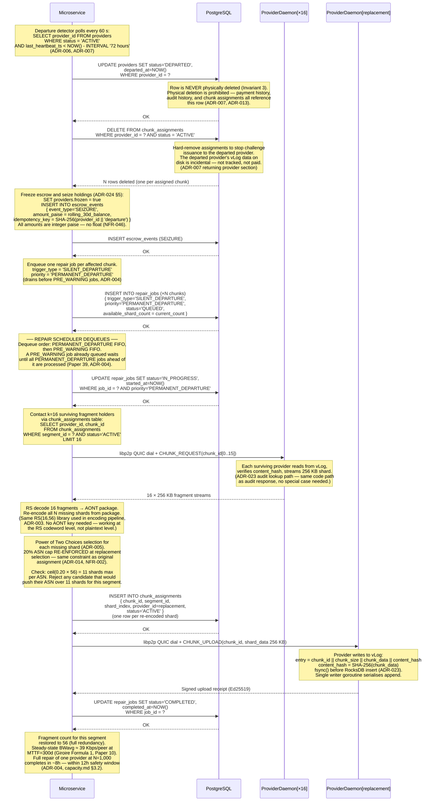
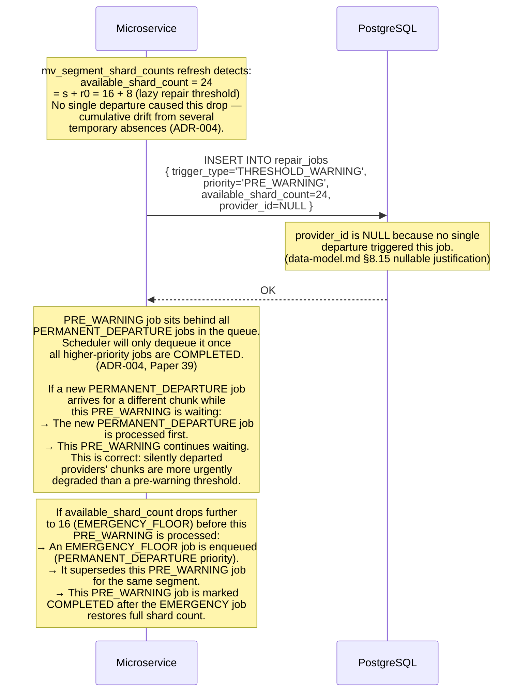
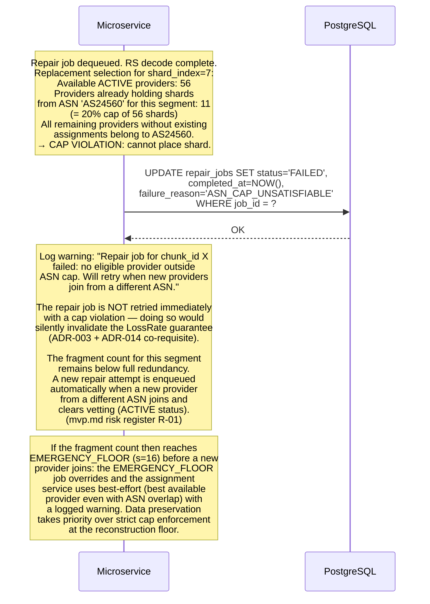
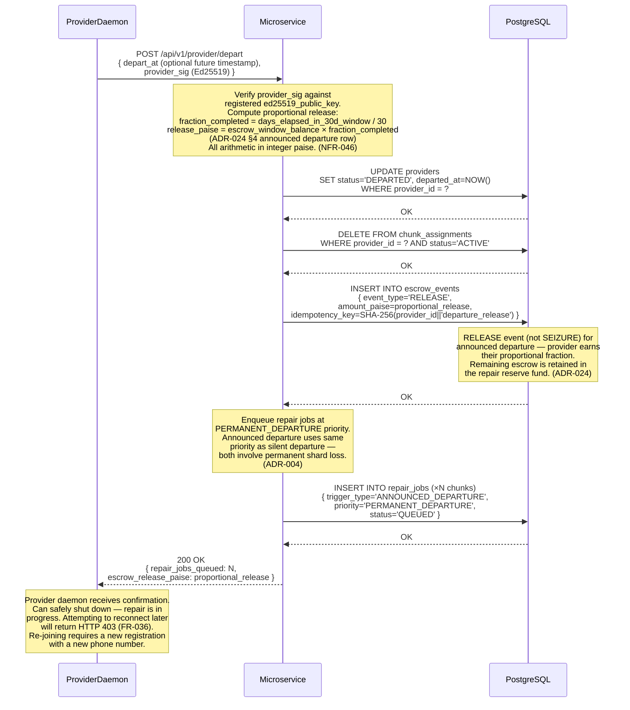

# Vyomanaut V2 — Repair Flow Sequence Diagram

**Document ID:** `VYOM-SEQ-003`
**Version:** 1.0
**Status:** Authoritative
**Date:** April 2026
**Author:** Vyomanaut Engineering
**Repository:** [masamasaowl/Vyomanaut_Research](https://github.com/masamasaowl/Vyomanaut_Research)
**Companion documents:**
- [architecture.md §15 Repair System](../architecture.md#15-repair-system)
- [architecture.md §22 Runtime Flows — Flow 3](../architecture.md#22-runtime-flows)
- [requirements.md §6.9 Repair System](../requirements.md#69-repair-system)
- [ADR-004](../../decisions/ADR-004-repair-protocol.md) · [ADR-007](../../decisions/ADR-007-provider-exit-states.md) · [ADR-014](../../decisions/ADR-014-adversarial-defences.md) · [ADR-024](../../decisions/ADR-024-economic-mechanism.md) · [ADR-029](../../decisions/ADR-029-bootstrap-minimum-viable-network.md)

---

## Overview

This diagram covers the self-healing loop: how the system detects that a provider has
gone permanently silent, triggers repair for its lost fragments, downloads surviving
shards, re-encodes the missing ones, and distributes them to new providers — all without
human intervention. The primary correctness properties are: (1) lazy repair defers
reconstruction until `available_shard_count ≤ 24` (s + r0), never firing on every
transient absence; (2) `PERMANENT_DEPARTURE` jobs always drain before `PRE_WARNING`
jobs, preventing permanently degraded stripes from accumulating; (3) the 20% ASN cap is
re-enforced at replacement selection, maintaining the co-requisite for the LossRate < 10⁻¹⁵
durability guarantee. These properties derive from [ADR-004](../../decisions/ADR-004-repair-protocol.md),
[ADR-014](../../decisions/ADR-014-adversarial-defences.md), and [ADR-003](../../decisions/ADR-003-erasure-coding.md).

---

## Participants

| Participant label | Role in this flow | Described in |
|---|---|---|
| `Microservice` | Departure detector; repair scheduler; replacement assignment service | [architecture.md §18](../architecture.md#18-coordination-microservice) |
| `PostgreSQL` | Stores `providers`, `chunk_assignments`, `repair_jobs`, `escrow_events` | [architecture.md §6](../architecture.md#6-component-overview) |
| `ProviderDaemon[×16]` | Surviving shard holders; contacted during repair download phase | [architecture.md §16](../architecture.md#16-provider-storage-engine) |
| `ProviderDaemon[replacement]` | Newly selected provider that receives the re-encoded shard | [architecture.md §16](../architecture.md#16-provider-storage-engine) |

---

## Happy Path 1 — Silent Departure Detected → Repair Triggered

The departure detector runs continuously. When a provider's `last_heartbeat_ts` exceeds
the 72-hour threshold, it is declared silently departed. All its chunk assignments are
removed from the routing table (to stop further challenge issuance), escrow is frozen and
seized into the repair reserve fund, and repair jobs are enqueued for every affected chunk.
The repair scheduler then executes the actual shard reconstruction.



### Cross-reference: diagram steps to ADRs and requirements

| Step # | Description | ADR / Requirement |
|---|---|---|
| 1 | Departure detector threshold: `last_heartbeat_ts < NOW() - INTERVAL '72 hours'` | [ADR-006](../../decisions/ADR-006-polling-interval.md), [ADR-007](../../decisions/ADR-007-provider-exit-states.md) |
| 2 | `providers.status = 'DEPARTED'`; physical deletion prohibited — Invariant 3 | [ADR-007](../../decisions/ADR-007-provider-exit-states.md), [ADR-013](../../decisions/ADR-013-consistency-model.md) |
| 3 | `chunk_assignments` hard-deleted to stop challenge issuance to departed provider | [ADR-007](../../decisions/ADR-007-provider-exit-states.md) |
| 4 | `escrow_events` SEIZURE — integer paise, idempotency key, no float | [ADR-024](../../decisions/ADR-024-economic-mechanism.md), [ADR-016](../../decisions/ADR-016-payment-db-schema.md) |
| 5 | `repair_jobs` enqueued with `priority = 'PERMANENT_DEPARTURE'` | [ADR-004](../../decisions/ADR-004-repair-protocol.md), [FR-035](../requirements.md#67-provider--exit-and-departure) |
| 6 | Priority queue drains `PERMANENT_DEPARTURE` before `PRE_WARNING` | [ADR-004](../../decisions/ADR-004-repair-protocol.md), Paper 39 |
| 7 | 16 surviving fragment holders contacted via `chunk_assignments` table; DHT not required | [ADR-001](../../decisions/ADR-001-coordination-architecture.md), [ADR-023](../../decisions/ADR-023-provider-storage-engine.md) |
| 8 | RS decode 16 → AONT package; re-encode missing shards; no AONT key needed | [ADR-003](../../decisions/ADR-003-erasure-coding.md), [ADR-022](../../decisions/ADR-022-encryption-erasure-order.md) |
| 9 | 20% ASN cap re-enforced at replacement selection — co-requisite for LossRate < 10⁻¹⁵ | [ADR-014](../../decisions/ADR-014-adversarial-defences.md), [FR-045](../requirements.md#69-repair-system) |
| 10 | Provider vLog write: `fsync()` before RocksDB insert; single writer goroutine | [ADR-023](../../decisions/ADR-023-provider-storage-engine.md), [NFR-023](../requirements.md#75-reliability-and-correctness) |

### What this diagram does not show

- How the provider's DHT records are removed — driven by the availability service on the next 12-hour republication cycle ([ADR-001](../../decisions/ADR-001-coordination-architecture.md)).
- The escrow seizure's interaction with Razorpay Route reversals — covered in [04-payment-release.md](./04-payment-release.md).
- How the repair scheduler handles correlated burst failures (multiple simultaneous departures from the same ASN) — the 20% ASN cap bounds this to ≤11 simultaneous shard losses; the repair queue simply accumulates multiple PERMANENT_DEPARTURE jobs and processes them FIFO.
- The Giroire Qpeek formula details — documented in [capacity.md §3.2](../capacity.md#32-burst-repair-bandwidth-qpeek); note that at N < 500 providers, repair window exceeds 12 hours and manual oversight of `repair_queue_depth` is required.

---

## Failure Path 1 — Emergency Floor (Fragment Count Reaches s=16)

When multiple providers depart in a short window, the available fragment count can drop
to s=16 — the reconstruction floor — before a repair job has completed. This triggers
an immediate emergency response that bypasses all normal queue ordering.

```mermaid
sequenceDiagram
    %% Repair Flow — Emergency Floor: available_shard_count reaches s=16
    %% ADR-004 (emergency floor), FR-044

    participant MS  as Microservice
    participant PG  as PostgreSQL

    Note over MS: Materialised view mv_segment_shard_counts<br/>refreshed after each chunk_assignment change.<br/>Repair monitor detects:<br/>  available_shard_count = 16 for segment S<br/>  (reached the reconstruction floor s=16).<br/>  ADR-004: "emergency floor — trigger immediately,<br/>  bypassing normal threshold and queue ordering."

    MS->>PG: INSERT INTO repair_jobs<br/>{ trigger_type='EMERGENCY_FLOOR',<br/>  priority='PERMANENT_DEPARTURE',<br/>  available_shard_count=16,<br/>  status='QUEUED' }
    Note over PG: EMERGENCY_FLOOR jobs are enqueued<br/>as PERMANENT_DEPARTURE priority —<br/>they drain at the front of the queue,<br/>ahead of any PRE_WARNING jobs and ahead<br/>of any regular PERMANENT_DEPARTURE<br/>jobs with a later created_at. (FR-044)
    PG-->>MS: OK

    Note over MS: Alert fires immediately:<br/>  repair_queue_depth metric observed;<br/>  operator notified via PagerDuty.<br/>  (NFR-027, architecture.md §24)<br/><br/>At N < 500 providers, repair window<br/>may exceed 12 hours — operator must<br/>manually confirm no second failure<br/>occurs during the repair window.<br/>(capacity.md §3.2)

    Note over MS: Repair scheduler immediately dequeues<br/>the EMERGENCY_FLOOR job (bypassing<br/>any PRE_WARNING jobs that arrived<br/>earlier). Execution follows the same<br/>download → re-encode → upload path<br/>as the Happy Path above.
```

### Cross-reference

| Step # | Description | ADR / Requirement |
|---|---|---|
| 1 | Fragment count monitored via `mv_segment_shard_counts` materialised view | [data-model.md §7](../data-model.md#7-materialised-views) |
| 2 | `EMERGENCY_FLOOR` jobs enqueued as `PERMANENT_DEPARTURE` priority — front of queue | [ADR-004](../../decisions/ADR-004-repair-protocol.md), [FR-044](../requirements.md#69-repair-system) |
| 3 | Alert fires on `repair_queue_depth > 1,000` OR on any `EMERGENCY_FLOOR` creation | [NFR-027](../requirements.md#76-observability-and-operability) |

---

## Failure Path 2 — Pre-Warning: Fragment Count Drops to s+r0=24

The lazy repair threshold fires before a provider is declared formally departed — the
redundancy has eroded due to multiple prior silent departures, each individually within
the lazy window. This generates a `PRE_WARNING` job that waits behind any active
`PERMANENT_DEPARTURE` jobs.



---

## Failure Path 3 — ASN Cap Unsatisfiable During Replacement Selection

At small network sizes (near the 56-provider floor), the assignment service may not
be able to find a replacement provider for a shard without violating the 20% ASN cap.
The repair job is retried rather than proceeding with a cap violation.



---

## Happy Path 2 — Announced Departure: Pre-emptive Repair

When a provider explicitly calls `POST /api/v1/provider/depart`, repair is triggered
immediately — before any 72-hour window elapses. The provider receives proportional
escrow release rather than seizure.



### Cross-reference

| Step # | Description | ADR / Requirement |
|---|---|---|
| 1 | Provider-signed departure request; microservice verifies Ed25519 signature | [ADR-021](../../decisions/ADR-021-p2p-transfer-protocol.md), [FR-034](../requirements.md#67-provider--exit-and-departure) |
| 2 | Proportional RELEASE computed as fraction of 30-day window completed | [ADR-024](../../decisions/ADR-024-economic-mechanism.md) §4 |
| 3 | `RELEASE` event (not `SEIZURE`) — announced departure is not penalised | [ADR-024](../../decisions/ADR-024-economic-mechanism.md), [FR-034](../requirements.md#67-provider--exit-and-departure) |
| 4 | Repair enqueued at `PERMANENT_DEPARTURE` priority — same as silent departure | [ADR-004](../../decisions/ADR-004-repair-protocol.md) |

---

## Invariants Demonstrated

| Invariant | Where it appears in this flow | Source |
|---|---|---|
| Physical provider row deletion is prohibited | Happy Path: `UPDATE status='DEPARTED'` — no DELETE | [ADR-007](../../decisions/ADR-007-provider-exit-states.md), Invariant 3 in [data-model.md](../data-model.md#3-design-invariants) |
| 20% ASN cap re-enforced at replacement selection | Happy Path step 9; Failure Path 3 shows what happens when the cap cannot be satisfied | [ADR-014](../../decisions/ADR-014-adversarial-defences.md), Invariant 4 in [trade-offs.md](../trade-offs.md) |
| All escrow amounts are integer paise | Both seizure and proportional release annotated "integer paise — no float" | [ADR-016](../../decisions/ADR-016-payment-db-schema.md), Invariant 4 in [data-model.md](../data-model.md#3-design-invariants) |
| `PERMANENT_DEPARTURE` jobs drain before `PRE_WARNING` | Failure Path 2 explicitly shows a PRE_WARNING job waiting behind PERMANENT_DEPARTURE | [ADR-004](../../decisions/ADR-004-repair-protocol.md) |
| Emergency floor (s=16) triggers immediate repair regardless of threshold | Failure Path 1 shows EMERGENCY_FLOOR job enqueued ahead of queue | [ADR-004](../../decisions/ADR-004-repair-protocol.md), [FR-044](../requirements.md#69-repair-system) |

---

## Related Diagrams

- **[02-audit-cycle.md](./02-audit-cycle.md)** — the sustained FAIL/TIMEOUT results from the audit cycle feed the departure detector that triggers this flow; content hash failures trigger accelerated re-audit which may subsequently trigger `THRESHOLD_WARNING` jobs.
- **[04-payment-release.md](./04-payment-release.md)** — the escrow seizure and proportional release events created in this flow are processed by the payment system; Razorpay Route reversals are shown in the payment diagram.
- **[05-provider-lifecycle.md](./05-provider-lifecycle.md)** — the `ACTIVE → DEPARTED` state transition executed in this flow is shown in its full state machine context there.