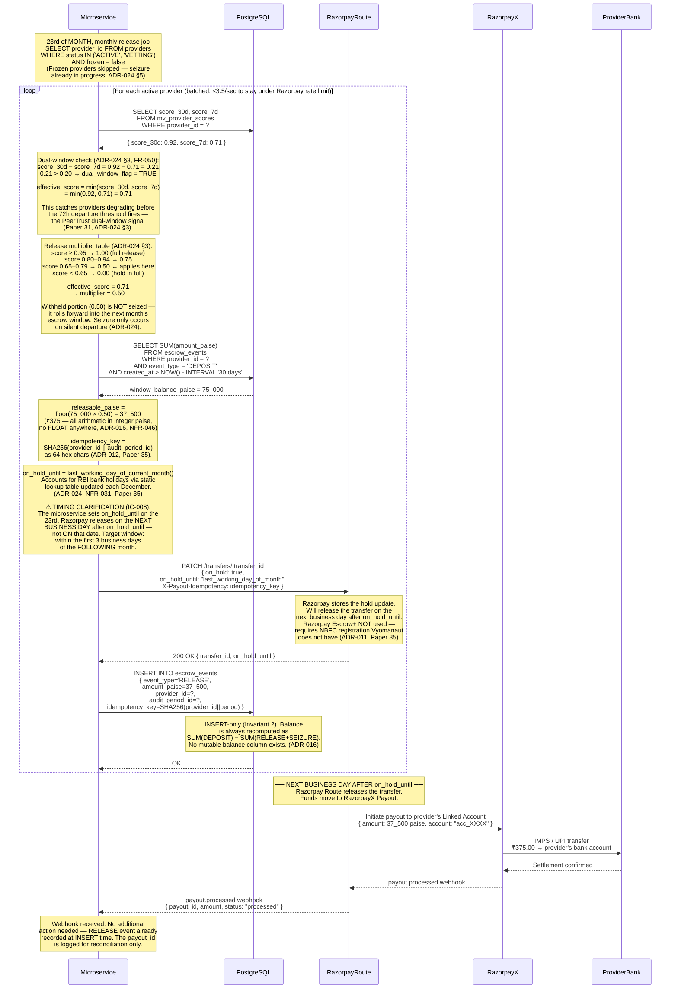
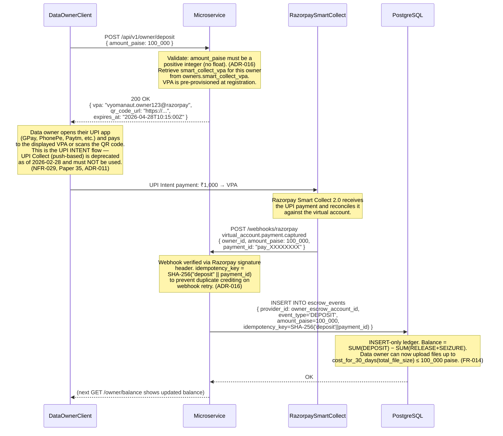
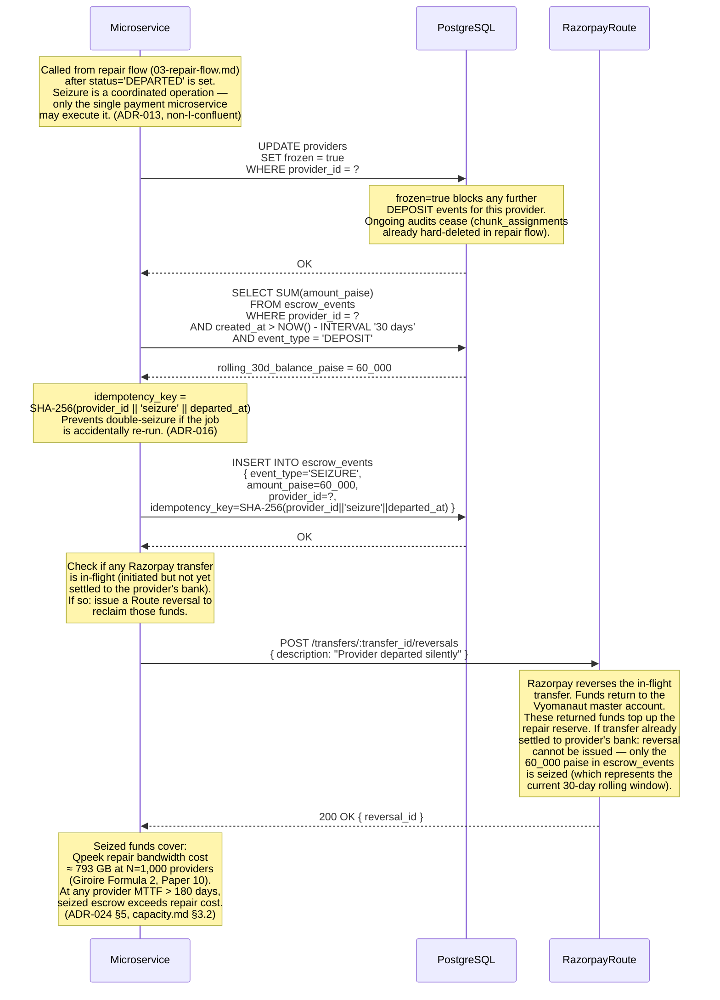
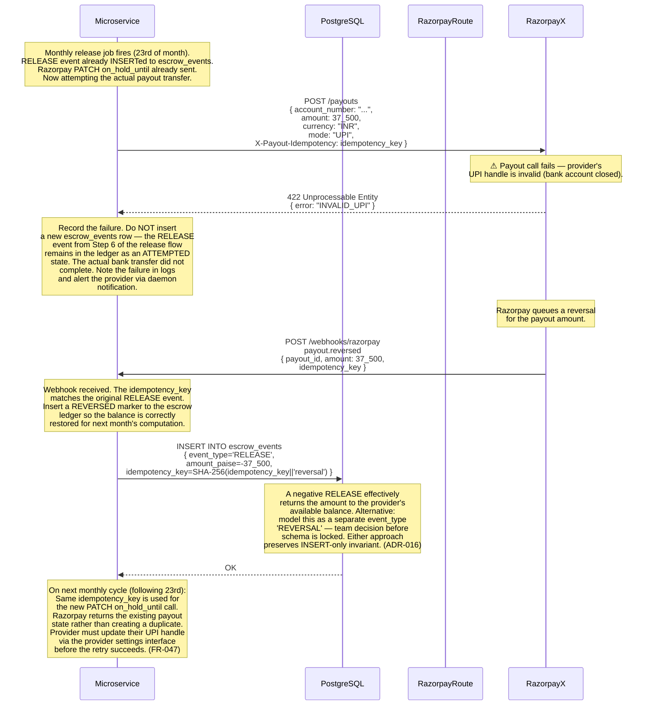
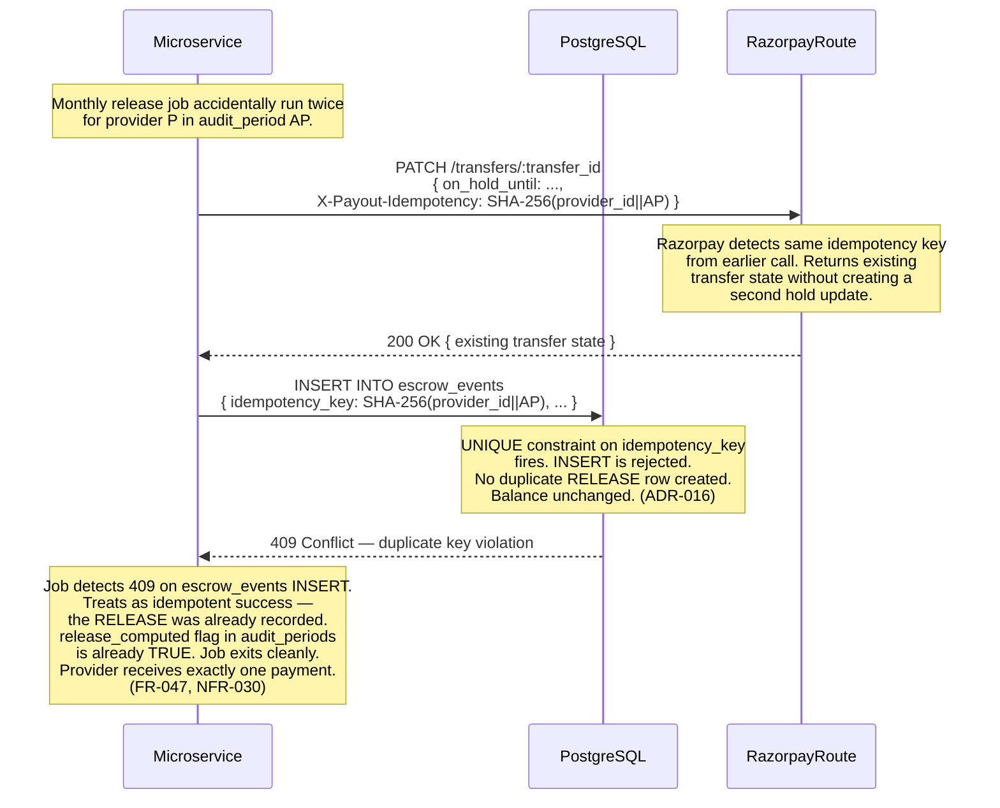

# Vyomanaut V2 — Payment Release Sequence Diagram

**Document ID:** `VYOM-SEQ-004`
**Version:** 1.0
**Status:** Authoritative
**Date:** April 2026
**Author:** Vyomanaut Engineering
**Repository:** [masamasaowl/Vyomanaut_Research](https://github.com/masamasaowl/Vyomanaut_Research)
**Companion documents:**
- [architecture.md §17 Payment System](../architecture.md#17-payment-system)
- [architecture.md §22 Runtime Flows — Flow 4](../architecture.md#22-runtime-flows)
- [requirements.md §6.10 Payment System](../requirements.md#610-payment-system)
- [ADR-011](../../decisions/ADR-011-escrow-payments.md) · [ADR-012](../../decisions/ADR-012-payment-basis.md) · [ADR-016](../../decisions/ADR-016-payment-db-schema.md) · [ADR-024](../../decisions/ADR-024-economic-mechanism.md)

---

## Overview

This diagram covers the four payment flows: (1) the monthly release computation that
converts audit pass history into actual bank transfers for providers; (2) the data
owner escrow deposit via UPI Intent; (3) escrow seizure when a provider departs
silently; and (4) idempotency and failure handling for Razorpay payout errors. The
primary correctness properties are: (1) all amounts are integer paise — floating-point
arithmetic is prohibited anywhere in the payment path; (2) the `X-Payout-Idempotency`
header prevents double-payment on retry; (3) withheld amounts from partial releases
roll forward rather than being seized. These properties derive from
[ADR-016](../../decisions/ADR-016-payment-db-schema.md), [ADR-012](../../decisions/ADR-012-payment-basis.md),
and [ADR-024](../../decisions/ADR-024-economic-mechanism.md).

---

## Participants

| Participant label | Role in this flow | Described in |
|---|---|---|
| `Microservice` | Monthly release computation; seizure orchestration; webhook handler | [architecture.md §18](../architecture.md#18-coordination-microservice) |
| `PostgreSQL` | `escrow_events`, `mv_provider_scores`, `audit_periods`, `providers` | [architecture.md §6](../architecture.md#6-component-overview) |
| `RazorpayRoute` | Programmable hold/release for provider earnings | [architecture.md §17](../architecture.md#17-payment-system) |
| `RazorpaySmartCollect` | Inbound UPI virtual account for data owner deposits | [architecture.md §17](../architecture.md#17-payment-system) |
| `RazorpayX` | Outbound bank transfer to provider's linked account | [architecture.md §17](../architecture.md#17-payment-system) |
| `DataOwnerClient` | Initiates escrow deposits via UPI Intent | [architecture.md §5](../architecture.md#5-system-context) |
| `ProviderBank` | Provider's UPI-linked bank account (terminal destination) | External |

---

## Happy Path 1 — Monthly Release Computation (23rd of Month)

On the 23rd of each month, the microservice computes each active provider's releasable
balance. The release multiplier is derived from the 30-day reliability score. A
dual-window deterioration flag catches providers who are degrading before the 72-hour
departure threshold fires. Razorpay releases on the next business day after
`on_hold_until` — the target window for providers is within the first 3 business days
of the following month. This gap is annotated explicitly to resolve the timing ambiguity
that exists across several prior documents.

### Cross-reference: diagram steps to ADRs and requirements

| Step # | Description | ADR / Requirement |
|---|---|---|
| 1 | Only non-frozen providers processed; frozen = seizure in progress | [ADR-024](../../decisions/ADR-024-economic-mechanism.md) §5 |
| 2 | Scores read from `mv_provider_scores` materialised view (up to 60 s stale — acceptable for monthly computation) | [ADR-008](../../decisions/ADR-008-reliability-scoring.md), [data-model.md §7](../data-model.md#7-materialised-views) |
| 3 | `score_30d − score_7d > 0.20` → `dual_window_flag = TRUE` → use lower score | [ADR-024](../../decisions/ADR-024-economic-mechanism.md) §3, [FR-050](../requirements.md#610-payment-system) |
| 4 | Release multiplier table: 0.50 band for score 0.65–0.79 | [ADR-024](../../decisions/ADR-024-economic-mechanism.md) §3, [FR-049](../requirements.md#610-payment-system) |
| 5 | Withheld portion rolls forward — not seized until silent departure | [ADR-024](../../decisions/ADR-024-economic-mechanism.md), trade-offs.md #19 |
| 6 | `floor()` used for paise arithmetic; all amounts integer paise, no float | [ADR-016](../../decisions/ADR-016-payment-db-schema.md), [NFR-046](../requirements.md#77-compliance-and-payments) |
| 7 | `on_hold_until` = last working day of current month; RBI holiday table (NFR-031) | [ADR-024](../../decisions/ADR-024-economic-mechanism.md), [NFR-031](../requirements.md#77-compliance-and-payments) |
| 8 | `X-Payout-Idempotency` header mandatory since 15 March 2025 | [ADR-012](../../decisions/ADR-012-payment-basis.md), [FR-047](../requirements.md#610-payment-system), Paper 35 |
| 9 | Razorpay Escrow+ NOT used; Route `on_hold` is the correct primitive | [ADR-011](../../decisions/ADR-011-escrow-payments.md), Paper 35 |
| 10 | `RELEASE` event inserted before Razorpay confirms; idempotency key prevents duplicate on retry | [ADR-016](../../decisions/ADR-016-payment-db-schema.md), [NFR-022](../requirements.md#75-reliability-and-correctness) |

### What this diagram does not show

- How per-audit-pass DEPOSIT events accumulate throughout the month — each audit PASS generates a paise-denominated DEPOSIT row in `escrow_events`; this background accumulation is not shown to keep the monthly release diagram readable.
- The vetting period modifier (60-day hold, 50% release cap) — `providers.status = 'VETTING'` triggers modified hold window logic; same diagram flow, different parameters ([ADR-024](../../decisions/ADR-024-economic-mechanism.md) §6, [FR-051](../requirements.md#610-payment-system)).
- Razorpay Linked Account creation and 24-hour cooling period — covered in [05-provider-lifecycle.md](./05-provider-lifecycle.md).
- The storage rate (paise per GB per month) — a product decision (OQ-001); the diagram is parameterised on `storage_rate_paise_per_gb_per_month` which is injected at runtime.

---

## Happy Path 2 — Data Owner Escrow Deposit via UPI Intent

When a data owner wants to store files, they must first deposit escrow funds. The system
uses Razorpay Smart Collect 2.0 virtual UPI accounts. UPI Collect is explicitly not used —
it was deprecated by NPCI on 28 February 2026. The microservice does not credit the
escrow balance until the Razorpay webhook confirms the payment has settled.

### Cross-reference

| Step # | Description | ADR / Requirement |
|---|---|---|
| 1 | `amount_paise` validated as positive integer — no float accepted | [ADR-016](../../decisions/ADR-016-payment-db-schema.md), [NFR-046](../requirements.md#77-compliance-and-payments) |
| 2 | UPI Intent flow (QR / app redirect) — UPI Collect deprecated 28 Feb 2026 | [ADR-011](../../decisions/ADR-011-escrow-payments.md), [NFR-029](../requirements.md#77-compliance-and-payments) |
| 3 | Escrow credited only on `virtual_account.payment.captured` webhook — not on client claim | [ADR-011](../../decisions/ADR-011-escrow-payments.md) |
| 4 | Idempotency key `SHA-256("deposit" || payment_id)` prevents double-credit on webhook retry | [ADR-016](../../decisions/ADR-016-payment-db-schema.md) |
| 5 | DEPOSIT event enables upload: `balance ≥ cost_for_30_days(file_size)` check | [FR-014](../requirements.md#62-data-owner--file-upload) |

---

## Happy Path 3 — Escrow Seizure on Silent Departure

When the departure detector declares a provider silently departed (triggered from the
repair flow in [03-repair-flow.md](./03-repair-flow.md)), the payment system seizes all
earnings in the 30-day rolling window into the repair reserve fund. If a Razorpay
transfer has already been initiated but not yet settled, a Route reversal is issued.

### Cross-reference

| Step # | Description | ADR / Requirement |
|---|---|---|
| 1 | Seizure is a non-I-confluent operation — single payment service only | [ADR-013](../../decisions/ADR-013-consistency-model.md) |
| 2 | `frozen = true` blocks further deposits; prevents escrow state race | [ADR-024](../../decisions/ADR-024-economic-mechanism.md) §5 |
| 3 | `SEIZURE` idempotency key prevents double-seizure on job re-run | [ADR-016](../../decisions/ADR-016-payment-db-schema.md) |
| 4 | Razorpay Route reversal issued for in-flight transfers | [ADR-024](../../decisions/ADR-024-economic-mechanism.md) §5, [ADR-011](../../decisions/ADR-011-escrow-payments.md) |
| 5 | `FR-035`: seizure triggered automatically — no operator intervention needed | [FR-035](../requirements.md#67-provider--exit-and-departure) |

---

## Failure Path 1 — Razorpay Payout API Returns Error

If the Razorpay payout call fails (network error, temporary API unavailability, or
provider bank rejection), Razorpay automatically reverses the payout and fires a
webhook. The microservice records a `REVERSED` state and retries on the next monthly
cycle using the same idempotency key — preventing any double-payment.

### Cross-reference

| Step # | Description | ADR / Requirement |
|---|---|---|
| 1 | `X-Payout-Idempotency` header mandatory on every payout call since 15 March 2025 | [FR-047](../requirements.md#610-payment-system), Paper 35 |
| 2 | Payout failure does NOT delete the RELEASE escrow row — it was recorded before the transfer | [ADR-016](../../decisions/ADR-016-payment-db-schema.md) |
| 3 | `payout.reversed` webhook triggers negative RELEASE to restore balance | [ADR-012](../../decisions/ADR-012-payment-basis.md), Paper 35 |
| 4 | Retry on next monthly cycle uses same idempotency key — no duplicate transfer | [ADR-016](../../decisions/ADR-016-payment-db-schema.md), [FR-047](../requirements.md#610-payment-system) |

---

## Failure Path 2 — Duplicate Monthly Release Job Run (Idempotency)

If the monthly release job is accidentally triggered twice (e.g., a scheduler bug or
operator re-run), the idempotency key on `escrow_events` and the Razorpay
`X-Payout-Idempotency` header together prevent any double payment.

---

## Invariants Demonstrated

| Invariant | Where it appears in this flow | Source |
|---|---|---|
| All amounts are integer paise — no float | Happy Path 1 step 6: `floor(75_000 × 0.50) = 37_500`; explicitly annotated | [ADR-016](../../decisions/ADR-016-payment-db-schema.md), Invariant 4 in [data-model.md](../data-model.md#3-design-invariants) |
| `escrow_events` is INSERT-only | Happy Path 1 step 10: RELEASE row inserted; Failure Path 1: REVERSED row inserted; no UPDATE or DELETE appears | [ADR-016](../../decisions/ADR-016-payment-db-schema.md), Invariant 2 in [data-model.md](../data-model.md#3-design-invariants) |
| Idempotency key prevents double-payment | Failure Path 2: 409 on duplicate `idempotency_key` → job exits cleanly | [ADR-016](../../decisions/ADR-016-payment-db-schema.md) |
| Razorpay releases on next business day after `on_hold_until`, not on the date itself | Happy Path 1: timing clarification annotation explicitly states "next business day after" | [ADR-024](../../decisions/ADR-024-economic-mechanism.md), Paper 35 |
| Withheld partial-release amounts roll forward — not seized | Happy Path 1 step 5: withheld 0.50 fraction annotated "NOT seized — rolls forward" | [ADR-024](../../decisions/ADR-024-economic-mechanism.md) |
| Seizure is a non-I-confluent coordinated operation | Happy Path 3 step 1: "only the single payment microservice may execute it" | [ADR-013](../../decisions/ADR-013-consistency-model.md) |

---

## Related Diagrams

- **[03-repair-flow.md](./03-repair-flow.md)** — the escrow seizure in Happy Path 3 of this diagram is triggered by the departure detection sequence in that flow; repair job enqueuing precedes the seizure call.
- **[02-audit-cycle.md](./02-audit-cycle.md)** — each PASS result in the audit cycle generates a per-audit paise DEPOSIT event to the provider's `escrow_events`; the monthly accumulation of those events is what Happy Path 1 releases.
- **[05-provider-lifecycle.md](./05-provider-lifecycle.md)** — the Razorpay Linked Account creation and 24-hour cooling period that gate payment eligibility are shown in the registration sequence of that diagram.