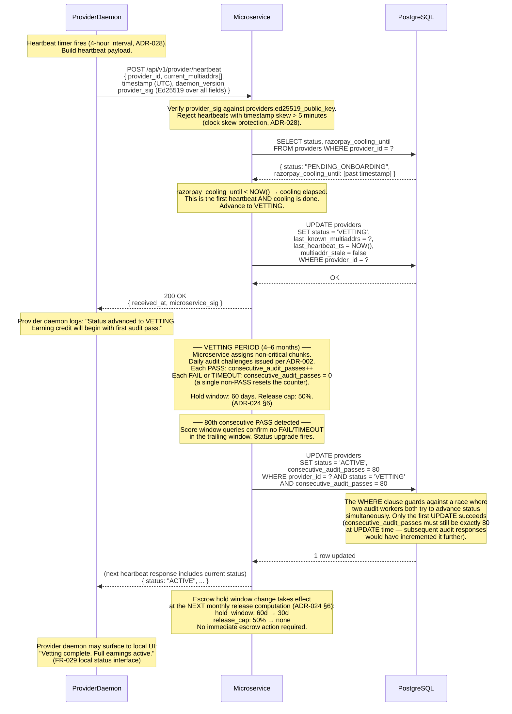
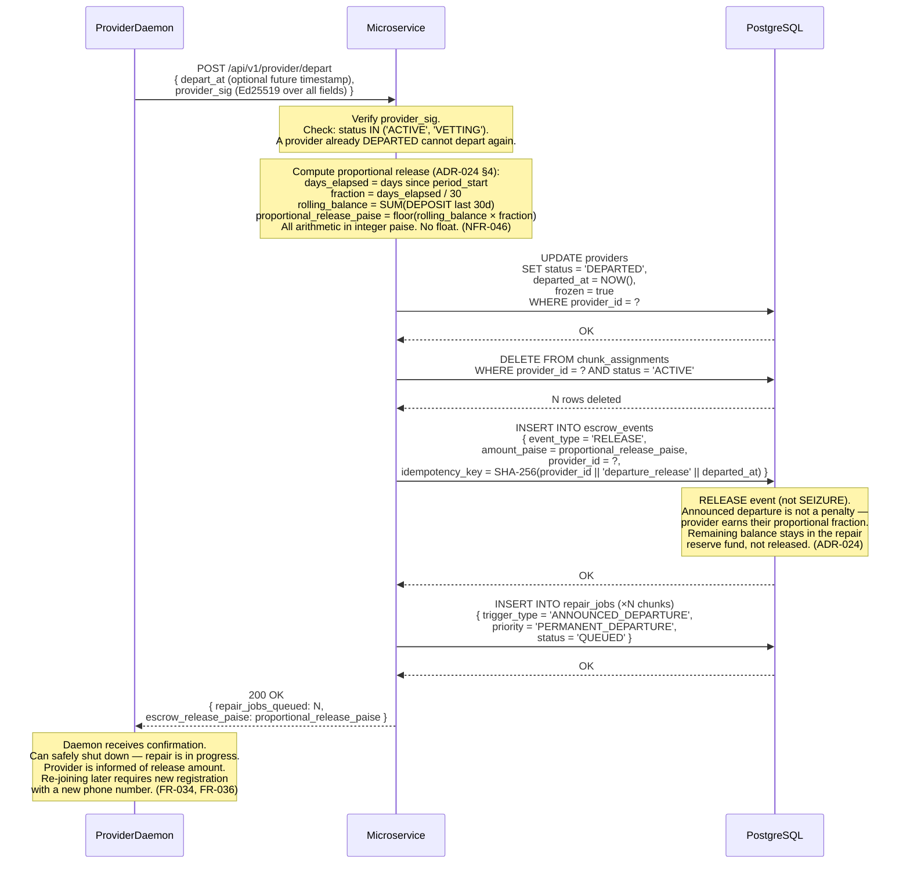
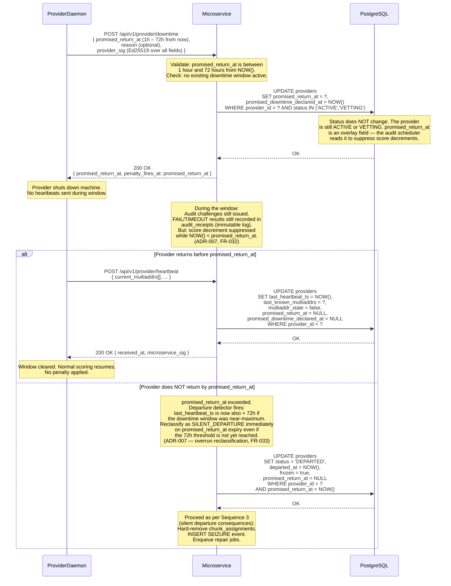
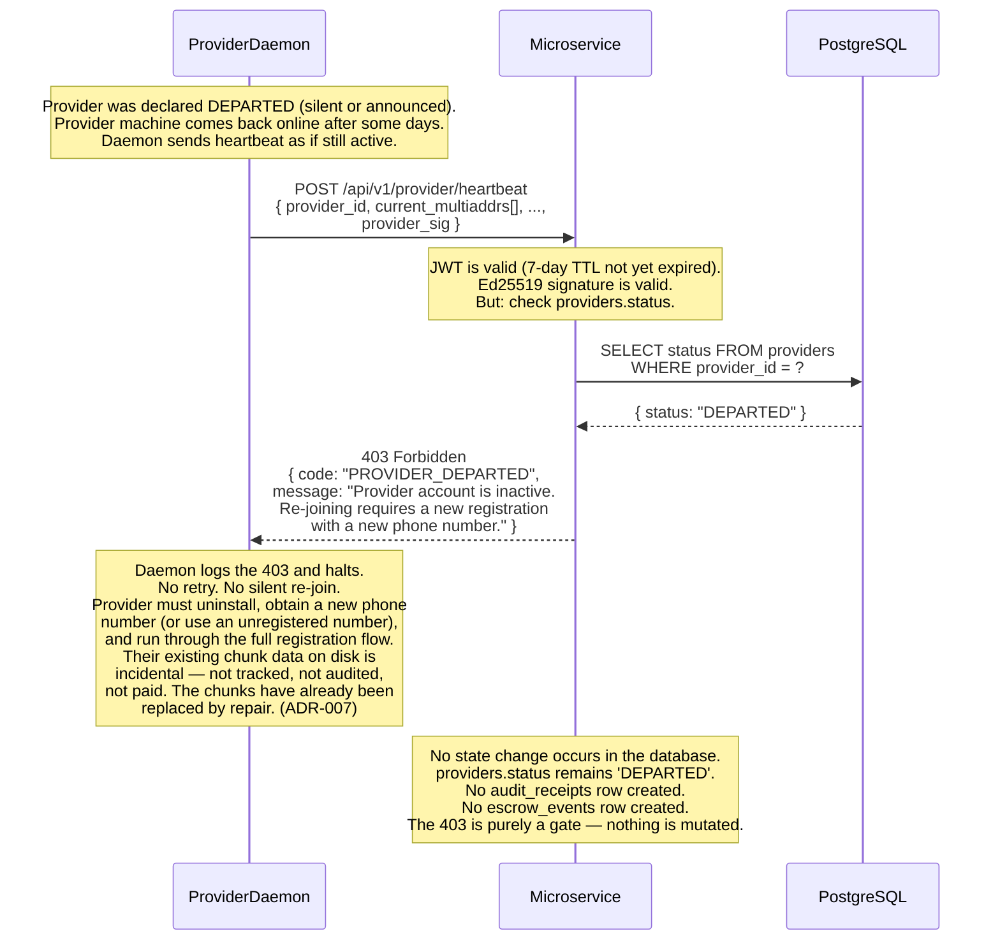

# Vyomanaut V2 — Provider Lifecycle Sequence Diagram

**Document ID:** `VYOM-SEQ-005`
**Version:** 1.0
**Status:** Authoritative
**Date:** April 2026
**Author:** Vyomanaut Engineering
**Repository:** [masamasaowl/Vyomanaut_Research](https://github.com/masamasaowl/Vyomanaut_Research)
**Companion documents:**
- [architecture.md §12 Provider Lifecycle](../architecture.md#12-provider-lifecycle)
- [requirements.md §6.5 Provider — Installation and Registration](../requirements.md#65-provider--installation-and-registration)
- [requirements.md §6.7 Provider — Exit and Departure](../requirements.md#67-provider--exit-and-departure)
- [ADR-005](../../decisions/ADR-005-peer-selection.md) · [ADR-006](../../decisions/ADR-006-polling-interval.md) · [ADR-007](../../decisions/ADR-007-provider-exit-states.md) · [ADR-024](../../decisions/ADR-024-economic-mechanism.md) · [ADR-028](../../decisions/ADR-028-provider-heartbeat.md) · [ADR-029](../../decisions/ADR-029-bootstrap-minimum-viable-network.md)

---

## Overview

This document covers the complete provider lifecycle: from first daemon installation through
registration, the vetting period, active operation, and all four departure paths. The primary
correctness properties are: (1) status transitions are **monotone and one-directional** —
no provider ever moves from `DEPARTED` back to any active state without a full re-registration;
(2) **physical row deletion is structurally impossible** — the `providers` row is never
removed, only soft-deleted via status flag (Invariant 3 in
[data-model.md §3](../data-model.md#3-design-invariants)); and (3) a provider reconnecting
after departure receives **HTTP 403 unconditionally** — the system never silently re-admits
a departed Peer ID. These properties derive from [ADR-007](../../decisions/ADR-007-provider-exit-states.md),
[ADR-013](../../decisions/ADR-013-consistency-model.md), and [ADR-024](../../decisions/ADR-024-economic-mechanism.md).

Unlike the other sequence diagram files in this directory, this document leads with a
`stateDiagram-v2` state machine and follows with sequence diagrams for each transition
that involves an external system call or a non-trivial invariant.

---

## Participants

| Participant label | Role in this flow | Described in |
|---|---|---|
| `ProviderDaemon` | Provider-side daemon process; generates keys; sends heartbeats | [architecture.md §16](../architecture.md#16-provider-storage-engine) |
| `Microservice` | Coordination microservice; enforces state transitions; issues challenges | [architecture.md §18](../architecture.md#18-coordination-microservice) |
| `PostgreSQL` | Stores `providers` table; enforces `providers_departed_status` constraint | [architecture.md §6](../architecture.md#6-component-overview) |
| `RazorpayRoute` | Creates Linked Accounts for each provider; enforces 24-hour cooling | [architecture.md §17](../architecture.md#17-payment-system) |
| `DHT` | Kademlia DHT — stores provider multiaddrs for chunk lookup | [architecture.md §13](../architecture.md#13-p2p-transfer-layer) |

---

## State Machine

The diagram below covers all four states and every valid transition between them.
Guard conditions are shown on transition arrows; the prohibited transition (any state → re-active
after `DEPARTED`) is shown explicitly to document what the system must refuse.

```mermaid
stateDiagram-v2
    %% Provider Lifecycle State Machine
    %% ADR-007 (four exit states), ADR-005 (vetting threshold),
    %% ADR-024 (vetting period hold window), ADR-029 (readiness gate)

    [*] --> PENDING_ONBOARDING : POST /api/v1/provider/register\n(OTP verified, Ed25519 key submitted)

    PENDING_ONBOARDING --> VETTING : First heartbeat received\nAND Razorpay cooling period elapsed\n(razorpay_cooling_until < NOW())

    VETTING --> ACTIVE : consecutive_audit_passes = 80\n(Jeffrey's prior threshold, ADR-005)

    ACTIVE --> DEPARTED : [silent] last_heartbeat_ts < NOW() - 72h\nOR [announced] POST /api/v1/provider/depart

    VETTING --> DEPARTED : [silent] last_heartbeat_ts < NOW() - 72h\nOR [announced] POST /api/v1/provider/depart

    PENDING_ONBOARDING --> DEPARTED : [silent] last_heartbeat_ts < NOW() - 72h\nafter first heartbeat\nOR provider never sends heartbeat\n(no chunk assignments exist; escrow seizure = zero)

    DEPARTED --> [*] : Terminal state. Row kept permanently.\nPhysical deletion is prohibited (Invariant 3).

    note right of PENDING_ONBOARDING
        hold_window = 60 days
        release_cap = 50%
        No chunk assignments issued.
        Razorpay cooling timer running.
    end note

    note right of VETTING
        hold_window = 60 days
        release_cap = 50%
        Receives non-critical chunks.
        consecutive_audit_passes counting.
        accelerated_reaudit flag available.
    end note

    note right of ACTIVE
        hold_window = 30 days
        release_cap = none
        Full chunk assignment eligibility.
        Power of Two Choices selection.
        20% ASN cap enforced per segment.
    end note

    note right of DEPARTED
        frozen = true
        chunk_assignments HARD-REMOVED
        Escrow seized (silent) or released
        proportionally (announced).
        HTTP 403 on all future connections.
        Re-join requires new phone number.
    end note
```



### Cross-reference: state machine to ADRs and requirements

| Transition | Guard condition | ADR / Requirement |
|---|---|---|
| `[*] → PENDING_ONBOARDING` | OTP-verified phone number, Ed25519 public key, declared storage | [FR-024](../requirements.md#65-provider--installation-and-registration), [ADR-001](../../decisions/ADR-001-coordination-architecture.md) |
| `PENDING_ONBOARDING → VETTING` | First heartbeat received AND `razorpay_cooling_until < NOW()` | [FR-025](../requirements.md#65-provider--installation-and-registration), [FR-026](../requirements.md#65-provider--installation-and-registration), [ADR-028](../../decisions/ADR-028-provider-heartbeat.md) |
| `VETTING → ACTIVE` | `consecutive_audit_passes = 80` (without interruption) | [ADR-005](../../decisions/ADR-005-peer-selection.md), [FR-026](../requirements.md#65-provider--installation-and-registration) |
| `ACTIVE → DEPARTED` (silent) | `last_heartbeat_ts < NOW() - INTERVAL '72 hours'` | [ADR-006](../../decisions/ADR-006-polling-interval.md), [ADR-007](../../decisions/ADR-007-provider-exit-states.md), [FR-035](../requirements.md#67-provider--exit-and-departure) |
| `ACTIVE → DEPARTED` (announced) | Provider calls `POST /api/v1/provider/depart` | [ADR-007](../../decisions/ADR-007-provider-exit-states.md), [FR-034](../requirements.md#67-provider--exit-and-departure) |
| `DEPARTED → [*]` (terminal) | Physical row deletion prohibited; `departed_at` set, row retained permanently | [ADR-007](../../decisions/ADR-007-provider-exit-states.md), [ADR-013](../../decisions/ADR-013-consistency-model.md), Invariant 3 |

### What this state machine does not show

- The internal score window resets that occur on each non-PASS audit result — `consecutive_audit_passes` resets to zero, but status does not transition until 72h is exceeded. Score changes are continuous, not discrete state changes.
- The `promised downtime` sub-state — a provider in `ACTIVE` or `VETTING` who calls `POST /api/v1/provider/downtime` is still in their primary status but has a `promised_return_at` timestamp set that suppresses score decrements during the window. This is a modal overlay on `ACTIVE`/`VETTING`, not a separate status ([ADR-007](../../decisions/ADR-007-provider-exit-states.md), [FR-032](../requirements.md#67-provider--exit-and-departure)).
- The `accelerated_reaudit` flag — set when `>1 FAIL` in a rolling 7-day window ([ADR-008](../../decisions/ADR-008-reliability-scoring.md), [Paper 32](../../research/paper-32-schroeder-flash-reliability.md)); this does not change status but changes audit scheduling cadence.
- The `frozen` flag used during seizure processing — an implementation detail of the payment service, not a lifecycle status ([ADR-024](../../decisions/ADR-024-economic-mechanism.md) §5).

---

## Sequence 1 — Registration → PENDING_ONBOARDING

Provider installs the daemon, generates an Ed25519 key pair, and registers with the
microservice. The microservice asynchronously creates a Razorpay Route Linked Account.
Chunk assignments are blocked until the 24-hour cooling period elapses. This is the
admission gate that replaces S/Kademlia's cryptographic node ID with a phone-number-verified
identity, preventing trivial Sybil registration.

```mermaid
sequenceDiagram
    %% Provider Lifecycle — Registration → PENDING_ONBOARDING
    %% FR-022, FR-023, FR-024, FR-025, ADR-001, ADR-021, ADR-029

    participant PD  as ProviderDaemon
    participant MS  as Microservice
    participant PG  as PostgreSQL
    participant RR  as RazorpayRoute

    Note over PD: First daemon launch.<br/>Generate Ed25519 key pair via<br/>  crypto/ed25519.GenerateKey(rand.Reader).<br/>Persist private key encrypted under<br/>HKDF(daemon_passphrase, "vyomanaut-keystore-v1")<br/>in platform keystore (ADR-021).<br/>Display public key fingerprint to provider.

    Note over PD: OTP verification flow precedes this call.<br/>Provider submits phone number; microservice<br/>sends 6-digit SMS OTP; provider confirms.<br/>OTP verification returns a short-lived JWT<br/>valid for one register call. (FR-023, FR-024)

    PD->>MS: POST /api/v1/provider/register<br/>{ ed25519_public_key (32 bytes, hex),<br/>  declared_storage_gb, city, region,<br/>  asn (e.g. "AS24560"),<br/>  initial_multiaddrs[],<br/>  provider_sig (Ed25519 over all other fields) }
    Note over MS: Verify provider_sig against ed25519_public_key.<br/>Check: phone_number not already registered<br/>(UNIQUE constraint — ADR-005 Sybil defence).<br/>Check: ASN format valid (e.g. "AS\d+" or "SIM-AS\d+").

    MS->>PG: INSERT INTO providers<br/>{ provider_id (UUIDv7),<br/>  phone_number, ed25519_public_key,<br/>  status = 'PENDING_ONBOARDING',<br/>  declared_storage_gb, city, region, asn,<br/>  initial_multiaddrs → last_known_multiaddrs,<br/>  consecutive_audit_passes = 0,<br/>  frozen = false, created_at = NOW() }
    PG-->>MS: OK

    Note over MS: Initiate Razorpay Linked Account creation<br/>asynchronously (non-blocking).
    MS->>RR: POST /v2/accounts<br/>{ type: "route",<br/>  profile.name: provider display name,<br/>  profile.contact.mobile: phone_number,<br/>  legal_info.pan: ... }
    Note over RR: Razorpay creates Linked Account.<br/>Triggers webhook on completion.<br/>24-hour cooling period starts from<br/>account creation timestamp. (Paper 35)
    RR-->>MS: 200 OK { id: "acc_XXXXXXXXXXXXXXXX" }

    MS->>PG: UPDATE providers<br/>SET razorpay_linked_account_id = "acc_XXX",<br/>    razorpay_cooling_until = NOW() + INTERVAL '24 hours'<br/>WHERE provider_id = ?
    PG-->>MS: OK

    MS-->>PD: 201 Created<br/>{ provider_id (UUID),<br/>  status: "PENDING_ONBOARDING",<br/>  token (7-day JWT, role="provider"),<br/>  razorpay_cooling_until }

    Note over PD: Daemon stores provider_id and JWT.<br/>Starts 4-hour heartbeat timer (ADR-028).<br/>Displays to provider:<br/>  "Registration complete. Your earnings account<br/>  will be ready in 24 hours." (FR-025 UX note)
```

### Cross-reference

| Step # | Description | ADR / Requirement |
|---|---|---|
| 1 | Ed25519 key pair generated at first launch; private key encrypted in platform keystore | [ADR-021](../../decisions/ADR-021-p2p-transfer-protocol.md), [FR-023](../requirements.md#65-provider--installation-and-registration) |
| 2 | `provider_sig` over request body proves daemon holds the private key for the submitted public key | [ADR-021](../../decisions/ADR-021-p2p-transfer-protocol.md) |
| 3 | `phone_number UNIQUE` constraint at DB level is the Sybil defence — one verified identity per device | [ADR-005](../../decisions/ADR-005-peer-selection.md), [FR-024](../requirements.md#65-provider--installation-and-registration) |
| 4 | `status = 'PENDING_ONBOARDING'` — no chunk assignments, no audit challenges until cooling elapsed | [FR-025](../requirements.md#65-provider--installation-and-registration) |
| 5 | Razorpay Linked Account creation is async — daemon receives 201 before Razorpay confirms | [ADR-011](../../decisions/ADR-011-escrow-payments.md), Paper 35 |
| 6 | `razorpay_cooling_until = NOW() + 24h` blocks payment releases until Razorpay's mandatory period passes | [ADR-029](../../decisions/ADR-029-bootstrap-minimum-viable-network.md), Paper 35 |

### What this diagram does not show

- The OTP send/verify round-trip — `POST /api/v1/auth/otp/send` + `POST /api/v1/auth/otp/verify` precede this call; the JWT from OTP verify is the bearer token used here.
- Razorpay Linked Account webhook failure handling — if Razorpay does not confirm account creation within 5 minutes, the microservice retries the account creation call with the same idempotency key.
- Simulation mode registration — in `--sim-count=N` mode, the daemon generates synthetic ASNs (`SIM-AS1` through `SIM-AS5`) and skips the real Razorpay call, substituting a mock cooling_until ([ADR-029](../../decisions/ADR-029-bootstrap-minimum-viable-network.md)).

---

## Sequence 2 — First Heartbeat → VETTING; Then VETTING → ACTIVE

The provider's first heartbeat triggers the `PENDING_ONBOARDING → VETTING` transition
(provided the Razorpay cooling period has elapsed). From `VETTING`, the provider
accumulates consecutive audit passes; on reaching 80, the microservice advances status
to `ACTIVE` and adjusts the escrow hold window. The vetting period implements
Storj's statistical confidence threshold — 80 consecutive passes gives >99% confidence
in provider reliability under Jeffrey's prior ([ADR-005](../../decisions/ADR-005-peer-selection.md)).



### Cross-reference

| Step # | Description | ADR / Requirement |
|---|---|---|
| 1 | Heartbeat signed with provider's Ed25519 key — same key registered at join | [ADR-028](../../decisions/ADR-028-provider-heartbeat.md), [FR-027](../requirements.md#66-provider--operation) |
| 2 | Timestamp skew check ±5 minutes prevents replayed heartbeats | [ADR-028](../../decisions/ADR-028-provider-heartbeat.md) |
| 3 | `razorpay_cooling_until < NOW()` guard prevents early chunk assignment | [ADR-029](../../decisions/ADR-029-bootstrap-minimum-viable-network.md), [FR-025](../requirements.md#65-provider--installation-and-registration) |
| 4 | `PENDING_ONBOARDING → VETTING` updates `last_known_multiaddrs` — heartbeat is also an address refresh | [ADR-028](../../decisions/ADR-028-provider-heartbeat.md) |
| 5 | `consecutive_audit_passes` counts back-to-back PASS results; any non-PASS resets to zero | [ADR-005](../../decisions/ADR-005-peer-selection.md) |
| 6 | `VETTING → ACTIVE` UPDATE guarded by `AND consecutive_audit_passes = 80` prevents double-update race | [ADR-005](../../decisions/ADR-005-peer-selection.md), [ADR-013](../../decisions/ADR-013-consistency-model.md) |
| 7 | Hold window change (60d → 30d) takes effect at next monthly release computation, not immediately | [ADR-024](../../decisions/ADR-024-economic-mechanism.md) §6, [FR-051](../requirements.md#610-payment-system) |

### What this diagram does not show

- The case where cooling has NOT elapsed when the first heartbeat arrives — the microservice updates `last_heartbeat_ts` and `last_known_multiaddrs` but does not advance status to `VETTING`; the daemon stays `PENDING_ONBOARDING` until the next heartbeat after cooling expires.
- Chunk assignment during vetting — handled by the assignment service per [ADR-005](../../decisions/ADR-005-peer-selection.md); vetting chunks receive additional erasure headroom not shown here.
- How the 80-pass count interacts with `accelerated_reaudit` — if `accelerated_reaudit = true`, the daily audit cycle fires more frequently, but `consecutive_audit_passes` only increments on a standard scheduled audit PASS, not on accelerated re-audit PASSes.

---

## Sequence 3 — ACTIVE → DEPARTED (Silent, 72-Hour Threshold)

The departure detector polls periodically for providers whose last heartbeat exceeds 72 hours.
When detected, all chunk assignments are hard-removed to stop challenge issuance, escrow is frozen
and seized, and repair jobs are enqueued. The DHT record is retired on the next republication
cycle. This sequence complements [03-repair-flow.md](./03-repair-flow.md) Happy Path 1, which
shows the repair execution that follows; this diagram focuses on the state transition itself.

```mermaid
sequenceDiagram
    %% Provider Lifecycle — ACTIVE → DEPARTED (silent, 72-hour threshold)
    %% ADR-006, ADR-007, ADR-024 §5, FR-035

    participant MS  as Microservice
    participant PG  as PostgreSQL
    participant DHT as DHT

    Note over MS: Departure detector runs every 60 seconds.<br/>SELECT provider_id FROM providers<br/>WHERE status = 'ACTIVE'<br/>AND last_heartbeat_ts < NOW() - INTERVAL '72 hours'<br/>(ADR-006, ADR-007)

    Note over MS: Provider P found: 74 hours of silence.<br/>This exceeds Bolosky's weekend absence peak<br/>(µ=64h, 99.7% return within 70h).<br/>Declare silent departure. (ADR-006, Paper 09)

    %% ── Step 1: Advance status ──────────────────────────────────────────────
    MS->>PG: UPDATE providers<br/>SET status = 'DEPARTED',<br/>    departed_at = NOW(),<br/>    frozen = true<br/>WHERE provider_id = ?<br/>AND status = 'ACTIVE'
    Note over PG: Soft delete only. Physical row removal<br/>is prohibited — payment history, audit<br/>receipts, and chunk_assignments all<br/>reference this provider_id (Invariant 3).<br/>The departed_at column is set and never cleared.
    PG-->>MS: 1 row updated

    %% ── Step 2: Hard-remove chunk assignments ───────────────────────────────
    MS->>PG: DELETE FROM chunk_assignments<br/>WHERE provider_id = ?<br/>AND status = 'ACTIVE'
    Note over PG: This is the ONLY hard DELETE in the system<br/>for a provider departure. Chunk assignment rows<br/>are deleted (not soft-deleted) because:<br/>  (a) they are routing records, not audit evidence,<br/>  (b) leaving them causes stale challenge issuance,<br/>  (c) audit_receipts retains the full audit history.<br/>No audit evidence is lost by this DELETE.<br/>(ADR-007 returning provider section)
    PG-->>MS: N rows deleted

    %% ── Step 3: Freeze and seize escrow ─────────────────────────────────────
    MS->>PG: SELECT SUM(amount_paise) FROM escrow_events<br/>WHERE provider_id = ?<br/>AND event_type = 'DEPOSIT'<br/>AND created_at > NOW() - INTERVAL '30 days'
    PG-->>MS: rolling_30d_balance_paise (integer paise — no float)

    MS->>PG: INSERT INTO escrow_events<br/>{ event_type = 'SEIZURE',<br/>  amount_paise = rolling_30d_balance_paise,<br/>  provider_id = ?,<br/>  idempotency_key = SHA-256(provider_id || 'seizure' || departed_at) }
    Note over PG: INSERT-only. idempotency_key prevents<br/>double-seizure if the detector re-runs.<br/>The balance is now zero — the 30-day window<br/>is reclaimed for the repair reserve fund.<br/>(ADR-016, ADR-024 §5, Invariant 2)
    PG-->>MS: OK

    %% ── Step 4: Enqueue repair jobs ─────────────────────────────────────────
    Note over MS: For each deleted chunk_assignment:<br/>  INSERT INTO repair_jobs<br/>  { trigger_type = 'SILENT_DEPARTURE',<br/>    priority = 'PERMANENT_DEPARTURE',<br/>    chunk_id, segment_id,<br/>    provider_id = departing_provider,<br/>    status = 'QUEUED',<br/>    available_shard_count = current_count }
    Note over MS: See 03-repair-flow.md for repair execution.<br/>Repair is enqueued here; execution is separate.

    %% ── Step 5: DHT cleanup ──────────────────────────────────────────────────
    Note over MS: DHT records for this provider expire<br/>naturally at their 24-hour TTL.<br/>The availability service stops republishing<br/>on the next 12-hour cycle (ADR-001, ADR-006).<br/>No active DHT DELETE is issued — expiry<br/>is the correct mechanism.

    Note over DHT: Provider's multiaddr records expire within<br/>24 hours of last republication.<br/>After expiry, FIND_NODE for this Peer ID<br/>returns no results. (ADR-001)

    Note over MS: Razorpay Route reversal (if in-flight transfer):<br/>  POST /transfers/:id/reversals { ... }<br/>  Only issued if transfer is not yet settled<br/>  to provider's bank. See 04-payment-release.md §3.
```

### Cross-reference

| Step # | Description | ADR / Requirement |
|---|---|---|
| 1 | `WHERE status = 'ACTIVE' AND last_heartbeat_ts < NOW() - INTERVAL '72 hours'` — the departure condition | [ADR-006](../../decisions/ADR-006-polling-interval.md), [FR-035](../requirements.md#67-provider--exit-and-departure) |
| 2 | `UPDATE providers SET status = 'DEPARTED'` — soft delete only; physical removal prohibited | [ADR-007](../../decisions/ADR-007-provider-exit-states.md), Invariant 3 |
| 3 | `DELETE FROM chunk_assignments` — hard DELETE of routing records stops stale challenge issuance | [ADR-007](../../decisions/ADR-007-provider-exit-states.md) |
| 4 | SEIZURE idempotency key `SHA-256(provider_id || 'seizure' || departed_at)` — double-seizure safe | [ADR-016](../../decisions/ADR-016-payment-db-schema.md), [ADR-024](../../decisions/ADR-024-economic-mechanism.md) §5 |
| 5 | `amount_paise` in SEIZURE row is always a positive integer; sign implied by `event_type = 'SEIZURE'` | [ADR-016](../../decisions/ADR-016-payment-db-schema.md), Invariant 4 |
| 6 | DHT cleanup by record expiry, not active delete — 12h republish stops; 24h TTL removes records | [ADR-001](../../decisions/ADR-001-coordination-architecture.md), [ADR-006](../../decisions/ADR-006-polling-interval.md) |

### What this diagram does not show

- The repair execution (download → re-encode → upload to replacements) — covered in [03-repair-flow.md §Happy Path 1](./03-repair-flow.md).
- The Razorpay Route transfer reversal in detail — covered in [04-payment-release.md §Happy Path 3](./04-payment-release.md).
- The `VETTING → DEPARTED` path — identical to the above except `consecutive_audit_passes` is already 0 and no full-escrow balance has accumulated; the seizure amount may be negligible.

---

## Sequence 4 — Announced Departure (Graceful Exit)

When a provider explicitly announces departure via `POST /api/v1/provider/depart`, repair
is triggered immediately and escrow is released proportionally rather than seized. A provider
who exits cleanly receives their earned fraction; silent departure is penalised to create a
financial deterrent against vanishing. This asymmetry is the mechanism by which [ADR-024](../../decisions/ADR-024-economic-mechanism.md)
incentivises announced over silent departure.



### Cross-reference

| Step # | Description | ADR / Requirement |
|---|---|---|
| 1 | `depart_at` is optional — if in the past or omitted, departure is treated as immediate | [ADR-007](../../decisions/ADR-007-provider-exit-states.md), [FR-034](../requirements.md#67-provider--exit-and-departure) |
| 2 | Proportional release: `floor(balance × days_elapsed/30)` — integer paise only | [ADR-024](../../decisions/ADR-024-economic-mechanism.md) §4, [NFR-046](../requirements.md#77-compliance-and-payments) |
| 3 | `RELEASE` event (not `SEIZURE`) — announced departure is rewarded, not penalised | [ADR-024](../../decisions/ADR-024-economic-mechanism.md), [FR-034](../requirements.md#67-provider--exit-and-departure) |
| 4 | Same `chunk_assignments` hard DELETE as silent departure — routing records always removed on departure | [ADR-007](../../decisions/ADR-007-provider-exit-states.md) |
| 5 | Repair enqueued at `PERMANENT_DEPARTURE` priority — same as silent departure for the repair scheduler | [ADR-004](../../decisions/ADR-004-repair-protocol.md) |

### What this diagram does not show

- Repair execution — see [03-repair-flow.md §Happy Path 2](./03-repair-flow.md).
- The promised downtime sub-state (short temporary absence, not departure) — see [Sequence 5 — Promised Downtime](#sequence-5--promised-downtime-overlay) below.

---

## Sequence 5 — Promised Downtime Overlay

A provider who needs to take their machine offline for a known period can declare
promised downtime in advance. During this window, audit FAILs and TOIMEOUTs do not decrement
the reliability score and no escrow penalty is applied. If the provider overruns the
promised window, the system reclassifies to silent departure with full seizure consequences.
This is not a status transition — the provider remains `ACTIVE` or `VETTING` — but the
`promised_return_at` modal overlay changes how audit results are processed.



### Cross-reference

| Step # | Description | ADR / Requirement |
|---|---|---|
| 1 | Window must be 1–72 hours from now; longer absences are not eligible for downtime protection | [ADR-007](../../decisions/ADR-007-provider-exit-states.md), [FR-032](../requirements.md#67-provider--exit-and-departure) |
| 2 | Status does NOT change — `promised_return_at` is an overlay, not a state | [ADR-007](../../decisions/ADR-007-provider-exit-states.md) |
| 3 | Audit receipts are still recorded during the window (INSERT-only log is inviolable); score suppression is at the scorer layer | [ADR-015](../../decisions/ADR-015-audit-trail.md), Invariant 1 |
| 4 | Overrun triggers immediate reclassification to `DEPARTED` even if 72h threshold not yet elapsed | [ADR-007](../../decisions/ADR-007-provider-exit-states.md), [FR-033](../requirements.md#67-provider--exit-and-departure) |

### What this diagram does not show

- Stacking of downtime windows — a second `POST /api/v1/provider/downtime` while a window is active returns HTTP 409 (`DOWNTIME_ALREADY_ACTIVE`).
- Fine deduction for promise overrun — the seizure mechanism in the `else` branch covers the financial consequence; no separate fine event is required.

---

## Sequence 6 — Reconnect After Departure: HTTP 403

Any provider whose `status = 'DEPARTED'` that attempts to send a heartbeat, submit an
audit receipt, or call any authenticated endpoint receives HTTP 403 unconditionally. The
system does not re-admit departed Peer IDs. Re-joining requires a full new registration
with a new phone number and a fresh Ed25519 key pair. This sequence closes the attack
vector where a provider could depart, have their escrow seized, and then silently re-join
under the same identity to accumulate new assignments without a new vetting period.



### Cross-reference

| Step # | Description | ADR / Requirement |
|---|---|---|
| 1 | JWT may still be technically valid — 7-day TTL — but status check overrides JWT validity | [ADR-007](../../decisions/ADR-007-provider-exit-states.md) |
| 2 | HTTP 403 (not 401) — the provider is authenticated but not authorised; identity is known | [ADR-007](../../decisions/ADR-007-provider-exit-states.md), [FR-036](../requirements.md#67-provider--exit-and-departure) |
| 3 | No database mutation on the 403 path — the gate is read-only | [ADR-007](../../decisions/ADR-007-provider-exit-states.md) |
| 4 | Existing chunk data on disk is not re-integrated — repair has already replaced it | [ADR-007](../../decisions/ADR-007-provider-exit-states.md) |

### What this diagram does not show

- What happens if the departed provider tries to submit an audit receipt (not a heartbeat) — identical 403 path; the `provider_id` status check fires on all authenticated endpoints.
- The new registration flow that the provider must follow to re-join — see [Sequence 1](#sequence-1--registration--pending_onboarding).

---

## Invariants Demonstrated

| Invariant | Where it appears in this flow | Source |
|---|---|---|
| Physical row deletion prohibited | Sequence 3 step 2: `UPDATE status = 'DEPARTED'` with annotation explaining why hard DELETE is prohibited | [ADR-007](../../decisions/ADR-007-provider-exit-states.md), Invariant 3 in [data-model.md](../data-model.md#3-design-invariants) |
| `chunk_assignments` hard DELETE is the sole exception | Sequence 3 step 3: explicitly annotated as the only hard DELETE and why audit evidence is not lost | [ADR-007](../../decisions/ADR-007-provider-exit-states.md) |
| All escrow amounts are integer paise | Sequence 4 step 2: proportional release uses `floor()` and integer paise; annotated no-float rule | [ADR-016](../../decisions/ADR-016-payment-db-schema.md), Invariant 4 |
| `escrow_events` is INSERT-only | Sequences 3 and 4: both SEIZURE and RELEASE are INSERTs, never UPDATEs | [ADR-016](../../decisions/ADR-016-payment-db-schema.md), Invariant 2 |
| HTTP 403 on reconnect — no silent re-admission | Sequence 6: status check fires before any state mutation | [ADR-007](../../decisions/ADR-007-provider-exit-states.md), [FR-036](../requirements.md#67-provider--exit-and-departure) |
| Status transitions are monotone and one-directional | State machine: no arrow from `DEPARTED` to any active state | [ADR-007](../../decisions/ADR-007-provider-exit-states.md) |
| Idempotency key on every seizure | Sequence 3 step 4: `SHA-256(provider_id || 'seizure' || departed_at)` | [ADR-016](../../decisions/ADR-016-payment-db-schema.md) |

---

## Related Diagrams

- **[01-file-upload.md](./01-file-upload.md)** — provider assignment in the upload flow requires `status = 'ACTIVE'` and `razorpay_cooling_until < NOW()`; providers that have not completed the lifecycle shown here are ineligible.
- **[02-audit-cycle.md](./02-audit-cycle.md)** — the daily audit challenges that accumulate `consecutive_audit_passes` (driving the `VETTING → ACTIVE` transition) and the FAILs/TIMEOUTs that feed the departure detector are all generated here.
- **[03-repair-flow.md](./03-repair-flow.md)** — repair execution that follows the `ACTIVE → DEPARTED` transition; this lifecycle diagram shows the state change and repair job enqueuing; that diagram shows the actual re-encoding and shard redistribution.
- **[04-payment-release.md](./04-payment-release.md)** — escrow seizure (silent departure) and proportional release (announced departure) are shown in detail in that diagram's Happy Paths 1 and 3.