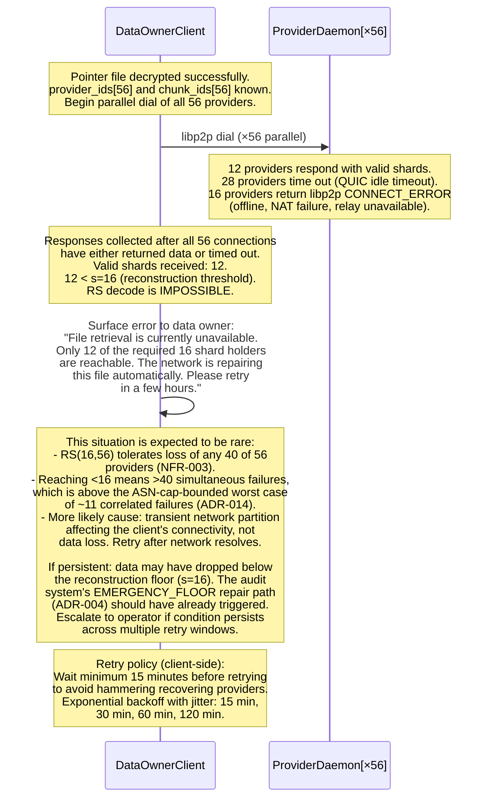
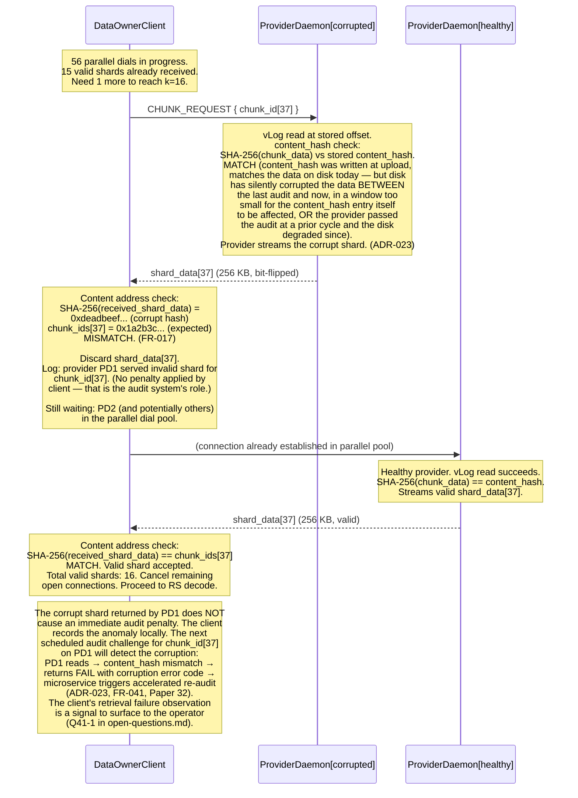
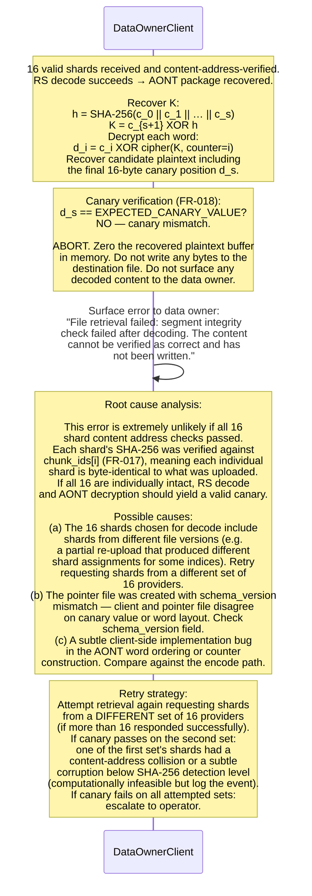
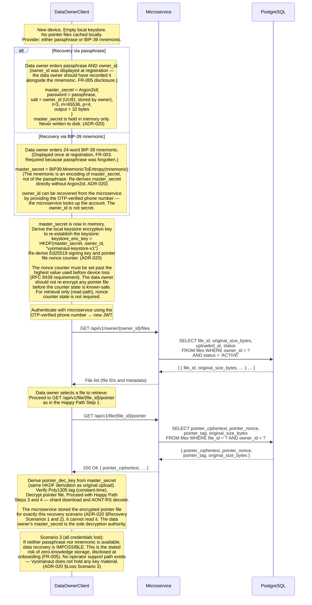

# Vyomanaut V2 — File Retrieval Sequence Diagram

**Document ID:** `VYOM-SEQ-006`
**Version:** 1.0
**Status:** Authoritative
**Date:** April 2026
**Author:** Vyomanaut Engineering
**Repository:** [masamasaowl/Vyomanaut_Research](https://github.com/masamasaowl/Vyomanaut_Research)
**Companion documents:**
- [architecture.md §10 Data Encoding Pipeline](../architecture.md#10-data-encoding-pipeline)
- [architecture.md §22 Runtime Flows — Flow 5](../architecture.md#22-runtime-flows)
- [requirements.md §6.3 Data Owner — File Retrieval](../requirements.md#63-data-owner--file-retrieval)
- [ADR-019](../../decisions/ADR-019-client-side-encryption.md) · [ADR-020](../../decisions/ADR-020-key-management.md) · [ADR-021](../../decisions/ADR-021-p2p-transfer-protocol.md) · [ADR-022](../../decisions/ADR-022-encryption-erasure-order.md) · [ADR-023](../../decisions/ADR-023-provider-storage-engine.md)

---

## Overview

This document covers the complete file retrieval flow: from a data owner requesting the
encrypted pointer file through shard download, AONT-RS decoding, and plaintext
reconstruction on their local device. The primary correctness properties are:
(1) the **Poly1305 authentication tag is verified with constant-time comparison before
any decryption is attempted** — a tampered or corrupt pointer file is rejected before
a single byte of ciphertext is processed (NFR-019); (2) **each retrieved shard is
content-addressed before RS decode** — a provider serving wrong or corrupted data is
detected immediately and discarded rather than silently poisoning the decode
([FR-017](../requirements.md#63-data-owner--file-retrieval)); and (3) **the AONT
canary word is verified after decode** — the client must never return corrupted
plaintext to the data owner under any circumstances
([FR-018](../requirements.md#63-data-owner--file-retrieval)). These properties close
the data integrity guarantee from the upload side (established in
[01-file-upload.md](./01-file-upload.md)) through the full round-trip. The decode
pipeline mirrors [ADR-022](../../decisions/ADR-022-encryption-erasure-order.md) in
reverse; [ADR-019](../../decisions/ADR-019-client-side-encryption.md) governs the
cipher primitives; [ADR-020](../../decisions/ADR-020-key-management.md) governs key
derivation and the new-device recovery paths.

---

## Participants

| Participant label | Role in this flow | Described in |
|---|---|---|
| `DataOwnerClient` | Derives decryption keys locally; orchestrates shard downloads; decodes AONT-RS | [architecture.md §6](../architecture.md#6-component-overview) |
| `Microservice` | Returns encrypted pointer file ciphertext; never holds the decryption key | [architecture.md §18](../architecture.md#18-coordination-microservice) |
| `ProviderDaemon[×56]` | Receives chunk retrieval request; reads from vLog; returns raw shard | [architecture.md §16](../architecture.md#16-provider-storage-engine) |
| `PostgreSQL` | Stores pointer file ciphertext; serves `files` table on pointer fetch | [architecture.md §6](../architecture.md#6-component-overview) |

---

## Happy Path — Single Segment File

The happy path shows retrieval of a file comprising one segment (≤ 4 MB of user
plaintext, ≤ 14 MB on the wire). Files comprising multiple segments repeat the
shard-download and AONT-RS decode stages sequentially per segment and concatenate
the results in `segment_index` order. All decoding is local — the microservice is
not in the data path after returning the pointer file ciphertext.

```mermaid
sequenceDiagram
    %% File Retrieval — Happy Path (single segment)
    %% ADR-022 (AONT-RS decode), ADR-020 (key hierarchy, pointer file),
    %% ADR-019 (ChaCha20/AES cipher), ADR-021 (libp2p/QUIC),
    %% FR-015, FR-016, FR-017, FR-018, NFR-014, NFR-019

    participant C  as DataOwnerClient
    participant MS as Microservice
    participant PG as PostgreSQL
    participant PD as ProviderDaemon[×56]

    Note over C: Session start — master_secret already<br/>in memory (Argon2id from passphrase, ADR-020).<br/>If not: derive before this flow begins<br/>(see Failure Path 4 — new device).

    %% ── Step 1: Fetch encrypted pointer file from microservice ───────────
    C->>MS: GET /api/v1/file/{file_id}/pointer
    Note over MS: Verify JWT (bearer token, role="owner").<br/>Authorise: file.owner_id == JWT.sub.<br/>Microservice has no decryption key —<br/>it is a blind store. (NFR-014)
    MS->>PG: SELECT pointer_ciphertext,<br/>         pointer_nonce, pointer_tag,<br/>         original_size_bytes, schema_version<br/>FROM files WHERE file_id = ?<br/>AND owner_id = ? AND status = 'ACTIVE'
    PG-->>MS: { pointer_ciphertext (BYTEA),<br/>  pointer_nonce (12 B), pointer_tag (16 B),<br/>  original_size_bytes, schema_version }
    MS-->>C: 200 OK<br/>{ pointer_ciphertext (base64),<br/>  pointer_nonce (base64, 12 B),<br/>  pointer_tag (base64, 16 B),<br/>  original_size_bytes, schema_version }

    %% ── Step 2: Derive pointer file decryption key and verify tag ────────
    Note over C: ── LOCAL — no network ──<br/>Derive pointer_dec_key =<br/>  HKDF-SHA256(<br/>    ikm  = master_secret,<br/>    salt = owner_id,<br/>    info = "vyomanaut-pointer-v1" || file_id,<br/>    len  = 32<br/>  )<br/>The microservice never held this key.<br/>(ADR-020)

    Note over C: CRITICAL — Verify Poly1305 tag FIRST<br/>before any decryption attempt (NFR-019):<br/>  expected_tag = Poly1305(<br/>    key  = derived from pointer_dec_key + nonce,<br/>    msg  = pointer_ciphertext,<br/>    aad  = owner_id || file_id || schema_version<br/>  )<br/>  result = crypto/subtle.ConstantTimeCompare(<br/>    expected_tag, received_tag<br/>  )<br/>If result = 0: ABORT — do not decrypt.<br/>See Failure Path 1.

    Note over C: Tag verified. Decrypt:<br/>  pointer_plaintext =<br/>    ChaCha20-Poly1305.Decrypt(<br/>      key   = pointer_dec_key,<br/>      nonce = pointer_nonce (96-bit counter),<br/>      ct    = pointer_ciphertext,<br/>      aad   = owner_id || file_id || schema_version<br/>    )<br/>Deserialise: provider_ids[56], chunk_ids[56],<br/>erasure_params { s:16, r:40, n:56, lf:256KB },<br/>segment_id, segment_index, original_size_bytes.<br/>Verify owner_sig over all fields (ADR-020).

    %% ── Step 3: Parallel libp2p shard download ───────────────────────────
    Note over C,PD: Dial ALL 56 providers in parallel (FR-016).<br/>Cancel connections once 16 valid shards received.<br/>Each connection is one independent libp2p/QUIC<br/>stream (ADR-021). Use last_known_multiaddrs<br/>from the pointer file's provider_ids list<br/>via the microservice chunk_assignments table;<br/>however the client derives addresses by<br/>requesting a fresh lookup only if needed<br/>(pointer file already has provider_ids —<br/>addresses resolved via DHT FIND_NODE or<br/>the microservice's /file/{id}/pointer response).

    loop for each shard_index in 0..55 (all 56 parallel, cancel after 16)
        C->>PD: libp2p dial (QUIC v1 primary,<br/>TCP+Noise XX fallback, ADR-021)<br/>CHUNK_REQUEST { chunk_id[i] }
        Note over PD: Look up chunk_id in RocksDB (Bloom filter first).<br/>If absent: return NOT_FOUND immediately.<br/>If present: read 262,212 bytes from vLog.<br/>Verify SHA-256(chunk_data) == content_hash.<br/>If mismatch: return CORRUPT error code.<br/>Else: stream raw shard_data (256 KB). (ADR-023)
        PD-->>C: 256 KB shard_data[i]
        Note over C: Verify content address:<br/>  SHA-256(shard_data[i]) == chunk_ids[i]<br/>If mismatch: discard shard, continue<br/>waiting for more responses. (FR-017)<br/>See Failure Path 3.
    end

    Note over C: First 16 valid (content-address-verified) shards<br/>received. Cancel all remaining 40 connections.<br/>(FR-016 — 16 fastest responding providers)

    %% ── Step 4: AONT-RS decode ───────────────────────────────────────────
    Note over C: ── LOCAL — no network ──<br/>RS decode: any 16 of the 56 shards →<br/>recover the full AONT package<br/>(s+1 = 17 codewords including key block).<br/>Uses systematic property: shards 0–15 may<br/>be the AONT package directly if all 16 data<br/>shards were received intact. (ADR-003, ADR-022)

    Note over C: Recover AONT key K:<br/>  h = SHA-256(c_0 || c_1 || … || c_s)<br/>  K = c_{s+1} XOR h<br/>K cannot be recovered from fewer than<br/>k=16 shards — the fundamental security<br/>property of AONT-RS. (ADR-022)

    Note over C: Decrypt each 16-byte word:<br/>  For i in 0..s:<br/>    d_i = c_i XOR cipher(K, counter=i)<br/>  Cipher: ChaCha20-256 (no AES-NI)<br/>  or AES-256-CTR (AES-NI detected at<br/>  daemon startup). (ADR-019)<br/>  K is discarded after decode — ephemeral.

    Note over C: Verify canary word (FR-018):<br/>  d_s == fixed 16-byte canary value<br/>If canary mismatch: ABORT — do not return<br/>any plaintext to the data owner.<br/>See Failure Path 4.

    Note over C: Strip padding:<br/>  plaintext = decoded_bytes[0 : original_size_bytes]<br/>  (Files < 4 MB were padded to one full<br/>  segment = 4 MB at upload; strip here.)<br/>(FR-008, ADR-022)

    Note over C: Write plaintext to destination file.<br/>For multi-segment files: repeat Steps 3–4<br/>for each segment in segment_index order,<br/>then concatenate all decoded segments.
```

### Cross-reference: diagram steps to ADRs and requirements

| Step # | Description | ADR / Requirement |
|---|---|---|
| 1 | JWT authorisation: `file.owner_id == JWT.sub` — a data owner cannot retrieve another owner's pointer file | [FR-015](../requirements.md#63-data-owner--file-retrieval), [ADR-020](../../decisions/ADR-020-key-management.md) |
| 1b | Microservice stores pointer ciphertext and returns it blindly — it holds no decryption key | [NFR-014](../requirements.md#74-security-and-privacy), [ADR-020](../../decisions/ADR-020-key-management.md) |
| 2a | `pointer_dec_key = HKDF-SHA256(master_secret, owner_id, "vyomanaut-pointer-v1" \|\| file_id)` — deterministically re-derivable on any device with the master secret | [ADR-020](../../decisions/ADR-020-key-management.md), [ADR-019](../../decisions/ADR-019-client-side-encryption.md) |
| 2b | Poly1305 tag verified with `crypto/subtle.ConstantTimeCompare` **before** any decryption attempt — no timing oracle | [NFR-019](../requirements.md#74-security-and-privacy), [ADR-019](../../decisions/ADR-019-client-side-encryption.md) |
| 2c | AAD = `owner_id \|\| file_id \|\| schema_version` — same AAD used at encryption; mismatch causes tag failure | [ADR-019](../../decisions/ADR-019-client-side-encryption.md) |
| 2d | `owner_sig` over pointer file plaintext verified — prevents microservice from substituting a forged pointer file | [ADR-020](../../decisions/ADR-020-key-management.md) |
| 3a | All 56 providers dialled in parallel; connections cancelled after first 16 valid shards | [FR-016](../requirements.md#63-data-owner--file-retrieval), [ADR-021](../../decisions/ADR-021-p2p-transfer-protocol.md) |
| 3b | Provider verifies `content_hash` on vLog read before streaming — silent disk corruption surfaces before transmission | [ADR-023](../../decisions/ADR-023-provider-storage-engine.md) |
| 3c | Client verifies `SHA-256(shard_data) == chunk_ids[i]` — detects transmission corruption or wrong-shard response | [FR-017](../requirements.md#63-data-owner--file-retrieval) |
| 4a | RS decode requires any 16 of 56 shards — 40-fault tolerance from [ADR-003](../../decisions/ADR-003-erasure-coding.md) | [NFR-003](../requirements.md#71-durability), [ADR-003](../../decisions/ADR-003-erasure-coding.md) |
| 4b | `K = c_{s+1} XOR SHA-256(all codewords)` — K is unrecoverable with fewer than k=16 codewords | [ADR-022](../../decisions/ADR-022-encryption-erasure-order.md) |
| 4c | Cipher selection: ChaCha20-256 (no AES-NI) or AES-256-CTR (AES-NI) — same CPUID detection as encode | [ADR-019](../../decisions/ADR-019-client-side-encryption.md) |
| 4d | Canary verification: client aborts and returns no plaintext if canary is wrong | [FR-018](../requirements.md#63-data-owner--file-retrieval), [ADR-022](../../decisions/ADR-022-encryption-erasure-order.md) |
| 4e | Padding stripped to `original_size_bytes` — recorded in the pointer file and in `files.original_size_bytes` | [FR-008](../requirements.md#62-data-owner--file-upload), [ADR-022](../../decisions/ADR-022-encryption-erasure-order.md) |

### What this diagram does not show

- **DHT-based provider address resolution** — the pointer file contains `provider_ids[56]` (UUIDs); the client resolves current multiaddrs via DHT `FIND_NODE(HMAC(chunk_id, file_owner_key))` or via a microservice endpoint. This resolution step is omitted here for clarity but is required before the libp2p dial; it mirrors the chunk lookup described in [ADR-001](../../decisions/ADR-001-coordination-architecture.md) and [ADR-021](../../decisions/ADR-021-p2p-transfer-protocol.md).
- **Multi-segment file orchestration** — for files larger than 14 MB, the pointer file contains `segments[]` with one entry per segment. Steps 3–4 repeat sequentially per segment; segments are independent — a failure on segment N does not affect segment N+1's decodability.
- **K ephemeral lifetime** — K is held in memory only for the duration of word decryption and is zeroed immediately afterward. It is never written to disk or logged at any verbosity level.

---

## Failure Path 1 — Pointer File Tag Verification Fails

The Poly1305 tag check is the first cryptographic gate in the decode pipeline. If the
received tag does not match the expected tag under constant-time comparison, the client
aborts before touching a single byte of ciphertext. Two root causes are possible: the
pointer ciphertext was corrupted in the microservice's storage (rare), or an adversary
has tampered with the ciphertext in transit (AEAD ensures this is detectable). In
either case the data owner cannot retrieve the file from the local device and must
investigate the cause before retrying.

```mermaid
sequenceDiagram
    %% File Retrieval — Failure: Pointer file Poly1305 tag verification fails
    %% ADR-019 (constant-time tag compare), NFR-019, FR-015

    participant C  as DataOwnerClient
    participant MS as Microservice

    C->>MS: GET /api/v1/file/{file_id}/pointer
    MS-->>C: 200 OK<br/>{ pointer_ciphertext, pointer_nonce,<br/>  pointer_tag (tampered or corrupt),<br/>  original_size_bytes }

    Note over C: Derive pointer_dec_key via HKDF (ADR-020).<br/>Reconstruct expected Poly1305 tag over<br/>ciphertext with AAD = owner_id || file_id || schema_version.

    Note over C: constant_time_result =<br/>  crypto/subtle.ConstantTimeCompare(<br/>    expected_tag, received_tag<br/>  )<br/>Result = 0 — tags do not match.

    Note over C: ABORT IMMEDIATELY.<br/>Do NOT attempt AEAD decryption.<br/>Do NOT log any portion of pointer_ciphertext<br/>(it may contain partial plaintext structure<br/>if a padding oracle were later discovered —<br/>defensive logging hygiene).<br/>(NFR-019, ADR-019)

    C->>C: Surface error to data owner:<br/>  "File retrieval failed: pointer file<br/>  integrity check failed. The stored<br/>  metadata may be corrupt."<br/>  Do not disclose tag values to the UI<br/>  (no useful information to the user;<br/>  potential information leak to observer).

    Note over C: Possible causes:<br/>  (a) Storage corruption in Postgres BYTEA column<br/>      (verify with microservice admin tooling).<br/>  (b) Network transmission error — retry once<br/>      with a fresh GET request. If tags still<br/>      mismatch on retry, escalate.<br/>  (c) Adversarial modification in transit<br/>      (TLS should prevent this; investigate<br/>      certificate pinning if suspected).<br/><br/>Recovery: if the owner has a locally cached<br/>copy of the pointer file plaintext (e.g. from<br/>a prior successful retrieval session that was<br/>interrupted), they may retry from that cache.<br/>Otherwise escalate to operator support.
```

### Cross-reference

| Step # | Description | ADR / Requirement |
|---|---|---|
| 1 | `crypto/subtle.ConstantTimeCompare` — mandatory; `bytes.Equal` must never be used on tag comparison | [NFR-019](../requirements.md#74-security-and-privacy), [ADR-019](../../decisions/ADR-019-client-side-encryption.md) |
| 2 | Abort before AEAD decryption — even a failed decryption call can leak timing information on some implementations | [NFR-019](../requirements.md#74-security-and-privacy) |
| 3 | No plaintext or tag values surfaced in UI or logs — defensive hygiene against future padding-oracle discovery | [ADR-019](../../decisions/ADR-019-client-side-encryption.md) |
| 4 | Retry once on network error — `pointer_tag` is stored in Postgres and is stable; a second mismatch is a genuine integrity failure | [FR-015](../requirements.md#63-data-owner--file-retrieval) |

### What this failure path does not show

- What the operator should do if Postgres `pointer_tag` is found to differ from what the client originally submitted — this is a data integrity incident requiring inspection of the Postgres WAL and backup restoration.
- How the client distinguishes between a corrupt tag (storage failure) and a bad derivation (owner used wrong `file_id` or `owner_id`) — both appear identical to the client; correct `owner_id` is always the JWT `sub` claim, so a bad derivation indicates a client bug.
- Reconstruction from a locally cached pointer file — this is a client implementation choice; the diagram focuses on the failure detection, not the recovery UX.

---

## Failure Path 2 — Fewer Than 16 Providers Reachable

Reed-Solomon reconstruction requires exactly k=16 valid shards. If the client dials all
56 providers, waits for each to respond up to the per-connection timeout, and accumulates
fewer than 16 valid (content-address-verified) shard responses, retrieval for that segment
is impossible at this moment. This is the correct outcome when network conditions are
severe or when the provider pool for a segment has genuinely degraded below the repair
threshold — a situation that should trigger an alert and repair on the audit side.



### Cross-reference

| Step # | Description | ADR / Requirement |
|---|---|---|
| 1 | All 56 dialled in parallel; client waits for each up to a per-connection timeout before concluding | [FR-016](../requirements.md#63-data-owner--file-retrieval), [ADR-021](../../decisions/ADR-021-p2p-transfer-protocol.md) |
| 2 | `s=16` is the hard reconstruction threshold; no RS decode is possible below it | [ADR-003](../../decisions/ADR-003-erasure-coding.md), [NFR-004](../requirements.md#72-availability) |
| 3 | Toleration of any 40 simultaneous failures is the design guarantee — reaching <16 reachable implies >40 simultaneous failures | [NFR-003](../requirements.md#71-durability), [ADR-003](../../decisions/ADR-003-erasure-coding.md) |
| 4 | EMERGENCY_FLOOR repair (fragment count = 16) is triggered by the audit system, not the client | [ADR-004](../../decisions/ADR-004-repair-protocol.md), [FR-044](../requirements.md#69-repair-system) |

### What this failure path does not show

- How the client resolves a per-provider timeout value — the client uses its own QUIC idle timeout (not the audit RTO); these are separate mechanisms serving different purposes.
- The distinction between a provider returning `NOT_FOUND` (shard not assigned to them) vs a genuine connection failure — `NOT_FOUND` means the client's pointer file has a stale assignment, which should not occur for non-repaired files; if seen frequently, investigate chunk assignment consistency.
- Partial success across segments — if a multi-segment file has segment 0 recoverable (≥16 shards) and segment 1 not (< 16 shards), the client should surface this per-segment distinction rather than treating the entire file as unavailable.

---

## Failure Path 3 — Shard Fails Content Address Verification; Retry From Alternate

If a provider serves a shard whose SHA-256 content address does not match `chunk_ids[i]`
from the pointer file, the shard is silently discarded and the client continues waiting
for responses from the remaining connections. Because 56 providers were dialled in
parallel and only 16 valid shards are needed, up to 40 bad shards can be tolerated per
segment before retrieval fails. This path illustrates the most common single-shard
failure: a provider whose disk has silently corrupted the chunk data since their last
audit pass.



### Cross-reference

| Step # | Description | ADR / Requirement |
|---|---|---|
| 1 | `SHA-256(shard_data) == chunk_ids[i]` check on every received shard before acceptance | [FR-017](../requirements.md#63-data-owner--file-retrieval) |
| 2 | Up to 40 invalid shards tolerated per segment (56 − 16 = 40 parity) before retrieval fails | [ADR-003](../../decisions/ADR-003-erasure-coding.md), [NFR-003](../requirements.md#71-durability) |
| 3 | Bad shard silently discarded — client continues from parallel pool without interruption | [FR-016](../requirements.md#63-data-owner--file-retrieval), [ADR-021](../../decisions/ADR-021-p2p-transfer-protocol.md) |
| 4 | Corrupt provider is detected on the next scheduled audit cycle via `content_hash` mismatch on the provider's vLog read — not by the retrieval client | [ADR-023](../../decisions/ADR-023-provider-storage-engine.md), [FR-041](../requirements.md#68-audit-system) |
| 5 | Client-side anomaly log is not a payment or scoring action — scoring is centralised in the microservice (ADR-008); the client's observation is diagnostic only | [ADR-008](../../decisions/ADR-008-reliability-scoring.md), [ADR-013](../../decisions/ADR-013-consistency-model.md) |

### What this failure path does not show

- The case where a provider returns `CORRUPT` error code proactively (because the `content_hash` check at the provider's vLog read already failed) — this is semantically identical from the client's perspective: the shard is invalid and discarded. The provider's explicit error code is informative but does not change client behaviour.
- Counting how many distinct providers served bad shards for a given segment — this could feed a local anomaly counter surfaced to the operator, but the mechanism is outside this flow.
- The scenario where a provider returns a valid-looking shard for the wrong `chunk_id` (content collision) — computationally infeasible under SHA-256.

---

## Failure Path 4 — Canary Verification Fails After AONT Decode

The canary is a fixed 16-byte value appended to the plaintext before AONT encoding at
upload time ([ADR-022](../../decisions/ADR-022-encryption-erasure-order.md)). If RS
decode and AONT decryption succeed but the recovered canary word does not match the
expected value, the segment plaintext is corrupt at a level that passed the per-shard
content address checks — a highly unusual event indicating RS codeword-level data
corruption across multiple providers. The client must not return any portion of the
recovered plaintext; data confidentiality is preserved (K was successfully derived, so
the data is present) but data integrity cannot be guaranteed.



### Cross-reference

| Step # | Description | ADR / Requirement |
|---|---|---|
| 1 | Canary word `d_s` is appended at AONT encode time (Step 1 of the AONT pipeline); verified here after full decode | [ADR-022](../../decisions/ADR-022-encryption-erasure-order.md), [FR-018](../requirements.md#63-data-owner--file-retrieval) |
| 2 | Plaintext buffer zeroed on canary failure — K was recoverable so decrypted content is present in memory; must not leak | [FR-018](../requirements.md#63-data-owner--file-retrieval), [ADR-022](../../decisions/ADR-022-encryption-erasure-order.md) |
| 3 | No partial output — the client writes nothing to the destination file before canary passes | [FR-018](../requirements.md#63-data-owner--file-retrieval) |
| 4 | Retrying with a different set of 16 providers is valid — RS is a maximum-distance-separable code; any valid set of 16 shards from the same upload produces the same plaintext | [ADR-003](../../decisions/ADR-003-erasure-coding.md) |

### What this failure path does not show

- Canary failure on one segment while other segments decode correctly — the client should surface this per-segment and allow partial file reconstruction for segments that pass, making it clear to the data owner which portion of the file is unavailable.
- How a developer distinguishes canary failure from a tag failure (Failure Path 1) — pointer file tag failure is detected before any shard downloads begin; canary failure occurs after full RS decode and AONT decryption; the two are structurally separated in the pipeline.

---

## Failure Path 5 — New-Device Recovery From Passphrase or BIP-39 Mnemonic

A data owner who has lost their device but retained either their passphrase (and can
recall their `owner_id`) or their 24-word BIP-39 mnemonic can recover all files on
a fresh machine. The key derivation is deterministic — the master secret re-derived
from the same inputs is identical to the original — so the pointer file encryption
keys are re-derivable without any out-of-band key exchange. The microservice stores
only the encrypted pointer file ciphertext and cannot assist decryption; recovery
is entirely a function of the data owner's retained credentials.



### Cross-reference

| Step # | Description | ADR / Requirement |
|---|---|---|
| 1a | Passphrase path: `Argon2id(passphrase, owner_id, t=3, m=65536, p=4)` → `master_secret` — identical to original derivation | [ADR-020](../../decisions/ADR-020-key-management.md), [FR-004](../requirements.md#61-data-owner--registration-and-onboarding) |
| 1b | Mnemonic path: `BIP39.MnemonicToEntropy(mnemonic)` → `master_secret` — mnemonic encodes master_secret directly, not the passphrase | [ADR-020](../../decisions/ADR-020-key-management.md), [FR-004](../requirements.md#61-data-owner--registration-and-onboarding) |
| 2 | `master_secret` never written to disk at any point — held in memory for the session only | [ADR-020](../../decisions/ADR-020-key-management.md), [NFR-014](../requirements.md#74-security-and-privacy) |
| 3 | Nonce counter: retrieval is read-only and does not require counter state; counter matters only when re-encrypting pointer files after device recovery | [ADR-019](../../decisions/ADR-019-client-side-encryption.md), [ADR-020](../../decisions/ADR-020-key-management.md) |
| 4 | `owner_id` is not secret — the data owner must retain it alongside the mnemonic, or can retrieve it via OTP-verified phone lookup | [ADR-020](../../decisions/ADR-020-key-management.md), [FR-004](../requirements.md#61-data-owner--registration-and-onboarding) |
| 5 | `GET /api/v1/owner/{owner_id}/files` returns file metadata (IDs, sizes, dates) — pointer ciphertext is fetched per-file | [FR-019](../requirements.md#64-data-owner--file-management) |
| 6 | Microservice stored the pointer file ciphertext for this recovery purpose; it cannot assist further — zero-knowledge | [ADR-020](../../decisions/ADR-020-key-management.md), [NFR-014](../requirements.md#74-security-and-privacy) |
| 7 | All-credentials-lost scenario: permanent unrecoverable data loss; operator has no key material | [ADR-020](../../decisions/ADR-020-key-management.md), [FR-005](../requirements.md#61-data-owner--registration-and-onboarding) |

### What this failure path does not show

- The onboarding UX that mandates BIP-39 confirmation before the first upload is permitted — this is shown in the registration flow upstream of all upload diagrams; the confirmation gate (two randomly selected words, [FR-003](../requirements.md#61-data-owner--registration-and-onboarding)) is what makes this recovery path reliable.
- Re-establishing the nonce counter after device recovery for future pointer file writes — the data owner must set the counter past any prior value before re-encrypting; the safe default is to request the highest `pointer_nonce` from the microservice across all their files and increment from there.
- The FIDO2/WebAuthn hardware key path — [ADR-020](../../decisions/ADR-020-key-management.md) notes this as an optional input to `Argon2id`; the derivation chain is identical; the diagram shows the passphrase path as the representative case.

---

## Invariants Demonstrated

| Invariant | Where it appears in this flow | Source |
|---|---|---|
| Poly1305 tag verified before any decryption attempt | Happy Path step 2b; Failure Path 1: tag mismatch → abort before AEAD call | [ADR-019](../../decisions/ADR-019-client-side-encryption.md), [NFR-019](../requirements.md#74-security-and-privacy) |
| Constant-time tag comparison mandatory | Happy Path step 2b and Failure Path 1: `crypto/subtle.ConstantTimeCompare`; `bytes.Equal` explicitly prohibited | [NFR-019](../requirements.md#74-security-and-privacy) |
| No plaintext returned without canary confirmation | Failure Path 4: buffer zeroed, destination file untouched on canary mismatch | [FR-018](../requirements.md#63-data-owner--file-retrieval), [ADR-022](../../decisions/ADR-022-encryption-erasure-order.md) |
| Content address verified per shard before decode | Happy Path step 3c; Failure Path 3: corrupt shard discarded before entering decode | [FR-017](../requirements.md#63-data-owner--file-retrieval) |
| Microservice holds no decryption key | Happy Path step 1b; Failure Path 5: blind pointer file store confirmed | [NFR-014](../requirements.md#74-security-and-privacy), [ADR-020](../../decisions/ADR-020-key-management.md) |
| K is ephemeral — never stored or logged | Happy Path step 4b–4c; Failure Path 4: buffer zeroed including K | [ADR-022](../../decisions/ADR-022-encryption-erasure-order.md) |
| RS reconstruction requires any 16 of 56 — 40-fault tolerance | Happy Path step 4a; Failure Path 2: <16 valid → impossible; Failure Path 3: up to 40 bad shards tolerated | [ADR-003](../../decisions/ADR-003-erasure-coding.md), [NFR-003](../requirements.md#71-durability) |

---

## Related Diagrams

- **[01-file-upload.md](./01-file-upload.md)** — the encoding pipeline whose inverse is shown here; the AONT-RS parameters (K generation, canary append, RS(16,56) systematic dispersal, `chunk_ids` as content addresses) are established there; the pointer file ciphertext stored in that flow is fetched and decrypted in this one.
- **[02-audit-cycle.md](./02-audit-cycle.md)** — the daily audit that maintains provider shard availability; Failure Path 2 (fewer than 16 reachable) reflects a pool that the audit system should have already flagged; Failure Path 3 (corrupt shard) feeds into the accelerated re-audit path shown in that diagram's Failure Path 5.
- **[03-repair-flow.md](./03-repair-flow.md)** — the repair that restores fragment counts after provider departure; if retrieval encounters Failure Path 2, the underlying cause (fragment count at or below reconstruction floor) should already have triggered an EMERGENCY_FLOOR repair job; the two flows are complementary indicators of the same degradation event.
- **[05-provider-lifecycle.md](./05-provider-lifecycle.md)** — the vetting pipeline that ensures providers entering the assignment pool have demonstrated reliability before receiving production shard assignments; the content address guarantee in Failure Path 3 depends on providers having passed the vetting threshold.